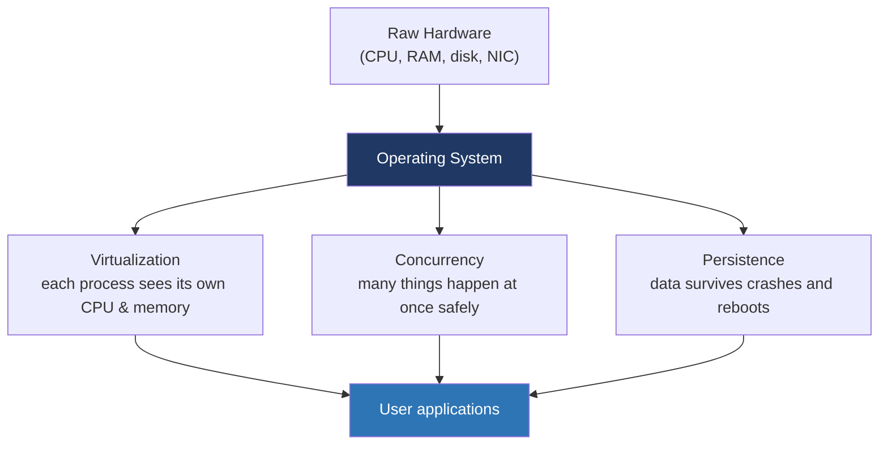
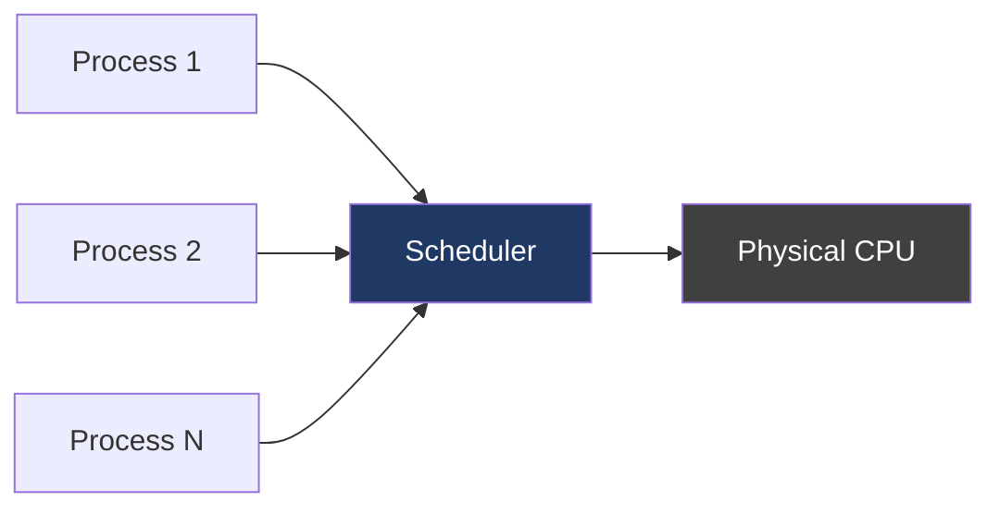
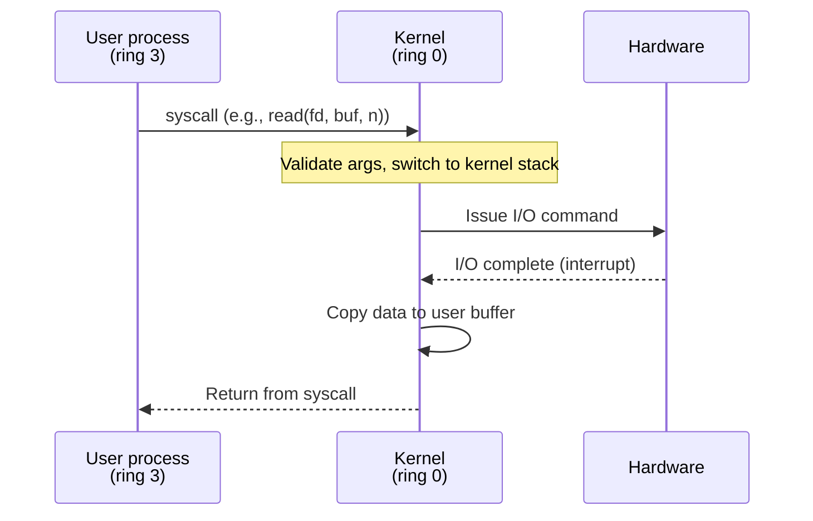

# Day 1 — What is an operating system?

> **Week 1 · Foundations**
> Reading: OSTEP Chapters 1–2 (Introduction, Dialogue on Virtualization)

## Why this matters

Before diving into details, you need a sharp answer to the deceptively simple question: *what does an OS actually do?* Many engineers can name OS components (scheduler, memory manager, filesystems) without being able to articulate the unifying purpose. That's exactly the question that opens systems interviews.

The answer, distilled: **an OS provides three abstractions** that turn raw hardware into a programmable platform — virtualization, concurrency, and persistence.

## 1.1 The three big ideas

### Virtualization

The OS takes the **physical** CPU and physical memory and presents each running program with the **illusion** that it owns them. Your process sees a private 256 TB address space. Your code thinks it's running on a dedicated CPU. Both are lies — there's one physical CPU shared across hundreds of processes, and physical RAM is a tiny fraction of what each process appears to have.

The mechanisms behind those illusions are **time-sharing** (for CPU) and **virtual memory with paging** (for RAM). The whole rest of this study plan is, in some sense, a deep dive into those two mechanisms and what they make possible.

### Concurrency

Modern programs do many things at once — a web server handles many connections; a database services many queries. The OS provides *threads* and *synchronization primitives* (locks, condition variables, atomics) so concurrent code can share data without corrupting it.

Concurrency is hard. Most subtle bugs in production systems are concurrency bugs. Week 3 of this plan is entirely about getting concurrency right.

### Persistence

RAM is volatile; disks are not. The OS provides *filesystems* that make persistent storage usable — files have names, can be read and written, and survive crashes (mostly — `fsync` matters). Week 4 covers this.

## 1.2 The OS as a resource manager

A second framing — equally important — is that the OS **multiplexes finite hardware among competing demands**. There's one CPU but ten processes; the scheduler decides who runs. There's 16 GB of RAM but processes want 100 GB; the VM subsystem decides who gets pages. There's one network card but a thousand sockets; the kernel demuxes packets to the right one.

This framing makes interview answers much sharper. When asked "what does the kernel do," don't list components — describe the multiplexing job: *the kernel mediates access to limited hardware so multiple processes can share it safely and fairly.*

## 1.3 User space vs. kernel space

CPUs have privilege levels. On x86, ring 0 is most privileged (kernel), ring 3 is least (user). The kernel runs in ring 0 with full access to hardware; your process runs in ring 3 and cannot touch I/O ports, change page tables, or disable interrupts. To request a privileged operation, your process executes a **system call** — a controlled transition from user to kernel mode.

This boundary is the most important security and stability mechanism in the system. Every interaction between userspace and the kernel goes through this controlled gate. The cost — a syscall is hundreds to thousands of cycles — is why high-performance code tries to minimize them (think `io_uring`, vDSO, `mmap` instead of `read`).

## 1.4 Monolithic vs. microkernel

A historical debate worth knowing for interviews:

- **Monolithic kernel** (Linux, BSD, Windows NT internally): all OS services run in kernel space — drivers, filesystems, network stack, scheduler, all in one address space. Fast (no context switches between subsystems) but large and complex; a buggy driver can crash the kernel.
- **Microkernel** (MINIX, QNX, seL4): only the bare essentials (scheduling, IPC, memory) in kernel space; everything else (filesystems, drivers, even networking) runs as user processes. More robust (a driver crash doesn't kill the kernel) but slower (everything goes through IPC).

Linux is firmly monolithic, but with **modules** (loadable code that runs in kernel space) for flexibility. Practical answer in interviews: "Linux is monolithic, which trades isolation for performance; modern microkernels like seL4 prove the microkernel approach works but the performance gap historically kept Linux/Windows monolithic."

## 1.5 Why this all matters in practice

When you debug a production issue:

- "My app is slow" — could be CPU contention (scheduling), memory pressure (VM/swap), I/O (filesystems), or network (sockets). The OS abstractions you need to understand are the ones that explain the symptom.
- "My app crashed" — could be a bad pointer (memory protection caught it via SIGSEGV), an unhandled signal, an OOM kill, or a bug. Understanding the OS tells you which it was.
- "My app is non-deterministic" — almost always a concurrency issue. Understanding memory models, atomics, and locks is the only path to fixing it.

Senior systems engineers are paid largely for the ability to reason from these fundamentals to specific real problems. That's what we're building.

## Hands-on (30 minutes)

1. Run `uname -a`. Identify your kernel version. We'll come back to this.
2. Run `cat /proc/cpuinfo | head -30`. Note your CPU model, flags. We'll talk about specific flags later (e.g., `pae`, `nx`, `sse4_2`).
3. Run `cat /proc/meminfo`. Note `MemTotal`, `MemFree`, `MemAvailable`, `Cached`. The difference matters — don't worry yet why.
4. Run `ps -ef | head -20`. PID 1 is `init` or `systemd`. PID 2 is `kthreadd` (kernel thread parent). Note that PID 0 is not visible — it's the per-CPU idle task.
5. Try to make a system call directly: `strace -e trace=write echo hello`. You'll see the `write(1, "hello\n", 6)` syscall. That single line is what `printf` ultimately becomes.

## Interview questions

### Q1. What does an operating system do?

**Answer:** An OS provides three core abstractions that turn raw hardware into a usable platform: **virtualization** (each process gets the illusion of its own CPU and memory), **concurrency** (safe management of many simultaneous activities), and **persistence** (durable storage via filesystems). Equivalently, the OS is a resource manager that multiplexes finite hardware — CPU time, memory pages, I/O bandwidth — among competing processes.

A sharper answer mentions the user/kernel boundary as the security-and-stability mechanism that makes the rest possible: privileged operations are mediated through controlled syscalls, so a user process cannot directly access hardware or another process's memory.

### Q2. What's the difference between user mode and kernel mode?

**Answer:** Modern CPUs implement privilege levels (rings on x86, EL0–EL3 on ARM). Kernel mode (ring 0 on x86) has unrestricted access — it can execute privileged instructions, modify page tables, configure interrupts, do raw I/O. User mode (ring 3) is restricted: privileged instructions trap, memory access is filtered through page-table protection bits.

The transition between them is controlled. A user process enters the kernel via a **system call** (an explicit, validated request) or via an **interrupt/exception** (involuntary, e.g., a page fault or hardware IRQ). The kernel returns to user mode with a special instruction (`iretq` on x86, `eret` on ARM). This boundary is what prevents a buggy or malicious process from corrupting the kernel or other processes.

### Q3. What's a system call and why is it expensive?

**Answer:** A system call is the user-to-kernel transition mechanism. The user process places arguments in registers, executes a trap instruction (`syscall` on x86-64), and the CPU switches privilege level, jumps to the kernel's syscall entry point, runs the handler, and returns.

It's expensive (hundreds to thousands of cycles) because:
- The CPU pipeline flushes during the privilege transition.
- The kernel must save and restore user CPU state.
- The kernel must validate user-provided pointers (can't trust userspace).
- TLB and cache state may be partially invalidated (especially after Meltdown mitigations like KPTI, which adds a page-table switch).

This cost is why high-performance Linux code minimizes syscalls — `mmap` instead of repeated `read`, `io_uring` instead of `read`/`write` per operation, `vDSO` for things like `gettimeofday` (mapped read-only into userspace, so no privilege transition).

### Q4. Monolithic vs. microkernel — which is "better"?

**Answer:** Neither is universally better; they trade off differently.

- **Monolithic** (Linux, Windows NT, macOS XNU mostly): all OS services live in kernel space. Pro: low overhead — communication between subsystems is just function calls. Con: a bug anywhere can crash the kernel; the kernel is large and complex.
- **Microkernel** (QNX, seL4, MINIX 3): only essential primitives (scheduling, memory, IPC) in kernel; filesystems, drivers, networking run as user-space servers. Pro: isolation — a buggy filesystem can't corrupt the kernel. Con: every interaction crosses IPC, historically making microkernels slower.

Modern microkernels (seL4) have closed much of the performance gap with careful design and small kernel footprint. The mainstream world stayed monolithic because Linux/Windows were already there and "fast enough." Both Apple's XNU and Windows have hybrid elements. For interviews: state the tradeoff, mention Linux is monolithic with loadable modules for flexibility, and note that the choice is largely historical/pragmatic rather than purely technical.

## Self-test

1. What are the three abstractions an operating system provides, and what mechanism implements each in Linux?
2. Why must a process trap into the kernel to read a file rather than reading the disk directly?
3. What runs as PID 0, PID 1, and PID 2 on a typical Linux system?
4. If a syscall takes 1 µs and you make 1 million per second, how much CPU is the syscall overhead alone? What does this imply about high-performance code?
5. Name one operation a user process can do without entering the kernel, and one that requires a syscall. Explain why.
