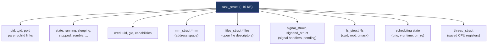
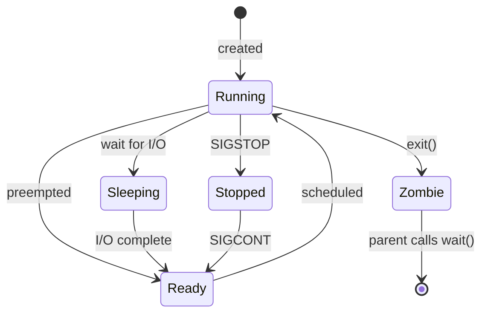
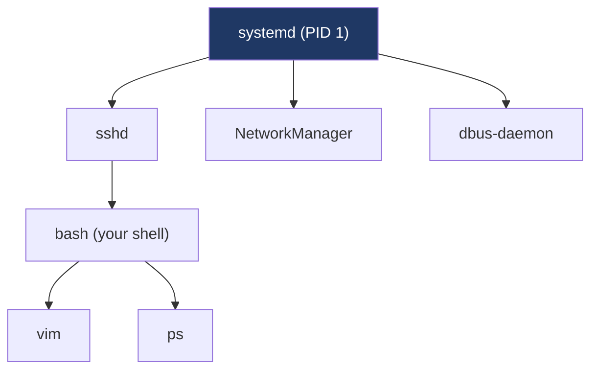
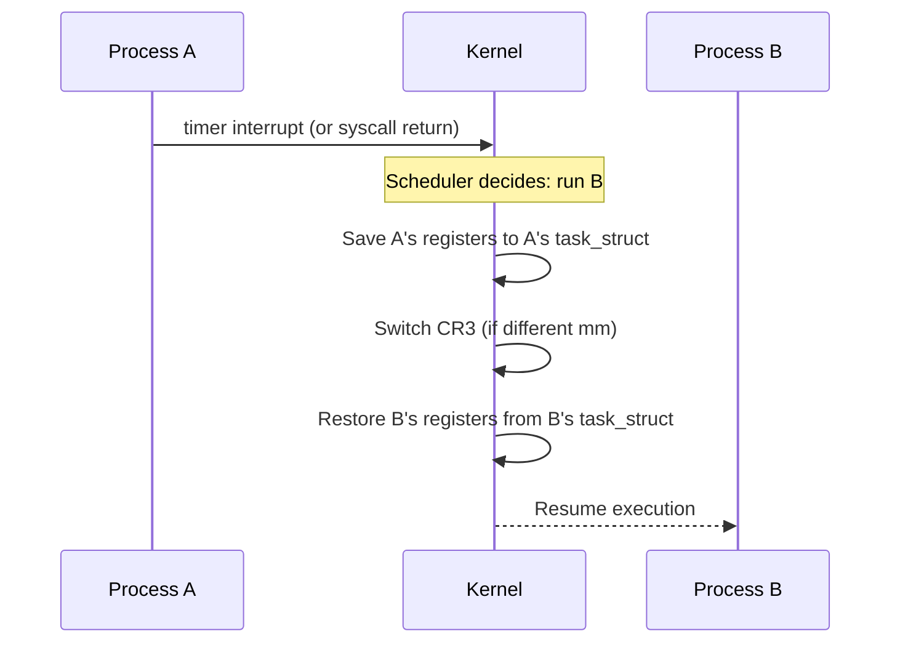

# Day 2 — Processes: the abstraction

> **Week 1 · Foundations**
> Reading: OSTEP Chapters 4–5 (The Abstraction: The Process; Process API)

## Why this matters

The **process** is the OS's most fundamental abstraction. Almost every other OS concept exists either to support processes or to let processes interact. Today we get clarity on what a process actually *is* — not just "a running program" but a precisely defined kernel data structure with specific contents and a specific lifecycle.

## 2.1 What's in a process?

A process is everything the kernel needs to keep track of one running program. In Linux, that's a `struct task_struct` — a large structure containing or pointing at:



Of these, the most-asked-about in interviews are:

- **PID/TGID/PPID**: identity and lineage
- **Address space (mm_struct)**: virtual memory layout (Day 8)
- **File descriptors (files_struct)**: open files
- **Signal handlers**: how the process reacts to async events
- **CPU state**: the registers saved when the process is preempted

## 2.2 Process states

A process is always in one of a few states. Linux uses these:



In `ps` output, you'll see codes:

| Code | Meaning |
|------|---------|
| R | Running or runnable (on a run queue) |
| S | Interruptible sleep (waiting, can be woken by signal) |
| D | Uninterruptible sleep (usually I/O — cannot be killed) |
| T | Stopped |
| Z | Zombie (exited, parent hasn't reaped) |

The **D state** is interview-relevant: a process in `D` cannot be killed, even with `SIGKILL`. It's stuck inside the kernel waiting for something (usually I/O). If your process is stuck in D, that's the kernel's fault, not the process's.

The **zombie state** is also a classic interview topic. When a process exits, its parent must call `wait()` to collect the exit status. Until then, the kernel keeps the process's `task_struct` around (just enough to record the exit code) — this is a zombie. If the parent never reaps, zombies accumulate. They consume PIDs and a small amount of kernel memory; many zombies indicate a broken parent.

## 2.3 Process vs. program

A **program** is a passive thing — bytes in a file (an ELF executable on Linux). A **process** is an active execution of that program — the program's instructions plus all the state required to run them: registers, memory, open files, etc.

Multiple processes can run the same program (e.g., five copies of `bash` open). They share the program text (read-only ELF code is mapped into each process from the same physical pages), but each has its own data, stack, and heap.

## 2.4 The process tree

Every process (except init/PID 1) has a parent. The parent is whoever created it. This forms a tree:



Run `pstree` to see your system's tree. Note `systemd` (PID 1) at the root.

If a process's parent dies before it does, it becomes an **orphan** and is **reparented** to PID 1 (or in some setups, a "subreaper" like a session leader). PID 1 is responsible for reaping orphans — that's why `init`/`systemd` runs `wait()` in a loop.

## 2.5 The Linux unification: tasks, threads, processes

In Linux, the kernel does not have separate "process" and "thread" concepts internally — it has **tasks**. A task is a `task_struct`. What we call a "process" is a task that has its own address space; a "thread" is a task that shares an address space with one or more other tasks.

Both are created by the same syscall: `clone()` (or `fork()`, which is `clone()` with specific flags). The flags determine what's shared:

| Flag | What's shared |
|------|---------------|
| `CLONE_VM` | Address space (`mm_struct`) — makes it a thread |
| `CLONE_FILES` | File descriptor table |
| `CLONE_FS` | cwd, root, umask |
| `CLONE_SIGHAND` | Signal handlers |
| `CLONE_THREAD` | Thread group (same `tgid`) |

`fork()` shares almost nothing (well, the address space is COW-shared but logically copied). `pthread_create()` ultimately calls `clone()` with `CLONE_VM | CLONE_FILES | CLONE_FS | CLONE_SIGHAND | CLONE_THREAD | ...`.

This is why on Linux, `ps -eLf` shows threads as if they were processes — because to the kernel, they essentially are.

## 2.6 The scheduler's view

From the scheduler's perspective, each task is a schedulable entity. The scheduler picks the next task to run based on its policy and priority. Threads of the same process compete with threads of other processes on equal footing — the scheduler doesn't care that two threads happen to share an address space.

We'll cover scheduling in detail on Days 5–6.

## 2.7 Context switching

When the scheduler decides to switch from process A to process B, it performs a **context switch**:

1. Save A's CPU registers into A's `task_struct`.
2. Switch the kernel stack pointer to B's kernel stack.
3. If A and B have different address spaces (different `mm_struct`s), switch CR3 (the page-table base register). This is expensive — it usually invalidates the TLB.
4. Restore B's registers.
5. Resume execution at B's saved instruction pointer.



A context switch typically costs **1–10 µs**. That's not much in absolute terms, but at 100,000 switches/second it becomes meaningful overhead. Two threads of the same process switch faster than two unrelated processes (no CR3/TLB cost).

## Hands-on (30 minutes)

1. Run `ps -eLf | wc -l`. Count tasks (including threads). Then `ps -ef | wc -l` for just processes.
2. Run `pstree -p $$`. See the tree from your shell up to PID 1.
3. Find a sleeping process: `ps axo pid,stat,comm | head -20`. Note `S` and `D` states. If you see a `D`, that's a process stuck in I/O.
4. Create a zombie deliberately:
   ```bash
   ( sleep 0 & ) && sleep 5 && ps -eo pid,stat,comm | grep Z
   ```
   The child exits immediately but the parent shell is busy (`sleep 5`); during those 5 seconds the child is a zombie. Look for the `Z` flag.
5. Examine a process: `cat /proc/$$/status` (your shell's own status). Note `Pid`, `PPid`, `Tgid`, `State`, `VmSize`, `Threads`, etc.
6. See open file descriptors: `ls -l /proc/$$/fd/`. Note 0, 1, 2 (stdin, stdout, stderr) and any others.

## Interview questions

### Q1. What's the difference between a process and a thread?

**Answer:** A process is an instance of an executing program with its own private resources — most importantly, its own **virtual address space**. A thread is a unit of execution that shares its process's address space and most resources with sibling threads.

Concretely:

| Property | Process | Thread |
|----------|---------|--------|
| Address space | Private | Shared with siblings |
| File descriptors | Private (after fork) | Shared |
| Signal handlers | Private | Shared (process-wide) |
| Stack | One per process | One per thread |
| Scheduling | Independent | Independent (Linux schedules threads) |
| Creation cost | Higher (page tables, COW setup) | Lower |

In Linux specifically, the kernel calls both "tasks" — they're the same underlying object (`task_struct`), distinguished only by which resources are shared. `clone()` is the underlying syscall; `fork()` and `pthread_create()` are wrappers with different flags.

### Q2. What's a zombie process and how do you avoid creating them?

**Answer:** A zombie is a process that has exited but whose parent hasn't called `wait()` to collect its exit status. The kernel keeps the `task_struct` around (just the exit info — memory, fds, etc. are released) so the parent can read the exit code. Once the parent waits, the zombie disappears.

Zombies are a problem because:
- They consume PIDs (limited by `kernel.pid_max`, default ~32K to 4M).
- They consume a small amount of kernel memory.
- A program that creates many children without waiting will eventually exhaust PIDs.

To avoid zombies:
- Always call `wait()` or `waitpid()` for child processes you create.
- Or set `signal(SIGCHLD, SIG_IGN)` — Linux/POSIX then auto-reaps children.
- Or set `SA_NOCLDWAIT` via `sigaction(SIGCHLD, ...)` — same effect, more portable.
- Or "double fork": fork, the child forks again and exits, the grandchild is reparented to PID 1, which reaps it. Useful for daemonization.

If a parent dies before its children, the children are reparented to PID 1, which always reaps. So zombies only persist when a long-lived parent is buggy.

### Q3. What's the D state and why can't you kill a D-state process?

**Answer:** D is "uninterruptible sleep." A process in D is blocked inside the kernel, waiting for something (typically a hardware operation — disk I/O, NFS, sometimes a buggy driver) that cannot be aborted halfway through. Signals are queued but not delivered; even `SIGKILL` waits.

You can't kill a D-state process because the kernel guarantees that the operation it's waiting on either completes or fails cleanly. Aborting in the middle could corrupt kernel state — for example, leaving a half-issued I/O request that the device will eventually complete into freed memory.

If a process is stuck in D forever, the cause is almost always at the kernel/driver/hardware layer: dead NFS server, broken device, kernel bug. The fix is to address that — sometimes a reboot is the only option.

There's also `D+` (in foreground) and `Dl` (multithreaded). And modern Linux has TASK_KILLABLE, a variant that *can* be interrupted by SIGKILL but not by other signals — used in newer code paths for safer behavior.

### Q4. How does the OS prevent one process from reading another process's memory?

**Answer:** Through virtual memory and the MMU. Each process has its own page tables, mapping virtual addresses to physical frames. When the CPU accesses an address, the MMU consults the current page tables (pointed to by CR3 on x86). On a context switch, the kernel changes CR3 to the new process's page tables.

A process cannot reference another process's physical pages because:
- Its own page tables don't map them.
- It can't change page tables (that requires kernel privilege).
- It can't disable the MMU (also kernel-only).

Even kernel memory is protected: the kernel's mappings have a "supervisor" bit; user-mode access traps. (This was weakened by Meltdown, hence KPTI — kernel page table isolation — which actually unmaps most kernel pages from user-mode page tables.)

If two processes want to share memory, they explicitly request it (`shm_open` + `mmap`, or `mmap` of the same file with `MAP_SHARED`). The kernel sets up matching page-table entries pointing at the same physical frames.

## Self-test

1. List five things contained in a Linux `task_struct`. Why is each there?
2. What's the difference between `ps -ef` and `ps -eLf`? Why?
3. If process P has 4 threads and you run `ps`, how many entries do you see by default? With `-L`?
4. A process is in D state for 30 seconds. What are three possible causes? What can you do?
5. Why is a context switch between threads of the same process cheaper than between processes?
