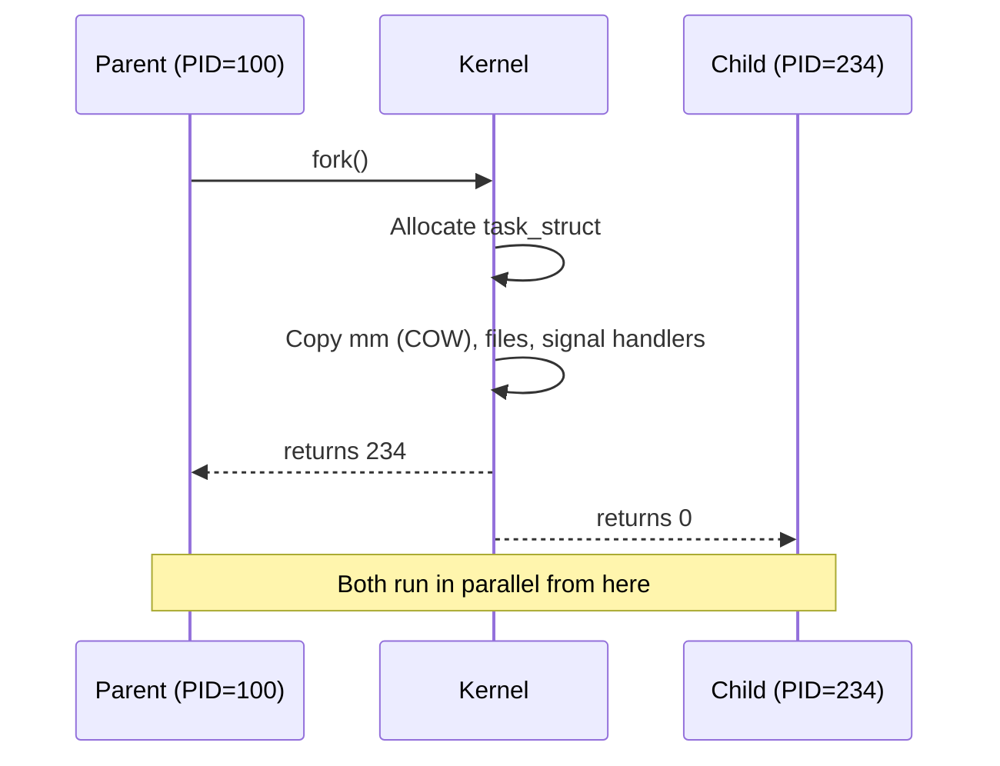
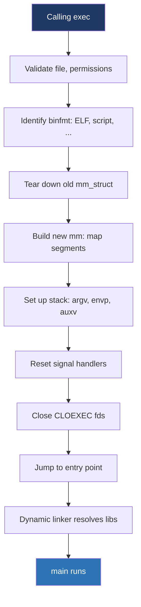
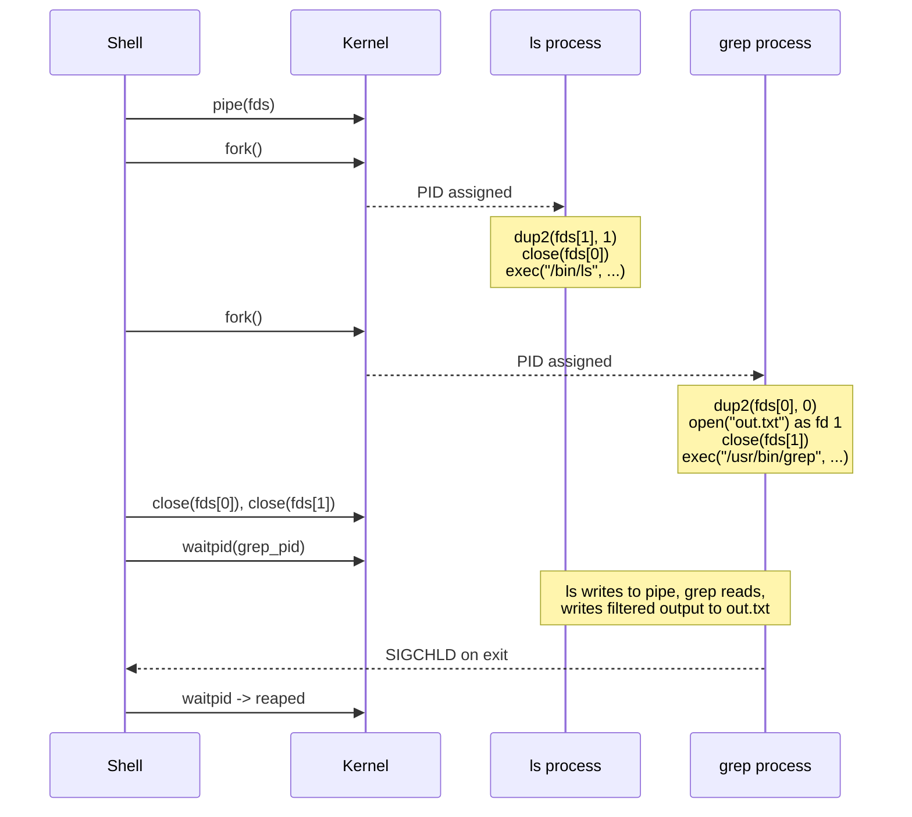

# Day 3 — fork, exec, wait

> **Week 1 · Foundations**
> Reading: OSTEP Chapter 5 (continued); TLPI Chapters 24–26 (Process Creation, Termination, Monitoring Children)

## Why this matters

`fork`, `exec`, and `wait` are the three syscalls that orchestrate process lifecycle on Unix. Understanding them in detail is non-negotiable for systems interviews — and writing correct shell-like or daemon code requires fluency with them. Today you will internalize what each does, why the design is what it is, and the subtle pitfalls.

## 3.1 fork() — creating a process

`fork()` creates a new process by duplicating the calling process. After `fork()`, both parent and child are running, executing the same code, with nearly identical state. They differ in exactly one observable way: `fork()` returns 0 in the child, the child's PID in the parent.

```c
pid_t pid = fork();
if (pid < 0) {
    perror("fork");
    exit(1);
} else if (pid == 0) {
    // CHILD
    printf("I'm the child, my pid is %d\n", getpid());
    exit(0);
} else {
    // PARENT
    printf("I'm the parent, child pid is %d\n", pid);
    waitpid(pid, NULL, 0);
}
```



### What gets copied?

After `fork()`, the child has:

- **A copy of the parent's address space**, but using **copy-on-write** (COW). Both processes' page tables initially point to the same physical pages, marked read-only. On first write, the kernel allocates a private copy. So `fork()` is cheap up front and only pays for actually-modified pages.
- **A copy of the file descriptor table**. Both processes see the same fds pointing to the same open file descriptions (so they share file offsets — important).
- **Copies of signal handlers**, signal mask, cwd, root, umask, environment, command line.
- **A new PID**. PPID set to the parent's PID.
- **Resource counters reset** (CPU time used, etc.).

### What's *not* copied?

- **Pending signals** are not inherited.
- **File locks** held by the parent are not inherited.
- **Memory locks** (`mlock`) are not inherited.
- **Timers** (`setitimer`, POSIX timers) are reset.
- **Threads other than the calling thread**: only the calling thread is duplicated. (This is a frequent gotcha in multi-threaded programs that fork.)

### The COW fork is cheap

A naive `fork()` would be horrendous — copying gigabytes of address space. COW means:
- The kernel sets every page in both processes' page tables to read-only.
- A write triggers a page fault.
- The fault handler allocates a new page, copies, marks one writable, and resumes the offending process.

For typical fork-then-exec patterns, almost no pages are written before exec discards everything. The result: forking a 4 GB process is a few microseconds.

## 3.2 exec() — replacing the program

`exec` doesn't create a process — it **replaces** the calling process's image with a new program. After `exec`, the PID stays the same, but the address space, code, data, and stack are all replaced. Open file descriptors persist (unless marked CLOEXEC); signal handlers reset to defaults (custom handlers don't survive, but ignore/default settings do).

There's a family of `exec` functions in libc — `execl`, `execlp`, `execle`, `execv`, `execvp`, `execve`. The kernel only implements one: `execve(path, argv, envp)`. The others are libc wrappers.

```c
char *argv[] = { "ls", "-l", NULL };
char *envp[] = { "PATH=/usr/bin", NULL };
execve("/bin/ls", argv, envp);
// only reaches here on failure
perror("execve");
exit(1);
```

### What exec does

1. Look up the file. Check permissions (executable bit + ACLs).
2. Read the first bytes; identify the format (ELF, `#!` script, custom binfmt).
3. Tear down the old `mm_struct`: zap all VMAs, free pages.
4. Build a new `mm_struct`. Map the new program's segments (code, data, bss).
5. Set up the stack: `argc`, `argv`, `envp`, the auxiliary vector.
6. For dynamic executables, load the dynamic linker (e.g., `/lib64/ld-linux-x86-64.so.2`) and jump to it. The dynamic linker maps shared libraries, performs relocations, then jumps to the program's `_start`.
7. Reset signal handlers (custom handlers → default; ignore stays ignore).
8. Close fds marked `O_CLOEXEC` or `FD_CLOEXEC`.



## 3.3 The fork+exec pattern

Why split into two calls? Why not a single `spawn(program, args)` like Windows?

The answer is **flexibility**. Between `fork` and `exec`, you can do arbitrary setup that the new program will inherit:

```c
pid_t pid = fork();
if (pid == 0) {
    // CHILD — runs before exec
    close(STDOUT_FILENO);
    open("output.txt", O_WRONLY | O_CREAT, 0644);  // becomes fd 1
    setpgid(0, 0);  // new process group
    dup2(saved_stderr, STDERR_FILENO);
    execve("/usr/bin/grep", argv, envp);
    _exit(127);  // exec failed
}
```

This pattern enables shell features like:
- **Redirection** (`cmd > file`): close stdout, open file as fd 1, then exec.
- **Pipes** (`a | b`): create a pipe, fork twice; in `a` make pipe write end fd 1, in `b` make pipe read end fd 0, then exec each.
- **Backgrounding** (`cmd &`): fork, child exec'd, parent doesn't wait.
- **setuid/setgid changes** for daemons that drop privileges before exec.

Windows' `CreateProcess` rolls all this into one call with many parameters; Unix's design is more orthogonal.

### Bonus: vfork() and posix_spawn()

`fork` is cheap thanks to COW, but it still duplicates page tables, which matters at scale. `vfork()` doesn't even copy page tables — child runs in parent's address space until it calls exec or `_exit`. Dangerous (any memory write in the child corrupts the parent), used only when speed is critical. `posix_spawn()` is a higher-level abstraction often implemented atop `vfork`.

## 3.4 wait() and waitpid()

A child that exits becomes a zombie until the parent reaps it. The reaping syscall is `wait()` (or `waitpid()`, the more flexible version):

```c
int status;
pid_t pid = waitpid(child_pid, &status, 0);  // blocks until child exits

if (WIFEXITED(status)) {
    printf("Exited with code %d\n", WEXITSTATUS(status));
} else if (WIFSIGNALED(status)) {
    printf("Killed by signal %d\n", WTERMSIG(status));
}
```

The macros (`WIFEXITED`, `WEXITSTATUS`, `WIFSIGNALED`, `WTERMSIG`) decode the status. This is awkward but historic.

`waitpid` options:

- `WNOHANG` — non-blocking. Returns 0 if no child has exited.
- `WUNTRACED` — also report stopped children (Ctrl-Z'd).
- `WCONTINUED` — also report continued children.

To wait for any child: `waitpid(-1, &status, 0)` (same as `wait(&status)`).

### SIGCHLD

When a child exits, the kernel sends `SIGCHLD` to the parent. The default action is to ignore it, but the parent typically installs a handler that calls `waitpid` in a loop with `WNOHANG`:

```c
void sigchld_handler(int sig) {
    int status;
    while (waitpid(-1, &status, WNOHANG) > 0) {
        // reaped one
    }
}
```

This is the standard pattern for servers that fork() per connection.

## 3.5 The shell as an example

A line in your shell — `ls -l | grep foo > out.txt` — exercises this whole API:



You should be able to write this code by the end of this study plan. It's a classic systems interview exercise.

## Hands-on (30 minutes)

1. Write and run a minimal `fork`+`exec`+`wait` program in C:
   ```c
   #include <stdio.h>
   #include <unistd.h>
   #include <sys/wait.h>
   int main() {
       pid_t pid = fork();
       if (pid == 0) {
           char *args[] = {"ls", "-l", NULL};
           execvp("ls", args);
           perror("exec");
           return 127;
       }
       int status;
       waitpid(pid, &status, 0);
       printf("child exited with %d\n", WEXITSTATUS(status));
       return 0;
   }
   ```
   Compile (`gcc -o fork_test fork_test.c`) and run.

2. Trace it: `strace -f ./fork_test 2>&1 | grep -E 'clone|execve|wait'`. See `clone()` (the underlying syscall), `execve()`, `wait4()`.

3. Demonstrate COW: write a program that allocates 1 GB, forks, and the child sleeps. Compare RSS of parent and child via `ps -o pid,rss,comm`. They should be near-identical and small (COW shares).

4. Demonstrate fd inheritance: open a file in the parent, fork, have the child write to that fd. The write goes to the same file. Now do `fcntl(fd, F_SETFD, FD_CLOEXEC)` before fork — the fd survives fork but is closed by exec.

5. Create a zombie deliberately and observe with `ps`:
   ```bash
   bash -c '( sleep 0 & ); sleep 10 & echo "parent sleeping, child is zombie"; ps -o pid,stat,comm | grep -E "Z|defunct"'
   ```

## Interview questions

### Q1. Walk me through what `fork()` does.

**Answer:** `fork()` creates a child process that's nearly identical to the parent. Specifically, the kernel:

1. Allocates a new `task_struct` and PID for the child.
2. Sets the child's PPID to the caller's PID.
3. Duplicates the parent's `mm_struct` — but uses copy-on-write: page tables in both processes initially point to the same physical pages, marked read-only. On a write fault, the kernel allocates a private copy.
4. Copies the file descriptor table — both processes see the same open files (and share file offsets).
5. Copies signal handler settings, cwd, umask, environment, etc.
6. Returns 0 in the child, the child's PID in the parent.

The COW mechanism is what makes fork practical: a 4 GB process can fork in microseconds because no pages are actually copied until written. In the typical fork-then-exec pattern, exec discards everything, so almost no pages are duplicated.

Common pitfall: only the calling thread is duplicated. If a multi-threaded process forks, the child has only one thread but the full memory state — which can leave locks held by other (now-gone) threads, deadlocking the child. That's why `pthread_atfork` exists, and why "fork in multi-threaded programs is dangerous" is a real warning.

### Q2. What does `exec()` do? What survives, what doesn't?

**Answer:** `exec` replaces the calling process's program image with a new one. The PID stays the same; almost everything else gets reset.

What survives:
- PID, PPID, PGID, SID
- Open file descriptors (unless marked `O_CLOEXEC` or `FD_CLOEXEC`)
- Working directory, root directory, umask
- Real and effective UID/GID (with caveats around setuid binaries)
- Pending signals (but not handlers)
- Resource limits, controlling terminal

What gets reset:
- All memory: code, data, heap, stack are replaced
- Signal handlers reset to default (handlers can't survive — they pointed into the old code). However, signals set to `SIG_IGN` stay ignored.
- Memory mappings (other than the new program's)
- Threads other than the calling one are gone (no other threads exist after exec)
- Timers (`alarm`, `setitimer`)

The sequence: kernel validates the file, identifies the binfmt (ELF, script via `#!`, custom), tears down the old `mm`, sets up the new one with the program's segments, configures the stack with `argc`/`argv`/`envp`/auxv, and jumps to the entry point (often the dynamic linker, which then loads shared libs and jumps to `main`).

### Q3. Why does Unix split process creation into `fork` + `exec` instead of a single spawn?

**Answer:** Flexibility. Between `fork` and `exec`, the child can do arbitrary setup that gets inherited by the new program — without needing a parameter for every possible adjustment.

Examples:
- **Redirection** (`cmd > file`): child closes stdout, opens the file, then execs. The new program automatically writes to the file because fd 1 is now the file.
- **Pipes** (`a | b`): create pipe, fork two children, wire each one's stdin/stdout to the pipe ends, then exec.
- **Privilege drop**: in a daemon, fork, child calls `setuid` to a non-root user, then execs.
- **Resource limits**: child sets `setrlimit`, then execs.
- **Namespace setup**: child enters new namespaces (`unshare`), then execs.

Windows `CreateProcess` takes a flag/parameter for each of these; the API is much larger and less composable. The Unix design follows from "small composable primitives" — the same philosophy as the shell pipeline.

The downside: `fork+exec` is more expensive than a single spawn (two syscalls, COW overhead even if minimal). For high-rate process creation, `posix_spawn` is the answer — it's an atomic spawn that can be implemented more efficiently.

### Q4. What's a zombie process? Why does the kernel keep them around?

**Answer:** When a process exits, the kernel releases most of its resources — memory, open files, etc. — but keeps the `task_struct` (or rather, just the parts needed to record exit status: exit code, killing signal, resource usage). This entry exists so the parent can call `wait()` and learn how the child finished. The entry that's awaiting reap is a zombie.

Once the parent calls `wait()`, the kernel releases the remaining `task_struct` and the zombie disappears. If the parent never reaps, zombies accumulate.

The kernel keeps them because exit status is data the parent typically wants. Think of `bash` running a command: it needs the exit code to set `$?`. The kernel can't just throw the status away when the child exits, because the parent might not have called `wait` yet.

If the parent itself dies without reaping, orphaned zombies are reparented to PID 1 (`init`/`systemd`), which always reaps. So zombies only persist when a long-lived parent is buggy.

A program with `signal(SIGCHLD, SIG_IGN)` (or `SA_NOCLDWAIT` via `sigaction`) tells the kernel "I don't care about exit statuses" — the kernel auto-reaps without producing zombies. Good for fire-and-forget child spawning.

## Self-test

1. After `fork()`, the parent has two threads; the child has how many?
2. A process opens a file, forks. Both processes write to that fd. Do their writes interleave at byte boundaries, or appear at distinct offsets?
3. What does `O_CLOEXEC` do? Why is it useful?
4. Which signal handlers survive `exec()`? Which do not?
5. Walk through the syscalls a shell makes to execute `cat /etc/passwd | wc -l`.
