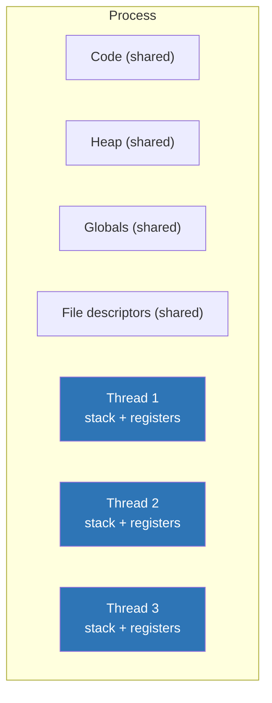
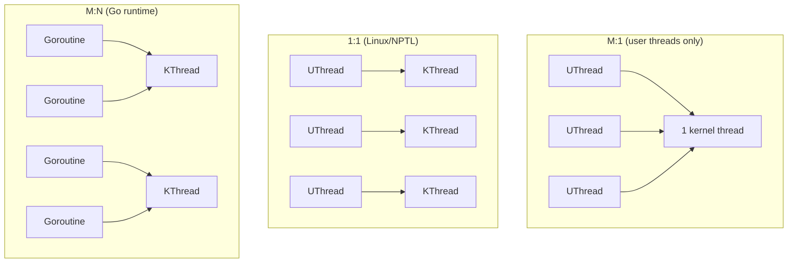

# Day 4 — Threads and the user/kernel split

> **Week 1 · Foundations**
> Reading: OSTEP Chapters 26–27 (Concurrency, Threads); TLPI Chapter 33 (Threads — Introduction)

## Why this matters

Threads are how a single process does multiple things at once. They're the foundation of every concurrent application and the source of most non-trivial bugs. Today: what threads actually are at the OS level, the user-space vs. kernel-space distinction, how Linux unifies threads and processes, and the basic pthread API.

## 4.1 What is a thread?

A thread is **an independent execution sequence within a process**. Concretely, each thread has:

- Its own **stack** (a separate memory region for local variables and call frames)
- Its own **CPU register state** (program counter, general-purpose registers)
- Its own **signal mask** and **errno**
- Possibly its own **thread-local storage** (TLS, accessed via `__thread` in C or `thread_local` in C++)

Threads in the same process **share**:

- The address space (heap, globals, code, mmap'd regions)
- File descriptors
- Signal handlers (the actions; per-thread there's a mask)
- Working directory, umask, etc.



## 4.2 Why threads?

Two classical reasons:

1. **Parallelism** — modern machines have many cores. To use them all, you need multiple execution sequences. One process with N threads can run N times faster on N cores (in the ideal case).
2. **Concurrency for I/O** — a thread blocked on I/O doesn't stall the whole program. Other threads keep running. (Async I/O — `epoll`, `io_uring` — is the alternative on a single thread; we'll cover it on Day 24.)

A third, more subtle reason: **separation of concerns**. A GUI app might have a UI thread, a network thread, a worker thread — each doing one thing well, communicating via queues.

## 4.3 User threads vs. kernel threads

Historically there was a debate over where to implement threads:

### User-level threads (M:1)

The thread library lives entirely in user space. The kernel sees one process and one schedulable entity. Switching between threads is cheap (just a function-call-like context switch in user space). But:

- A blocking syscall (one thread reads from disk) blocks **all threads** in the process.
- Cannot use multiple CPUs.

This was once called "green threads." Modern Go's goroutines are conceptually similar but with a sophisticated runtime that maps M goroutines onto N kernel threads (M:N).

### Kernel-level threads (1:1)

Each user thread is backed by a kernel-schedulable entity (a kernel-visible thread). Linux uses this model. Pros: blocking syscalls only block the calling thread; multiple threads run in parallel on multiple cores. Cons: every thread costs kernel resources (a `task_struct`, kernel stack); creation is slower than user-only threads.

### Hybrid (M:N)

Many user-level threads multiplexed onto a smaller number of kernel threads. Theoretically best of both worlds; complicated to implement well. Mostly abandoned by mainstream OSes (Solaris had it once, Linux abandoned NGPT for the simpler 1:1 NPTL).



**Linux uses 1:1 via NPTL (Native POSIX Thread Library)** — every `pthread_create` is a `clone()` syscall that creates a new kernel-visible task. This was one of the major Linux changes around 2002–2004 (replacing the older LinuxThreads library) and it dramatically improved performance and POSIX compliance.

## 4.4 The pthread API (core subset)

```c
#include <pthread.h>

void *worker(void *arg) {
    int id = *(int*)arg;
    printf("Hello from thread %d\n", id);
    return (void*)(long)id;  // pthread_join can collect this
}

int main() {
    pthread_t t1, t2;
    int id1 = 1, id2 = 2;

    pthread_create(&t1, NULL, worker, &id1);
    pthread_create(&t2, NULL, worker, &id2);

    void *ret1, *ret2;
    pthread_join(t1, &ret1);
    pthread_join(t2, &ret2);

    return 0;
}
```

Key calls:

| Call | Purpose |
|------|---------|
| `pthread_create` | Create a new thread |
| `pthread_join` | Wait for a thread to finish; collect return value |
| `pthread_detach` | Mark a thread to be cleaned up automatically (no join needed) |
| `pthread_exit` | Exit the calling thread |
| `pthread_self` | Get current thread's pthread_t |
| `pthread_cancel` | Request another thread to terminate |

**Detached vs. joinable** is the most-asked variant. A joinable thread keeps its return value waiting for `pthread_join`; a detached thread cleans itself up on exit. Mixing them up causes either resource leaks (forgot to join) or crashes (joining a detached thread).

## 4.5 Thread creation cost and limits

Linux thread creation is relatively cheap — about 10–50 µs per thread. But it's not free, and threads have non-trivial fixed cost:

- Default stack size: **8 MB** (virtual address space, but committed lazily). On a 64-bit system you can have many; on 32-bit you'd hit address-space limits around 500 threads.
- Each thread has a kernel stack (~16 KB) and a `task_struct` (~10 KB).

Practical limits:
- Hard limit: `cat /proc/sys/kernel/threads-max` (typically tens of thousands to millions)
- Per-user limit: `ulimit -u` (typically 4096+)
- Memory limit: stacks alone — 100K threads × 8 MB = 800 GB of address space (fine on 64-bit, fine for memory if mostly unused, but you'll exhaust other resources first).

For high concurrency, threads are expensive compared to event loops. The whole "C10K" problem motivated `epoll`, which lets one thread handle thousands of connections (Day 24).

## 4.6 Thread vs. process — when to choose

| Use threads when | Use processes when |
|------------------|-------------------|
| Need to share lots of state cheaply | Need isolation / fault containment |
| Coordinating tightly coupled work | Components are independent |
| Latency of communication matters (in-memory queues) | Components could conceivably run on different machines |
| Memory budget is tight | Want to limit blast radius of a crash |

In practice, modern designs often use **processes for isolation, threads within for parallelism**. Chrome's process-per-tab is a famous example: one bad tab can't crash the browser, but each tab uses threads internally.

## 4.7 Linux internals: tasks again

Recall from Day 2: in Linux, threads and processes are both `task_struct`s. `pthread_create` ultimately calls `clone()` with flags that share the address space, file descriptors, signal handlers, etc.:

```c
// Approximate flags pthreads uses
clone(child_func, child_stack,
      CLONE_VM | CLONE_FS | CLONE_FILES | CLONE_SIGHAND |
      CLONE_THREAD | CLONE_SYSVSEM | CLONE_SETTLS |
      CLONE_PARENT_SETTID | CLONE_CHILD_CLEARTID,
      arg);
```

The thread group ID (`tgid`) ties threads of the same process together. `getpid()` returns `tgid`; `gettid()` returns the per-thread `pid`. To the kernel, every thread is a "task" with a unique `pid`; userspace's "process ID" is the `tgid`.

## 4.8 Thread safety pitfalls

Just having multiple threads doesn't make code thread-safe. Common pitfalls:

- **Data races**: two threads access the same data, at least one writes, no synchronization → undefined behavior. We'll cover memory models on Day 19.
- **Non-reentrant functions**: classic offenders include `strtok` (uses internal state), `gmtime` (returns pointer to static buffer), `ctime`. Use `_r` variants (`strtok_r`, `gmtime_r`).
- **errno**: it's per-thread, so you don't have to worry. But thread-local storage is what makes that work.
- **Signals + threads**: fragile. Signals are delivered to "the process" but a specific thread handles them. Use `pthread_sigmask` to control which threads get which signals; ideally, dedicate one thread to signal handling and have the others block all signals.
- **fork() in threaded programs**: only the calling thread survives in the child. Locks held by other threads stay held — instant deadlock. Use `pthread_atfork` handlers, or avoid `fork` in threaded programs.

We'll dive deep into proper synchronization on Days 15–19.

## Hands-on (30 minutes)

1. Compile and run a basic pthread example. Save as `threads.c`:
   ```c
   #include <stdio.h>
   #include <pthread.h>
   #include <unistd.h>
   #include <sys/syscall.h>

   void *worker(void *arg) {
       printf("Thread: pid=%d, tid=%ld, pthread=%lu\n",
           getpid(), syscall(SYS_gettid), (unsigned long)pthread_self());
       sleep(2);
       return NULL;
   }

   int main() {
       pthread_t t1, t2;
       pthread_create(&t1, NULL, worker, NULL);
       pthread_create(&t2, NULL, worker, NULL);
       printf("Main: pid=%d, tid=%ld\n", getpid(), syscall(SYS_gettid));
       pthread_join(t1, NULL);
       pthread_join(t2, NULL);
       return 0;
   }
   ```
   Compile with `gcc threads.c -o threads -lpthread` and run.

2. Observe threads in `ps` and `top`:
   - `ps -eLf | grep threads` — see all three tasks (main + 2 threads).
   - In another terminal while it runs: `top -H -p $(pgrep threads)` (the `-H` shows individual threads).

3. Trace it: `strace -f ./threads 2>&1 | grep -E 'clone|exit' | head -20`. Note the `clone()` calls with their flags.

4. Inspect threads via `/proc`: `ls /proc/$(pgrep threads)/task/`. You'll see directories named by TID — one per thread.

5. Check thread limits on your system:
   - `cat /proc/sys/kernel/threads-max`
   - `ulimit -u`
   - `ulimit -s` (default stack size in KB)

## Interview questions

### Q1. What does a thread share with sibling threads, and what does it have to itself?

**Answer:** Threads in the same process share the **address space** (code, heap, globals, mmap'd regions), **file descriptors**, **signal handlers**, **working directory**, **resource limits**, and **process credentials** (UID/GID).

Each thread has its own:
- **Stack** (separate region of the shared address space)
- **CPU register state** (PC, general-purpose registers, FP state)
- **errno** and other thread-local storage
- **Signal mask** (which signals are blocked for this thread specifically)
- **Thread ID** (`gettid()`; on Linux, the kernel sees each thread as a task)

This sharing is what makes thread communication cheap — they read each other's data directly. It's also what makes concurrency dangerous — one thread can corrupt another's state without any explicit interaction.

### Q2. What's the difference between user threads and kernel threads?

**Answer:** Two different things people sometimes mean:

(a) **User-level vs. kernel-level threading models.** User-level threads are scheduled entirely in user space; the kernel sees one schedulable entity. Pros: fast context switches. Cons: can't use multiple CPUs, blocking I/O blocks all threads. Kernel-level threads (Linux's NPTL model) are 1:1 with kernel scheduling entities — each `pthread_create` is a `clone()` syscall. Linux uses 1:1.

(b) **User threads vs. kernel threads** as in Linux internals: user threads are tasks created by user processes (which is what your program creates with `pthread_create`); "kernel threads" specifically are tasks that exist only in kernel mode (no user context, no `mm_struct` — they live in the kernel's address space). Examples: `kswapd` (memory reclaim), `kworker` (workqueue helpers). Visible as `[name]` in `ps` (square brackets indicate kernel threads).

If asked, clarify which interpretation. The user-level vs. kernel-level scheduling question is more often asked in OS courses; the user vs. kernel-thread Linux distinction comes up in kernel-internals interviews.

### Q3. Linux has unified threads and processes — what does that mean?

**Answer:** The kernel has only one schedulable abstraction: the `task_struct`. A "process" is a task with its own address space; a "thread" is a task that shares an address space with sibling tasks. The same syscall — `clone()` — creates both, with flags determining what's shared.

The flags include:
- `CLONE_VM` — share `mm_struct` (address space)
- `CLONE_FILES` — share file descriptor table
- `CLONE_FS` — share cwd, root, umask
- `CLONE_SIGHAND` — share signal handler dispositions
- `CLONE_THREAD` — same thread group (same `tgid`, parent for waitpid purposes is the original parent)

`fork()` is `clone()` with no sharing flags (effectively); `pthread_create()` ultimately calls `clone()` with the full set of CLONE_VM/FILES/FS/SIGHAND/THREAD/SETTLS/etc.

This unification is elegant but has consequences. `ps -ef` shows only thread group leaders by default; `ps -eLf` shows every task. To the kernel scheduler, threads of the same process compete with threads of other processes on equal footing — there's no "process priority that splits among threads."

### Q4. How many threads can a process have? What limits it?

**Answer:** Several limits stack:

1. **System-wide**: `/proc/sys/kernel/threads-max`. Often a few tens of thousands to millions on modern Linux.
2. **Per-user**: `ulimit -u` (RLIMIT_NPROC). Typically 4096 by default; configurable.
3. **Address space**: each thread needs a stack. Default 8 MB; on 64-bit a process has 128 TB of virtual address space, so practical limit is ~16M threads (way more than other limits).
4. **Memory commit**: even if stacks are virtual, kernel structures cost real memory. ~30 KB per thread (kernel stack + `task_struct` + thread-local data) means 100K threads ≈ 3 GB of kernel memory.
5. **PID space**: `/proc/sys/kernel/pid_max` (default 4M on 64-bit). Each thread takes a PID.

In practice, a few thousand threads is fine; tens of thousands stresses the scheduler; hundreds of thousands is usually wrong (use async I/O instead). The architectural answer: if you're creating thousands of threads to hold blocking connections, consider `epoll`, `io_uring`, or a green-thread runtime (Go) instead.

## Self-test

1. A thread has a 64-byte global variable open to write. A second thread reads it. Without synchronization, what could go wrong even on a single CPU core?
2. A multi-threaded program calls `fork()`. The child has how many threads? What is the danger?
3. What's the difference between `pthread_join` and `pthread_detach`? Can a detached thread be joined?
4. Why is `strtok` not thread-safe? What's the alternative?
5. On Linux, how do you find the kernel thread ID (TID) of the current pthread? How is it different from `pthread_self()`?
