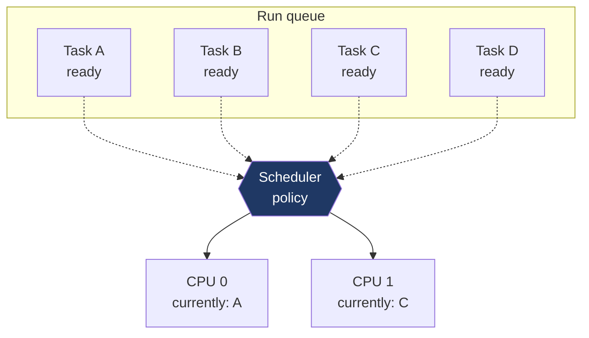
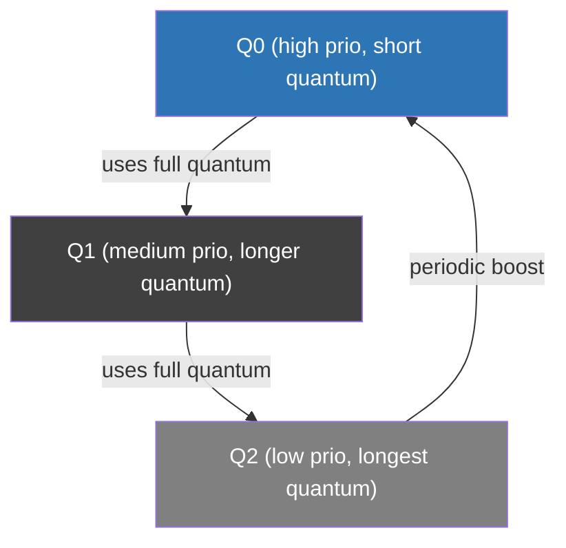
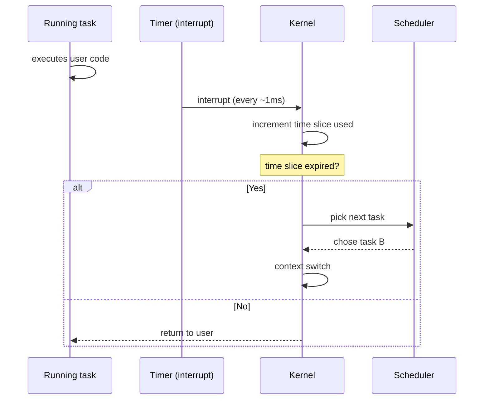

# Day 5 — CPU scheduling fundamentals

> **Week 1 · Foundations**
> Reading: OSTEP Chapters 7–8 (Scheduling: Introduction; Multi-Level Feedback Queue)

## Why this matters

There are always more tasks ready to run than CPUs to run them on. The **scheduler** decides who runs, when, and for how long. Today: classical scheduling concepts that still appear in every interview, even though the specific algorithms have evolved. Tomorrow we'll cover Linux's CFS and friends.

## 5.1 The scheduler's job

Given a set of runnable tasks and a set of CPUs, pick which task runs on which CPU at each moment. The answer is constrained by goals that conflict:

- **Throughput** — finish as much work as possible
- **Latency / response time** — interactive tasks should feel snappy
- **Fairness** — no task starves
- **Predictability** — real-time tasks must meet deadlines

You can't optimize all of these simultaneously. Scheduler design is a long history of tradeoffs.



## 5.2 Key metrics

Define some terms used in every scheduling discussion:

- **Turnaround time** = (completion time) − (arrival time). Total time from when a task arrived to when it finished.
- **Response time** = (first scheduled time) − (arrival time). How long until the task first runs.
- **Wait time** = total time spent ready but not running.
- **Throughput** = completed tasks per unit time.

Different workloads emphasize different metrics. Batch processing cares about turnaround and throughput. Interactive systems care about response time. Real-time systems care about meeting deadlines (a kind of upper-bound on response time).

## 5.3 Classical algorithms

### FIFO / FCFS (First-Come, First-Served)

Run tasks in arrival order until each finishes. Simple, no preemption.

```
arrival:  A(t=0,len=10), B(t=1,len=1), C(t=2,len=1)
schedule: |--------A--------|B|C|
average turnaround: (10 + 10 + 10) / 3 = 10
```

**Convoy effect**: a long task ahead of short ones makes everyone wait. B arrived needing only 1 unit but must wait 9 for A. Average response time is terrible.

### SJF (Shortest Job First)

Pick the shortest remaining task. Optimal for average turnaround time **if you know job lengths in advance** — which you usually don't. Modern schedulers approximate this by tracking past behavior.

### Round Robin (RR)

Every task gets a fixed time slice (quantum); when it expires, the scheduler moves to the next runnable task.

```
quantum=2, tasks: A(len=10), B(len=4), C(len=4)
schedule: AABBCCAABBCCAACCAA...
```

Pros: bounded response time (≤ quantum × N). Cons: many context switches if quantum is small; near-FIFO behavior if quantum is huge. Choosing quantum is the central tradeoff.

Modern Linux's CFS doesn't use a fixed quantum; it computes a dynamic one based on load.

### Priority scheduling

Each task has a priority; scheduler picks highest priority. Pros: high-priority work gets done first. Cons:

- **Starvation**: low-priority tasks may never run.
- **Priority inversion**: high-priority task blocked waiting for resource held by low-priority task. Classic example: Mars Pathfinder. Fixed via priority inheritance (the resource holder temporarily gets the waiter's priority).

### Multi-Level Feedback Queue (MLFQ)

Several queues with different priorities; tasks move between queues based on behavior:



**Heuristics**:
- Short, interactive tasks (don't use full quantum — they block on I/O) stay in high-priority queue → low response time.
- CPU-bound tasks burn through quantum → demoted to lower queue → less interactive priority.
- Periodic priority boost prevents starvation.

MLFQ approximates SJF without knowing job lengths — it uses *recent behavior* as a predictor. This was the basis of many real schedulers including BSD, classic Linux O(1), and Windows.

## 5.4 Preemptive vs. non-preemptive

A **preemptive** scheduler can interrupt a running task to run another. A **non-preemptive** scheduler waits for the current task to yield (block on I/O, exit, sleep).

Modern OSes are preemptive — the timer interrupt fires periodically (typically every 1–10 ms), giving the scheduler an opportunity to switch. Without preemption, a CPU-bound program could monopolize the CPU.



## 5.5 I/O-bound vs. CPU-bound

- **CPU-bound**: spends most time computing. Wants long uninterrupted runs.
- **I/O-bound**: spends most time blocked on I/O (reading files, network). When ready, wants quick scheduling so the I/O can issue and the task can sleep again.

Good schedulers favor I/O-bound tasks for responsiveness — they don't run long anyway, so giving them priority doesn't hurt CPU-bound throughput much. This is what MLFQ encodes.

## 5.6 Multi-CPU / multi-core scheduling

With N CPUs, scheduling becomes more complex:

- **Per-CPU run queues** — each CPU has its own queue, reducing contention. Linux CFS does this.
- **Load balancing** — periodically move tasks between CPUs to keep load even.
- **CPU affinity** — preference for a task to run on a specific CPU (cache locality). `taskset` and `sched_setaffinity` control this.
- **NUMA awareness** — on machines with multiple memory nodes, prefer the CPU near the task's memory.

Cache locality matters a lot. A task that ran on CPU 3 has data cached in CPU 3's L1/L2/L3. Migrating to CPU 5 means cold caches → slower. Schedulers try to keep tasks on the same CPU when possible.

## 5.7 Real-time scheduling

Real-time tasks must meet deadlines. There are two flavors:

- **Soft real-time**: missing a deadline is bad but recoverable (audio glitch).
- **Hard real-time**: missing a deadline is failure (anti-lock brake controller).

Linux supports real-time via `SCHED_FIFO` and `SCHED_RR` policies (POSIX-defined):

- `SCHED_FIFO`: priority-based; a higher-priority RT task always preempts lower. Within a priority level, run until block or yield.
- `SCHED_RR`: like FIFO but with round-robin within a priority level (time-sliced).
- `SCHED_DEADLINE` (Linux-specific): EDF (Earliest Deadline First) scheduling. Tasks declare runtime, period, deadline; the scheduler admission-controls and dispatches accordingly.

These coexist with normal `SCHED_OTHER` (CFS). RT tasks always run before normal tasks.

**Caveat**: Linux is not a hard real-time OS. Interrupt handlers, kernel locks, and various deferred work can introduce unbounded latency. For hard real-time, you need `PREEMPT_RT` patches or a true RTOS (VxWorks, QNX, FreeRTOS).

## 5.8 Anti-patterns and pitfalls

- **Spinning instead of blocking**: a busy-wait loop wastes CPU. Yield (`sched_yield`) is rarely the right answer either — it's better to block on a condition variable / event so the scheduler can run something else.
- **Setting RT priority on a regular app**: you can starve system processes. The kernel's RT throttling protects against the worst (default: RT can't use more than 95% of CPU), but it's still a bad habit.
- **Many short-lived threads**: thread creation/destruction has cost. Thread pools amortize.
- **Pinning to a CPU when you don't need to**: limits the scheduler's flexibility. Only pin if you have a measured reason (e.g., NUMA-sensitive workload, isolated cores).

## Hands-on (30 minutes)

1. See current scheduler stats: `cat /proc/schedstat | head -5`. Read `Documentation/scheduler/sched-stats.rst` to understand columns.

2. See per-task scheduling info: `cat /proc/$$/sched`. Look at `se.sum_exec_runtime`, `nr_switches`, `nr_voluntary_switches`, `nr_involuntary_switches`.

3. Watch a task's scheduling: `pidstat -t -p $$ 1 5` (per-thread CPU stats).

4. Set CPU affinity: `taskset -c 0 stress --cpu 1` (binds to CPU 0). Observe with `top -p $(pgrep stress)` then press `f`, select `P` (last used CPU).

5. Try changing scheduling policy on a test program (needs root for SCHED_FIFO):
   ```bash
   chrt -f 50 sleep 60 &
   chrt -p $!         # show policy/priority
   ```
   Then `chrt -p -o 0 $!` to switch back to OTHER.

6. Inspect run queue: `cat /proc/sched_debug | head -50` (lots of detail about CFS internals).

## Interview questions

### Q1. What goals does a scheduler try to achieve, and why are they in tension?

**Answer:** A scheduler tries to balance:

- **Throughput**: get the most work done per unit time. Favors long uninterrupted runs (no context-switch overhead).
- **Response time / latency**: react quickly to interactive events. Favors frequent preemption to give every task a turn.
- **Fairness**: no task starves; everyone gets a reasonable share.
- **Predictability / real-time**: deadline-sensitive tasks must run on time.

The tension: maximizing throughput means running CPU-bound tasks for long uninterrupted slices, which delays interactive tasks. Maximizing fairness with strict round-robin gives bad cache locality and poor I/O-bound responsiveness. Real-time priority can starve normal tasks.

Real schedulers like Linux's CFS are heuristic compromises: track per-task CPU usage (vruntime); always run the task that's used the least so far (fairness); but boost interactive tasks (low CPU usage → low vruntime → priority); use per-CPU queues with load balancing (throughput + cache locality).

### Q2. What's a context switch and how expensive is it?

**Answer:** A context switch is the kernel's act of switching the CPU from running one task to running another. It involves:

1. Saving the outgoing task's CPU registers (general-purpose, FPU/SIMD if used) into its `task_struct`.
2. If switching address spaces, updating CR3 (page-table base on x86). This invalidates non-global TLB entries — major cost.
3. Switching the kernel stack pointer.
4. Restoring the incoming task's registers.
5. Resuming execution.

Direct cost: 1–10 µs typically. Indirect cost (cache pollution, TLB misses) can be several times higher in practice — the new task starts cold.

A context switch between threads of the same process is faster than between processes (no CR3 change → TLB stays warm). On Linux, `vmstat 1` shows `cs` (context switches per second); a normal idle system might show 100–1000, a busy server 10K–100K, a heavily threaded app could go higher. If `cs` is alarmingly high, it's often a sign of lock contention or too-fine-grained threading.

### Q3. What's the difference between SCHED_OTHER, SCHED_FIFO, and SCHED_RR?

**Answer:** Three POSIX scheduling policies on Linux:

- **SCHED_OTHER** (also called SCHED_NORMAL): the default. Tasks share the CPU fairly via CFS. Affected by `nice` value (range −20 to +19, lower = more CPU).
- **SCHED_FIFO**: real-time. Priorities 1–99. Higher-priority RT tasks always preempt lower. Within the same priority, a task runs until it blocks or yields — it does **not** time-slice. Risk: a buggy FIFO task can monopolize a CPU.
- **SCHED_RR** (round-robin RT): like FIFO but with time-slicing within a priority level. The default RR quantum is 100 ms (configurable via `/proc/sys/kernel/sched_rr_timeslice_ms`).

RT policies (FIFO, RR) always preempt SCHED_OTHER. RT priority 1 still runs before any nice -20 task. Linux protects itself with RT throttling: by default, RT tasks can't consume more than 950 ms per 1000 ms (`/proc/sys/kernel/sched_rt_runtime_us` and `_period_us`), preventing total starvation of normal work.

There's also `SCHED_DEADLINE` (EDF, deadline-based) and `SCHED_IDLE` (very low priority, only runs when nothing else does), and `SCHED_BATCH` (like OTHER but biased against being treated as interactive).

### Q4. What's priority inversion and how do you fix it?

**Answer:** Priority inversion occurs when a high-priority task is blocked waiting for a resource held by a low-priority task — and a medium-priority task prevents the low-priority one from running, thus indefinitely blocking the high-priority one.

Concrete scenario:
- Low-priority task L acquires lock M.
- High-priority task H starts, tries to acquire M, blocks.
- Medium-priority task M' starts running. It doesn't need the lock, but it preempts L (H is blocked, L is the only task that could run). M' runs and runs.
- L can't run (M' is higher prio). H can't run (waiting for M, which only L can release). Deadlock-ish: H is "inverted" below M'.

Famous occurrence: Mars Pathfinder, 1997. The rover kept resetting because of priority inversion between a high-prio info bus task and a low-prio meteo task with a medium-prio communications task in between. Fixed remotely by enabling priority inheritance.

**Solutions**:
- **Priority inheritance**: when a high-prio task blocks on a lock, the lock holder temporarily gets boosted to the waiter's priority. This lets the holder finish quickly and release. Linux's PTHREAD_PRIO_INHERIT mutexes implement this.
- **Priority ceiling**: each lock has a priority ceiling = highest priority of any task that might use it. Acquiring the lock raises your priority to the ceiling. Prevents inversion preemptively.
- **Disable preemption** while holding the lock: only viable for very short critical sections (kernel uses this).

For application code on Linux, use `pthread_mutexattr_setprotocol(&attr, PTHREAD_PRIO_INHERIT)` if you have RT tasks contending for shared locks with non-RT tasks.

## Self-test

1. Why is shortest-job-first optimal for average turnaround time? Why is it impractical?
2. A round-robin scheduler with quantum 10 ms has 100 runnable tasks. What's the worst-case time before any specific task gets a turn?
3. Define starvation. Give two scheduling policies that risk starvation; one that prevents it.
4. Why is cache locality a scheduling concern? What does it cost when a task is migrated to a different CPU?
5. A real-time SCHED_FIFO priority-50 task is running. A SCHED_OTHER nice -20 task becomes runnable. Which one runs? What if a SCHED_FIFO priority-60 task becomes runnable?
