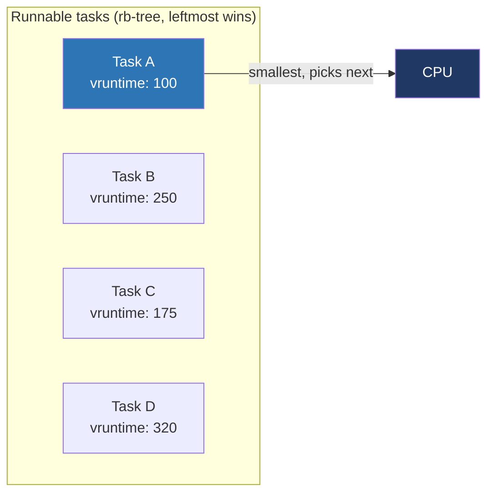
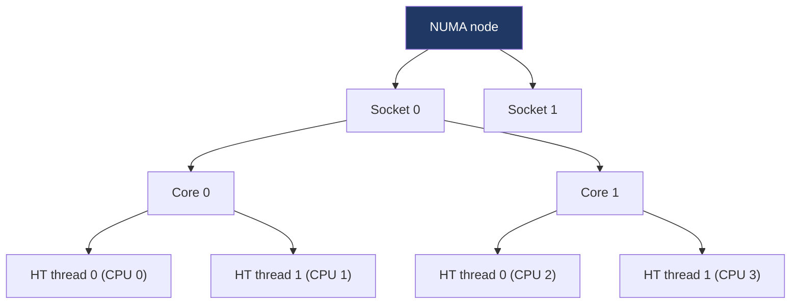

# Day 6 — Linux scheduling: CFS and friends

> **Week 1 · Foundations**
> Reading: LKD Chapter 4 (Process Scheduling); LWN articles on CFS

## Why this matters

Yesterday: classical scheduling. Today: how Linux actually does it. CFS — the **Completely Fair Scheduler** — has been the default since 2.6.23 (October 2007) and remains so today. Understanding CFS gets you past the textbook level into practical kernel knowledge that interview panels appreciate.

## 6.1 The big idea: virtual runtime

CFS takes a different approach from priority queues or MLFQ. Instead of categorizing tasks by priority and behavior, it tracks how much CPU each task has "used so far" — a per-task counter called `vruntime`. The rule is simple:

> **Run the runnable task with the smallest vruntime.**

That's it. Fairness emerges automatically: tasks that have used little CPU get preference; tasks that have used a lot fall behind. Over time, all tasks converge to roughly equal `vruntime`.



CFS stores runnable tasks in a **red-black tree** keyed by `vruntime`. The leftmost node (smallest key) is always the next to run. Operations are O(log N).

## 6.2 What is vruntime exactly?

`vruntime` (virtual runtime) is wall-clock time spent running, **scaled by priority**. For a default-priority task (nice 0), `vruntime` increases at the same rate as wall time. For a higher-priority task (nice -5), `vruntime` increases more slowly — so the task appears to be falling behind, and CFS keeps picking it. For a lower-priority task (nice +5), `vruntime` increases faster — the task gets less CPU.

Specifically, the increment is:

```
delta_vruntime = delta_exec * NICE_0_LOAD / weight(task.nice)
```

The weight table is geometric: each step in nice multiplies CPU share by ~1.25×. So nice-1 task gets ~10% more CPU than nice-0; nice-19 gets ~2% (1/55) of a nice-0's CPU.

When a task is created, it's given a `vruntime` close to the minimum currently in the tree (so it doesn't leapfrog) — preventing newly-spawned tasks from dominating.

## 6.3 Time slices in CFS

CFS doesn't use a fixed quantum. Instead, it has a **target latency** (`sched_latency_ns`, default 6 ms on small systems) — the period within which all runnable tasks should get a chance to run. Each task's slice is:

```
slice = target_latency * (task.weight / total.weight)
```

So with 4 equal tasks and 6 ms target latency, each gets 1.5 ms. With 12 tasks, each would get only 0.5 ms — but CFS clamps slices at `min_granularity` (default 0.75 ms) to avoid excessive context-switching. Above ~8 tasks, the effective period grows.

The running task gets preempted when:

- It used its slice **and** its `vruntime` exceeds the leftmost task's by some threshold.
- A waking task lands with smaller `vruntime` than current's (interactive wakeup).
- It blocks voluntarily.

## 6.4 Why CFS is good for interactivity

A task that sleeps a lot (waiting on input, network, disk) accumulates little `vruntime`. When it wakes up, its `vruntime` is small relative to CPU-bound tasks, so it runs immediately. This is exactly the responsiveness behavior MLFQ tried to engineer with multi-level queues — CFS gets it for free from the math.

There is a subtle bound: a task waking up after a long sleep should not have vruntime *too* far below the minimum, or it would dominate the CPU for ages. CFS sets the woken task's vruntime to `max(task.vruntime, min_vruntime - sched_latency)` — so it gets a boost but not unlimited.

## 6.5 Multi-CPU CFS

Each CPU has its own run queue (red-black tree). Tasks are scheduled per-CPU, which avoids the lock contention of a global queue. But this introduces imbalance: one CPU might have 10 runnable tasks while another has 1.

CFS runs **load balancing** periodically:

- On every scheduler tick, check if the local queue is "underloaded" relative to neighbors.
- If so, pull tasks from the busiest neighbor.
- Idle CPUs aggressively pull (idle balance).
- Wake-up balance: when a task is woken, sometimes place it on a different CPU if the original is busy.

The exact load metric is **PELT** (Per-Entity Load Tracking): a smoothed average of recent CPU usage per task and per run queue. It's an exponential moving average that decays on idle and grows on running. Load balancing uses these PELT signals.

Cache locality is preserved by:
- Preferring to keep tasks on their last CPU (the "wake affine" heuristic).
- NUMA awareness — prefer CPUs near the task's memory.
- Sched domains — a hierarchy (SMT siblings → core → socket → NUMA node) that biases toward "close" migrations.



The scheduler prefers migrating between SMT siblings (cheapest, share L1) over migrating across sockets (most expensive, cold caches and crossing the interconnect).

## 6.6 Other Linux scheduling classes

CFS handles `SCHED_OTHER` (default), `SCHED_BATCH`, and `SCHED_IDLE`. Two other classes coexist:

### Real-time (rt)

`SCHED_FIFO` and `SCHED_RR`. Live on a separate per-CPU run queue, scheduled by priority. Always preempt CFS tasks. Throttled by default: 950 ms per 1000 ms ceiling.

### Deadline (dl)

`SCHED_DEADLINE`, added in 3.14 (2014). EDF (Earliest Deadline First) with admission control. Tasks declare `(runtime, deadline, period)` — the kernel verifies the system can satisfy them, then the scheduler enforces. Used in audio, robotics, multimedia.

The combined picture: at every scheduling decision, the kernel asks **deadline first**, then **rt**, then **CFS**, then **idle**. Within each class, the class's own logic picks the task.

## 6.7 sched_ext (BPF-based schedulers)

A 2024 development worth knowing: **sched_ext** (`SCHED_EXT`) lets you write a scheduler in BPF and load it without rebuilding the kernel. Production schedulers like Meta's `scx_layered`, Google's `scx_lavd`, and others use this. Mainlined in 6.12.

Implication for interviews: the era of "the kernel has one scheduler called CFS" is ending. CFS remains the default; sched_ext is the new playground for experimentation. If asked, mention this — it shows currency.

## 6.8 Group scheduling and cgroups

Without group scheduling, CFS shares CPU fairly **across tasks**. So 100 web-server worker threads will collectively dominate over a single SSH session. That's not always desired.

**CPU cgroups** add a layer of grouping. Define groups, assign tasks to them, control each group's CPU share. CFS then fairly shares CPU **across groups**, then within each group.

```
/sys/fs/cgroup/
├── system.slice/        (system services)
├── user.slice/
│   ├── user-1000.slice/ (your user)
│   └── user-1001.slice/
└── kubepods.slice/      (containers)
```

Each cgroup has `cpu.weight` (cgroup v2; or `cpu.shares` v1) — its relative weight. Containers and systemd units use this heavily. `cpu.max` enforces a hard quota ("at most 200% of one CPU").

This is what makes containers fair: a container with `cpu.weight=100` competes evenly with another `cpu.weight=100` regardless of how many threads each runs internally.

## 6.9 Tunables

A handful of `/proc/sys/kernel/sched_*` knobs. You usually shouldn't touch them, but knowing they exist:

- `sched_min_granularity_ns` — minimum slice (default 0.75 ms). Lower = better latency, more switches.
- `sched_latency_ns` — target period (default 6 ms; scales with CPU count).
- `sched_wakeup_granularity_ns` — minimum vruntime gap before a wakeup preempts current.
- `sched_migration_cost_ns` — how "fresh" a task must be to be considered cache-hot.
- `sched_rt_runtime_us`, `sched_rt_period_us` — RT throttling.

## 6.10 Common interview confusions

**"Linux uses round-robin"** — not for normal tasks. SCHED_RR is RR within RT priorities; CFS is fundamentally different.

**"Higher priority always runs first"** — only true for RT classes. In CFS, "higher priority" (lower nice) means more CPU share, not strict precedence. A nice-0 task and a nice-5 task will both run; the nice-0 just runs about 2.5× more.

**"CFS is O(1)"** — the *predecessor* (Ingo Molnar's O(1) scheduler, ca. 2002–2007) was. CFS is O(log N) per operation — but with such small constants and modern hardware that it's effectively the same in practice.

## Hands-on (30 minutes)

1. See your scheduling policy and priority: `chrt -p $$`. By default it's `SCHED_OTHER` priority 0.

2. Look at sched_debug:
   ```bash
   sudo cat /proc/sched_debug | head -100
   ```
   Find a CPU's `cfs_rq` section. Note `nr_running`, `min_vruntime`, the listed tasks.

3. Look at one of your own tasks:
   ```bash
   cat /proc/$$/sched | head -30
   ```
   Note `se.vruntime`, `se.sum_exec_runtime`, `nr_voluntary_switches`, `nr_involuntary_switches`. Voluntary = blocked for I/O; involuntary = preempted.

4. See cgroup CPU control on your system: `cat /sys/fs/cgroup/cpu.weight 2>/dev/null` (cgroup v2) or `cat /sys/fs/cgroup/cpu/cpu.shares` (v1). Inspect a systemd service: `systemctl show sshd -p CPUWeight`.

5. Watch run-queue length over time:
   ```bash
   vmstat 1 5
   ```
   The `r` column is the count of runnable tasks. If consistently > number of CPUs, you're CPU-bound.

6. (Optional) See PELT signals if your kernel exposes them: `cat /proc/sched_debug | grep -A2 'load_avg'`.

## Interview questions

### Q1. How does CFS work?

**Answer:** CFS — the Completely Fair Scheduler — tracks per-task **vruntime** (virtual runtime), a measure of CPU consumed scaled by priority. It always picks the runnable task with the smallest vruntime, so tasks naturally take turns; the one most "behind" runs next.

Implementation: tasks are stored in a per-CPU red-black tree keyed by vruntime, so picking the leftmost (smallest key) is O(log N). When a task runs, its vruntime increments; when it falls behind the new leftmost, it's preempted.

The scheduler aims for a target latency (~6 ms by default) — the period in which all runnable tasks should run at least once. Each task's slice within that period is proportional to its weight (derived from its nice value).

I/O-bound tasks naturally win: they sleep a lot, accumulate little vruntime, so they get high effective priority on wake. CPU-bound tasks accumulate vruntime fast, fall toward the right of the tree, run less often. There's no separate "interactive" detection — it falls out of the math.

CFS replaced the older O(1) scheduler in 2.6.23 (2007). It's per-CPU run queues with periodic load balancing for SMP. Multi-class kernel: real-time (FIFO/RR) and deadline (EDF) classes preempt CFS.

### Q2. What does the `nice` value control? How much CPU does nice -10 vs. nice 10 get?

**Answer:** `nice` shifts a task's CPU share. Range: −20 (highest priority) to +19 (lowest). Default 0. Negative requires CAP_SYS_NICE (root, typically).

Internally, each nice value maps to a weight via a geometric table — each step is roughly 1.25×. Approximate weights:

- nice 0: weight 1024
- nice -10: weight ~9548 (~9× more CPU share)
- nice +10: weight ~110 (~9× less)

So a nice -10 task and a nice +10 task running together split CPU about 81:1. Two nice-0 tasks split 50:50. Nice 0 vs. nice +5: roughly 3:1.

`nice` doesn't change scheduling class; both nice-20 and nice+19 are SCHED_OTHER. It only adjusts the weight used in vruntime accounting and slice computation.

### Q3. How does the scheduler handle SMP/multi-core?

**Answer:** Each CPU has its own run queue (with its own rb-tree of CFS tasks), so most scheduling decisions are local — no global lock contention. The challenge is keeping load balanced:

- **Periodic load balancing**: on every scheduler tick, an idle CPU or a "balance domain leader" checks neighbor load. If imbalanced, pull tasks from the busiest neighbor.
- **Idle balance**: when a CPU goes idle, it aggressively looks for tasks to pull from busier CPUs.
- **Wake balance**: when a sleeping task wakes, the kernel may choose a different CPU than where it slept — preferring an idle CPU close in the topology.

The topology matters: SMT siblings share L1/L2 (cheap migrations); cores in a socket share L3; sockets share a NUMA node; cross-NUMA migrations are expensive. The scheduler uses **sched domains** — a hierarchy capturing this — to bias migrations toward "close" moves.

The load metric is **PELT** (Per-Entity Load Tracking) — a per-task and per-run-queue exponential moving average of utilization. PELT signals also feed into cpufreq governors for dynamic frequency scaling.

Cache locality is preserved by `sched_migration_cost_ns` — tasks migrated more recently than this threshold are treated as cache-hot, less attractive to move.

### Q4. What's the difference between SCHED_OTHER, SCHED_BATCH, SCHED_IDLE?

**Answer:** All three are CFS-managed (not real-time), but with different biases:

- **SCHED_OTHER** (a.k.a. SCHED_NORMAL): the default. Standard CFS behavior. Wake-time vruntime adjustment makes interactive tasks responsive.
- **SCHED_BATCH**: like OTHER but tells the scheduler "this task is non-interactive." The kernel skips the interactive wake-up boost. Useful for build farms, batch processing — slightly less context switching, more throughput, at cost of latency.
- **SCHED_IDLE**: very low priority. Only runs when nothing else (in the same CPU's run queue) wants to run. Even nice +19 normal tasks beat SCHED_IDLE. Useful for "spare cycles" workloads (BOINC, slow background indexers).

Switch via `sched_setscheduler` (or `chrt -b` for batch, `chrt -i` for idle).

In contrast, SCHED_FIFO/SCHED_RR are real-time classes that always preempt CFS tasks regardless of nice.

## Self-test

1. Two tasks: task A is nice 0, task B is nice 0. Both are CPU-bound. After 1 second of contention, what's the approximate ratio of CPU each got? What if B is nice 5?
2. CFS picks the task with smallest vruntime. If a task sleeps for 10 minutes, its vruntime is now far below `min_vruntime`. What stops it from monopolizing the CPU on wakeup?
3. What's the difference between the rb-tree CFS uses and the priority queue old O(1) scheduler used? Why was the change made?
4. A container has `cpu.weight=100`. Another has `cpu.weight=400`. Both are saturated. How does CPU split?
5. SCHED_DEADLINE has admission control. What does that mean and why is it necessary?
