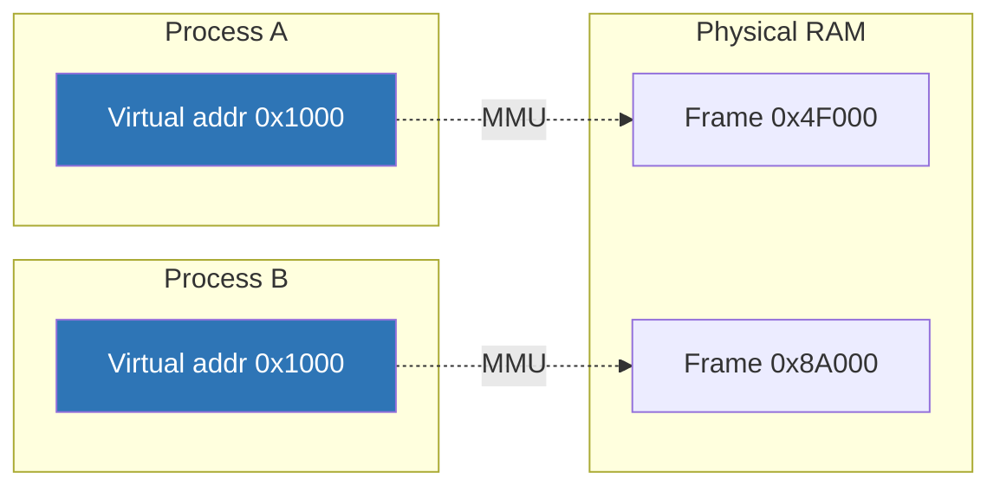

# Day 8 — Address spaces and virtual memory

> **Week 2 · Memory**
> Reading: OSTEP Chapters 13–15 (Address Spaces, Memory API, Address Translation)

## Why this matters

Virtual memory is the single most-asked memory topic in systems interviews. It's also the foundation for everything in Week 2. Today we build the conceptual model: what virtual memory is, why it exists, and what a process's address space actually looks like.

## 8.1 Why virtual memory?

In the early days, programs ran with physical addresses — your code at physical address 0x1000 talked directly to RAM at 0x1000. This caused four problems:

1. **No isolation**: any process could read/write any other's memory. A bug in one program could corrupt another.
2. **Fragmentation**: as programs of different sizes loaded and exited, free memory got cut into useless small holes.
3. **Limited size**: programs couldn't be larger than physical RAM.
4. **Hard to relocate**: programs had to be compiled for specific physical addresses, or include relocation logic.

**Virtual memory** solves all of these. Every process gets its own private virtual address space — a flat range from 0 to some huge number (256 TB on x86-64 with 4-level paging). The hardware MMU translates virtual addresses to physical at every access. The kernel sets up the mapping per-process, sharing physical pages where useful (e.g., shared libraries) and isolating where not.



Two processes can both use virtual address 0x1000 — they're mapped to different physical frames, so they don't conflict. Or, when sharing is desired (e.g., libc), both can be mapped to the *same* physical frame.

## 8.2 The MMU and the page abstraction

Memory is managed at **page granularity** — typically 4 KB on x86. The MMU translates a virtual page to a physical frame, in 4 KB chunks. Translation:

- The CPU emits a virtual address, e.g., 0x7fff_aabb_c123.
- The MMU splits it into a page number (high bits) and offset (low 12 bits = 4 KB).
- The MMU looks up the page number in the current process's page tables.
- The result is a physical frame number, plus permission bits.
- Combining frame number with offset gives the physical address.
- If permissions allow, access proceeds.

This happens on **every memory access**. Without acceleration, it would be impossibly slow (each access requires multiple memory accesses to walk the tables). The **TLB** (Day 9) caches recent translations.

## 8.3 The user-process address space layout

A typical Linux x86-64 process address space looks like this:

```
Virtual address (256 TB total user space)
+--------------------------------------+ 0x0000_7fff_ffff_ffff (~128 TB)
|                                      |
|              KERNEL                  |   (mapped, but not accessible from user mode)
|                                      |
+--------------------------------------+ 0x0000_7fff_xxxx_xxxx
|              STACK                   |   grows downward
|              ↓ ↓ ↓                   |   default 8 MB, sometimes more
|                                      |
|       (huge unused gap)              |
|                                      |
|              ↑ ↑ ↑                   |
|              MMAP region             |   shared libs, mmap'd files,
|                                      |   anonymous mmap (large mallocs)
|              ↑ ↑ ↑                   |
|              HEAP                    |   grows upward via brk/sbrk
|                                      |
+--------------------------------------+
|              BSS                     |   zero-initialized data
+--------------------------------------+
|              DATA                    |   initialized globals
+--------------------------------------+
|              TEXT (code)             |   ELF segments, read+execute
+--------------------------------------+ 0x0000_0000_0040_0000 (typical)
|                                      |
|       (lower addresses unmapped      |
|        for safety: NULL deref traps) |
|                                      |
+--------------------------------------+ 0x0000_0000_0000_0000
```

The regions:

- **Text**: program code. Read-only and executable. Usually mapped from the ELF file (so multiple instances of the same program share physical pages).
- **Data**: initialized global/static variables (`int x = 5;`). Read+write.
- **BSS**: uninitialized globals (`int y;`). Allocated zero-filled on demand (no actual storage in the ELF file — saves disk space).
- **Heap**: dynamic allocation via `malloc` (using `brk`/`sbrk` for small, `mmap` for large).
- **Mmap region**: shared libraries (libc, etc.), mmap'd files, large anonymous allocations. Grows downward into the gap.
- **Stack**: function call frames, local variables. Grows downward. Default 8 MB.
- **Kernel**: mapped into every process's address space (top half) but not accessible from user mode. (Post-Meltdown, KPTI removes most of this from user-mode page tables.)

## 8.4 Address space randomization (ASLR)

For security, Linux randomizes the placement of stack, heap, and mmap regions on each process start. An attacker who finds a buffer overflow can't predict exactly where return addresses or libc are. Knobs:

- `/proc/sys/kernel/randomize_va_space`: 0 (off), 1 (stack/mmap), 2 (also heap, default).
- ASLR for the executable itself requires a position-independent executable (PIE), built with `-fpie -pie`. Most distros now build all binaries PIE.

You can defeat ASLR for one process for debugging: `setarch x86_64 -R bash`.

## 8.5 The mm_struct

In the kernel, each process's address space is described by a `mm_struct`:

```c
struct mm_struct {
    struct vm_area_struct *mmap;     // linked list of VMAs (legacy)
    struct rb_root mm_rb;            // VMAs in rb-tree (lookup)
    pgd_t *pgd;                      // pointer to top-level page table
    atomic_t mm_users;               // tasks sharing this mm (threads)
    atomic_t mm_count;               // refcount including kernel users
    unsigned long start_code, end_code;
    unsigned long start_data, end_data;
    unsigned long start_brk, brk;     // heap boundaries
    unsigned long start_stack;
    unsigned long mmap_base;
    /* ... many more fields ... */
};
```

Threads of the same process share an `mm_struct`. Different processes have different ones. `fork()` creates a copy (with COW page tables); `clone(CLONE_VM)` shares.

## 8.6 VMAs (Virtual Memory Areas)

Within an `mm_struct`, the address space is divided into **VMAs** — contiguous regions with uniform properties. Each VMA describes [start, end), permissions (r/w/x), backing (file or anonymous), and flags.

```c
struct vm_area_struct {
    unsigned long vm_start, vm_end;   // range
    pgprot_t vm_page_prot;            // r/w/x bits
    unsigned long vm_flags;           // shared, growsdown, etc.
    struct file *vm_file;             // backing file (NULL if anonymous)
    unsigned long vm_pgoff;           // offset within file
    const struct vm_operations_struct *vm_ops;  // fault handler
};
```

Every region of the layout above corresponds to one or more VMAs:

```
$ cat /proc/$$/maps   # your shell's VMAs
00400000-0040b000 r-xp 00000000 fd:01 12345  /usr/bin/bash
0060a000-0060b000 rw-p 0000a000 fd:01 12345  /usr/bin/bash
0060b000-0060c000 rw-p 00000000 00:00 0      [heap initial]
01a4f000-01b30000 rw-p 00000000 00:00 0      [heap]
7fc8a3000000-7fc8a3001000 r-xp ... libc.so.6
7fc8a3001000-7fc8a3200000 ---p ...           [libc gap]
...
7ffd12345000-7ffd12368000 rw-p 00000000 00:00 0  [stack]
ffffffffff600000-ffffffffff601000 r-xp ...   [vsyscall]
```

Reading `/proc/<pid>/maps` is one of the most useful debugging skills — you immediately see what's mapped, where, and how. It tells you:

- Which libraries are loaded
- How much code, heap, stack the process has
- Whether the process has unusual mappings (mmap'd files, ringbuffers)

## 8.7 The kernel's address space

The kernel has its own address space that occupies the upper half of every process's virtual address space (on x86-64). This means:

- A user process can see kernel addresses exist, but cannot access them (the U/S bit blocks user-mode access).
- When a process enters the kernel via syscall, it uses the same page tables — so kernel data is just there, no remapping needed.

Pre-Meltdown, this was efficient: syscalls had no page-table change, only a privilege change. Meltdown showed that hardware speculative execution could leak kernel data even with the U/S protection. The fix: **KPTI** (Kernel Page Table Isolation). Two sets of page tables per process: one for user mode (kernel mappings mostly absent), one for kernel mode. Syscalls now switch CR3, costing some performance.

## 8.8 What virtual memory enables

Beyond the obvious (isolation, abstraction), virtual memory enables:

1. **Demand paging**: pages aren't loaded until accessed (Day 11).
2. **Copy-on-write**: COW fork, COW after read-only mappings (we saw this Day 3).
3. **Memory-mapped files** (`mmap`, Day 12): a file's contents appear as memory; access faults pull data in.
4. **Shared memory**: two processes mmap the same physical pages.
5. **Swap**: pages can live on disk, brought back on access.
6. **Overcommit**: the kernel can promise more virtual memory than physical (since most isn't actually used).

We'll cover each of these in detail this week.

## Hands-on (30 minutes)

1. Inspect your shell's address space:
   ```bash
   cat /proc/$$/maps | head -30
   cat /proc/$$/maps | wc -l    # how many VMAs?
   ```
   Identify the text segment, heap, stack, libc.

2. Look at status:
   ```bash
   cat /proc/$$/status | grep -E '^Vm'
   ```
   `VmSize` is total virtual; `VmRSS` is resident (actually in RAM); `VmStk` is stack; `VmExe` is text.

3. Allocate memory and watch the address space change:
   ```c
   #include <stdio.h>
   #include <stdlib.h>
   #include <unistd.h>
   int main() {
       printf("PID %d, before malloc: press enter\n", getpid()); getchar();
       void *p = malloc(100 * 1024 * 1024);  // 100 MB
       printf("after malloc, press enter\n"); getchar();
       memset(p, 0xab, 100 * 1024 * 1024);   // touch all pages
       printf("after memset, press enter\n"); getchar();
       return 0;
   }
   ```
   Compile, run, and at each prompt check `/proc/<pid>/maps` and `/proc/<pid>/status`. Note the difference between `VmSize` (grows on malloc) and `VmRSS` (only grows on memset, when pages are actually faulted in).

4. See how shared libraries are shared:
   ```bash
   pmap -X $$ | head -30           # detailed map
   pmap -X $(pgrep -n sshd) | grep libc.so   # libc in another process
   ```
   Compare physical addresses (you'll need `pmap -X` for this; might need root). The same libc pages are shared.

5. Measure ASLR:
   ```bash
   for i in 1 2 3; do bash -c 'cat /proc/$$/maps | grep stack'; done
   ```
   Different stack addresses each run.

## Interview questions

### Q1. What is virtual memory and why do we use it?

**Answer:** Virtual memory is an abstraction that gives each process its own private view of memory — a flat address range that maps, via the MMU and page tables, to actual physical RAM (or to swap, or to nothing yet). The kernel sets up the mapping per-process.

It solves several problems:

1. **Isolation**: process A's virtual address 0x1000 maps to a different physical frame than process B's. They can't accidentally read or corrupt each other's memory.
2. **Abstraction**: programs don't need to know the actual physical layout. They use the same virtual addresses regardless of where physical RAM is allocated.
3. **Sharing where wanted**: shared libraries (libc, etc.) are mapped from the same physical pages into many processes. Only one copy in RAM.
4. **More than physical RAM**: not all virtual pages need to be in RAM. Pages can live on disk (swap), be mapped from files, or simply not be backed yet (allocated but never written to).
5. **Security features**: ASLR, NX bit, page-level read/write/execute permissions all build on this layer.

The cost is one MMU translation per memory access. The TLB (Day 9) makes that nearly free in the common case.

### Q2. What does a process's virtual address space look like on Linux?

**Answer:** From low to high addresses:

- **Text** (code): the program's instructions. Read-only and executable. Mapped from the ELF file.
- **Data**: initialized globals. Read-write.
- **BSS**: uninitialized globals. Zero-filled on demand.
- **Heap**: grows upward via `brk`/`sbrk`. `malloc` uses this for small allocations.
- A large gap.
- **mmap region**: shared libraries, mmap'd files, large anonymous allocations (`malloc` for big requests). Grows downward.
- A larger gap.
- **Stack**: grows downward. Default 8 MB.
- **Kernel**: maps the upper half. Not accessible from user mode.

ASLR randomizes the start of stack, heap, and mmap region for security. On x86-64, total virtual address space is 256 TB (with 4-level paging) or 128 PB (5-level).

In Linux, this layout is encoded in the kernel as the process's `mm_struct`, with each region described by a `vm_area_struct` (VMA). You can inspect it via `/proc/<pid>/maps`.

### Q3. What's a VMA?

**Answer:** A Virtual Memory Area — a contiguous region of a process's virtual address space with uniform properties (permissions, backing, flags). The kernel represents the address space as a set of VMAs stored in a red-black tree (for lookup) and linked list (for iteration).

Each VMA records:
- Start and end virtual addresses
- Read/write/execute permissions
- Whether it's anonymous or backed by a file (and if so, which file and offset)
- Whether it's shared or private (`MAP_SHARED` vs. `MAP_PRIVATE`)
- Flags like `VM_GROWSDOWN` (stack), `VM_LOCKED` (mlock), etc.
- A `vm_ops` table — function pointers for `fault`, `close`, etc.

When a process accesses an address, the kernel finds the corresponding VMA. If access is allowed by the VMA's permissions but the page isn't in memory yet, the VMA's `fault` handler is called — that's how demand paging and COW work (Day 11).

You see VMAs concretely in `/proc/<pid>/maps`. Each line is one VMA.

### Q4. The user address space and the kernel address space — how do they relate?

**Answer:** On x86-64, every process's virtual address space includes both a user portion (low half, ~128 TB) and a kernel portion (high half). The kernel's mappings are the same in every process. User-mode access to kernel addresses is blocked by the U/S permission bit in page table entries.

Why include the kernel in user processes? When a user process makes a syscall, control transfers to the kernel. The kernel needs to access kernel data (its own structures, the user's task_struct, etc.). If kernel mappings weren't already present, every syscall would require switching to a separate kernel address space — extra overhead, TLB invalidation.

But that "shared with U/S protection" model was undermined by **Meltdown** (2018). Hardware speculative execution could leak kernel data despite the U/S bit. The fix is **KPTI** (Kernel Page Table Isolation): two sets of page tables per process. The user-mode set has minimal kernel mappings (just the syscall trampoline); the kernel-mode set has the full kernel mapping. Syscalls flip CR3 between them, paying a performance cost (~10–30% on syscall-heavy workloads).

You can see if KPTI is enabled: `cat /sys/devices/system/cpu/vulnerabilities/meltdown` (says "Mitigation: PTI").

## Self-test

1. A process has `VmSize=10GB` and `VmRSS=200MB`. What does this tell you?
2. Why does `malloc` of 1 GB usually succeed on a machine with 16 GB RAM, even when the system is busy?
3. The text segment is read-only. What happens if you try to write to it?
4. Two processes both `mmap` the same file with `MAP_SHARED`. They both call `mmap` and get back virtual address 0x7f0000000000. Are they the same memory?
5. What's stored at virtual address 0x0 in a typical process? Why?
