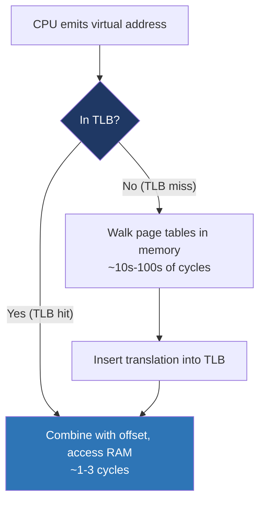
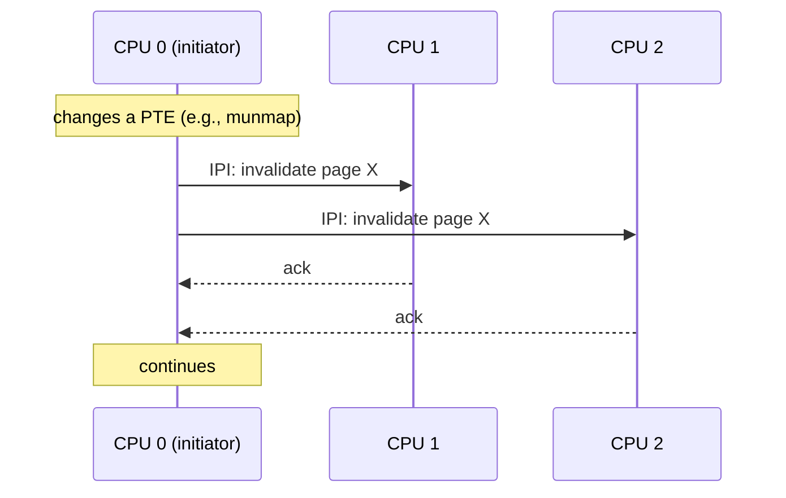

# Day 9 — Paging and the TLB

> **Week 2 · Memory**
> Reading: OSTEP Chapters 18–19 (Paging: Introduction, TLBs)

## Why this matters

Paging is the mechanism that turns the abstraction of virtual memory into reality. The TLB is the hardware that makes it fast. Together they're asked about in nearly every systems interview, and TLB-related performance issues are real in production. Today we get sharp on both.

## 9.1 What's a page?

A **page** is a fixed-size chunk of virtual memory; a **frame** is a fixed-size chunk of physical memory. They're the same size — typically 4 KB on x86. Memory is managed in page-sized units; the MMU translates virtual page numbers to physical frame numbers.

Why fixed size? It eliminates fragmentation at the management level. Any free frame can hold any page; no need to find an exactly-sized hole. The cost is **internal fragmentation** — if you allocate 1 byte, you get a 4 KB page anyway. But for typical workloads, internal fragmentation is small.

```
Virtual address (48 bits on x86-64):
┌─────────────────────┬───────────────────┐
│ Virtual Page Number │ Offset (12 bits)  │
│   (high 36 bits)    │ (4 KB within page)│
└──────────┬──────────┴───────────────────┘
           │
       MMU lookup
           │
           ▼
┌─────────────────────┬───────────────────┐
│ Physical Frame Num  │ Offset (12 bits)  │
└─────────────────────┴───────────────────┘
        Physical address
```

The offset within a page is identical between virtual and physical — only the page number translates. That's why page sizes are powers of 2 and naturally aligned.

## 9.2 Why not just one big translation table?

A naive design would be: virtual address → look up in a table → physical address. With 48-bit virtual addresses and 4 KB pages, you have 2^36 = 64 billion entries. Each entry needs ~8 bytes. That's 512 GB **per process**. Untenable.

The fix is **multi-level page tables**: a tree structure. Most of the address space is unmapped, so most of the tree doesn't need to exist. Only the populated branches consume memory.

We'll cover the table structure on Day 10. For now, the key fact: walking the page tables on every access would still be slow (multiple memory accesses per translation). The fix is the TLB.

## 9.3 The TLB — translation lookaside buffer

The **TLB** is a small, fast cache inside the CPU that holds recent virtual-to-physical translations. Each entry maps a virtual page to its physical frame, with permission bits. On every memory access, the MMU first checks the TLB:



A TLB hit costs near zero (parallel with the cache access). A TLB miss costs a page-table walk — multiple memory accesses, possibly with their own cache misses. On x86-64 with 4-level paging, a full miss can cost ~100–200 cycles, but partial caching (intermediate levels in a separate cache) helps.

### TLB sizes

Modern x86 CPUs have:

- **L1 dTLB**: ~64 entries, fully associative, fastest.
- **L1 iTLB**: ~64 entries (separate for instructions).
- **L2 STLB** (shared): ~1500–2000 entries, set-associative.

For 4 KB pages, a 64-entry L1 TLB covers 64 × 4 KB = 256 KB of address space. If your working set is bigger than that and accessed randomly, you take TLB misses constantly.

### TLB and cache are separate

The TLB caches **address translations**; the L1/L2/L3 data caches cache **memory contents**. They're independent. A TLB hit can still miss in the data cache (the translation is fast, the data isn't there yet).

## 9.4 Huge pages — bigger, fewer

If TLB coverage is the problem, one solution is bigger pages. Linux supports:

- **4 KB** (default)
- **2 MB** (huge pages on x86)
- **1 GB** (gigantic pages, requires CPU support)

A 2 MB page covers 512× the address space of a 4 KB page. A 64-entry TLB now covers 128 MB instead of 256 KB — a 512× improvement for the same TLB.

### When huge pages help

- **Large working sets accessed randomly**: databases, in-memory caches, scientific computing.
- **Memory-intensive HPC**: matrix operations on multi-GB arrays.
- **JIT-compiled code with large code segments**: JVMs, V8.

### When they don't (or hurt)

- **Small allocations**: a 4 MB malloc that becomes one 2 MB page wastes nothing, but a 16 KB allocation wasting 2 MB hurts.
- **Latency-sensitive workloads**: huge-page allocation requires contiguous physical memory, can stall under fragmentation.
- **Forking processes that touch huge pages** — COW operates at huge-page granularity, so a 1-byte write copies 2 MB.

### Three modes in Linux

1. **Static hugepages**: explicit pool reserved at boot or via `sysctl vm.nr_hugepages`. Used via `mmap` with `MAP_HUGETLB` or via hugetlbfs. Databases (Oracle, PostgreSQL) often use this.
2. **Transparent Huge Pages (THP)**: kernel automatically promotes anonymous mappings to huge pages when possible. Knob: `/sys/kernel/mm/transparent_hugepage/enabled` (`always` / `madvise` / `never`).
3. **`madvise(MADV_HUGEPAGE)`**: applications hint per-region.

## 9.5 TLB shootdowns — the cost of multi-CPU

Each CPU has its own TLB. When a page-table entry is changed (e.g., a page is unmapped or its permissions change), all CPUs that might have cached that translation must invalidate their TLB entry. This is a **TLB shootdown**:



This is expensive — IPIs (inter-processor interrupts) cost microseconds. On a 64-CPU system frequently calling `munmap`, shootdowns can dominate. Database engines and VMs often try to minimize them by:

- Batching unmappings
- Using `MADV_DONTNEED` instead of `munmap` (sometimes cheaper)
- Pinning processes to specific CPUs (limits cross-CPU shootdowns)

### Process-context identifiers (PCIDs / ASIDs)

Without help, every CR3 change (context switch between processes) flushes the entire TLB. Modern x86 has **PCID** (Process-Context IDentifier): each TLB entry is tagged with a PCID, so entries from different processes can coexist in the TLB. When you switch back to a process, its TLB entries may still be there. Linux uses this if `CONFIG_X86_PCID` is enabled (it is, by default).

ARM has the equivalent: ASID (Address Space ID).

## 9.6 Mapped, present, accessed, dirty — the PTE bits

Each page table entry includes flags:

| Bit | Meaning |
|-----|---------|
| Present | Page is in physical memory |
| R/W | Writable |
| U/S | User-accessible (vs. kernel-only) |
| PWT, PCD | Cache attributes |
| Accessed | Hardware sets when page is read or written |
| Dirty | Hardware sets when page is written |
| PS | Page size (huge page if set) |
| Global | Don't flush on CR3 change (kernel pages) |
| NX | Non-executable (eXecute Disable on Intel; XD bit) |

The OS uses these:
- **Accessed** drives LRU approximation for page reclaim (Day 11/Week 4).
- **Dirty** tells the kernel whether a page must be written to disk before reclaiming.
- **Global** marks kernel pages so they survive CR3 changes (avoids flushing kernel translations on context switch). KPTI changes this somewhat.
- **NX** prevents executing data — defends against many exploits (mark stack, heap NX).

## 9.7 Demand paging (preview)

Pages aren't pre-loaded when a process starts. The kernel maps the address space (sets up VMAs and page tables), but most page table entries start without the **Present** bit set. On first access, the MMU triggers a **page fault**; the kernel then loads the page (from disk for a file mapping, allocates and zeroes for anonymous).

This is why malloc-then-memset is slower than just malloc (Day 8 hands-on). malloc reserves address space; memset triggers actual page allocations.

Day 11 covers page faults in depth.

## 9.8 Real-world TLB measurements

You can measure TLB pressure with `perf`:

```bash
$ perf stat -e dTLB-loads,dTLB-load-misses,iTLB-loads,iTLB-load-misses ./myprogram
```

A high miss rate (>1%) on dTLB-load-misses suggests the working set exceeds TLB coverage. Mitigations: huge pages, restructure data layout, reduce working set.

The classic example: random-access on a large hash table. Each lookup goes to a different page; TLB miss every time. Linear scans by contrast hit the same TLB entry many times.

## Hands-on (30 minutes)

1. Check page size on your system: `getconf PAGE_SIZE` (should be 4096).

2. Check TLB info: `cpuid -1 -l 0x18` (modern Intel) or `lscpu | grep -i tlb`. On modern systems, look for L1 and L2 TLB sizes.

3. Look at huge page configuration:
   ```bash
   cat /proc/meminfo | grep -i huge
   cat /sys/kernel/mm/transparent_hugepage/enabled
   ```

4. Measure TLB misses for a memory-intensive program:
   ```c
   // Save as tlb_test.c
   #include <stdlib.h>
   #include <string.h>
   int main() {
       size_t N = 100*1024*1024 / sizeof(int);  // 100 MB of ints
       int *a = malloc(N * sizeof(int));
       memset(a, 0, N * sizeof(int));
       long sum = 0;
       // sequential
       for (size_t i = 0; i < N; i++) sum += a[i];
       // strided (every 16th = 64 bytes apart, skipping cache lines)
       for (size_t i = 0; i < N; i += 16) sum += a[i];
       // random pages
       for (int i = 0; i < 1000000; i++) {
           size_t off = ((size_t)rand() * 4096) % (N * sizeof(int));
           sum += a[off / sizeof(int)];
       }
       return sum & 1;
   }
   ```
   ```bash
   gcc -O2 -o tlb_test tlb_test.c
   perf stat -e dTLB-loads,dTLB-load-misses ./tlb_test
   ```
   Compare miss rates across the three loops. Random pages should have orders-of-magnitude higher miss rate.

5. Try with huge pages:
   ```bash
   echo always | sudo tee /sys/kernel/mm/transparent_hugepage/enabled
   perf stat -e dTLB-loads,dTLB-load-misses ./tlb_test
   ```
   Observe the change. Restore: `echo madvise | sudo tee ...`.

## Interview questions

### Q1. What is the TLB?

**Answer:** The Translation Lookaside Buffer is a small, fast cache inside the CPU that holds recent virtual-to-physical address translations. Without it, every memory access would require walking page tables in RAM — multiple memory loads per access, devastating to performance.

A TLB hit costs near zero (parallel with the cache access). A TLB miss requires a page-table walk; on x86-64 with 4-level paging, a complete miss costs around 100–200 cycles in the worst case, but partial caching (intermediate-level page-table entries cached separately) usually softens it.

Modern x86 CPUs have a 64-entry L1 dTLB (fully associative) and a much larger L2 STLB (~1500 entries) shared with iTLB. With 4 KB pages, the L1 dTLB covers 256 KB of address space — small relative to typical working sets.

The TLB is per-CPU. Each CPU caches its own translations. When a page table is modified (e.g., `munmap`), other CPUs must invalidate any cached translations — a "TLB shootdown" via inter-processor interrupts. This is why high-rate `mmap`/`munmap` cycles can be slow on many-core systems.

### Q2. What's a TLB miss and how do you reduce them?

**Answer:** A TLB miss happens when the CPU translates a virtual address whose page-number isn't currently in the TLB. The MMU then walks the page tables in memory, costing ~100 cycles. Cumulative TLB misses can dominate runtime on memory-bound workloads with large random-access patterns.

Reducing TLB misses:

1. **Use huge pages**. A 2 MB huge page covers 512× more address space per TLB entry. For databases or HPC working with large memory, huge pages can give significant speedups.
2. **Improve locality**. Group related data on the same pages. Access patterns that repeatedly hit the same pages benefit from TLB reuse.
3. **Reduce working-set size**. Compress data, use smaller types where possible.
4. **Use PCID** so context switches don't fully flush TLB. Most modern Linux configs do this by default.
5. **For specific microbenchmarks**: prefetch, prefault.

You can measure with `perf stat -e dTLB-loads,dTLB-load-misses`. A miss rate above ~1% suggests TLB pressure is real.

### Q3. What's a TLB shootdown?

**Answer:** When a CPU modifies a page-table entry (e.g., during `munmap`, page reclaim, or COW), other CPUs that have cached that translation must drop the cached entry. The originating CPU sends an inter-processor interrupt (IPI) to all relevant CPUs; each invalidates the affected TLB entries; they ack; original CPU continues.

This is expensive — IPIs cost microseconds, and the synchronization point ("wait for all acks") doesn't parallelize well. On many-core systems with frequent unmapping (some workloads with tight `mmap`/`munmap` cycles, certain VM/container patterns), shootdowns can become a major bottleneck.

Mitigations:
- **Batching**: kernel batches unmappings to amortize one shootdown over many operations.
- **`MADV_FREE`** (Linux): tells the kernel "this memory is free to reclaim if needed, but I'd like to write to it again." Avoids immediate unmapping.
- **CPU pinning**: limits which CPUs need shootdowns.
- **Larger pages**: fewer page-table entries to invalidate.

A famous case: the `madvise(MADV_DONTNEED)` vs. `munmap` discussion in glibc's malloc — `MADV_DONTNEED` is sometimes cheaper because it avoids structural page-table changes.

### Q4. What's the difference between regular pages and huge pages? When do you use each?

**Answer:** Regular pages are 4 KB on x86; huge pages are 2 MB (and gigantic pages 1 GB). Huge pages cover more address space per TLB entry, reducing TLB pressure for large working sets.

When to use huge pages:
- **Databases** with large buffer pools (Oracle, PostgreSQL with `huge_pages=on`).
- **HPC workloads** with large arrays accessed randomly.
- **Memory-resident caches** (Redis, Memcached) past a certain size.
- **JVMs** with large heaps (often via `-XX:+UseLargePages`).

When not to:
- **Small allocations** waste memory (allocating 50 KB gets you 2 MB).
- **Forking processes that mutate touched memory** — COW happens at 2 MB granularity, expensive.
- **Latency-sensitive systems** during memory pressure — defragmentation to find a contiguous 2 MB can cause stalls.

Three modes in Linux:
1. **Static** (hugetlbfs): explicit pre-allocation; applications request via `MAP_HUGETLB`.
2. **Transparent** (THP): kernel auto-promotes when possible; controlled via `/sys/kernel/mm/transparent_hugepage/enabled`.
3. **`madvise(MADV_HUGEPAGE)`**: applications hint specific regions for promotion.

The default on most distros is "madvise" — only promote on hint, avoiding latency surprises. "always" is more aggressive; "never" disables. Picking the right mode depends on the workload.

## Self-test

1. With 4 KB pages and 36 bits of physical address space, how many bits identify the frame? How many identify the offset?
2. A function loops over a 1 GB array, reading 8 bytes from each 4 KB page. With a 64-entry L1 TLB, what fraction of accesses are TLB misses?
3. Why does Linux use multi-level page tables instead of a flat translation array?
4. A process munmaps a region. What must happen on every CPU? Why?
5. Anonymous memory allocated with `mmap(MAP_HUGETLB)` — when does the actual physical memory get allocated?
