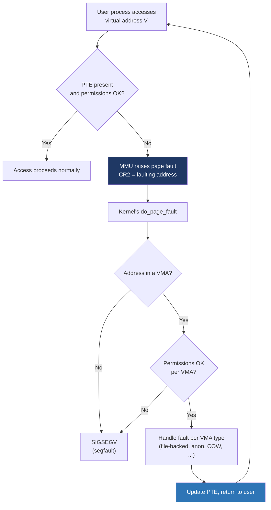

# Day 11 — Page faults and demand paging

> **Week 2 · Memory**
> Reading: OSTEP Chapters 21–22 (Beyond Physical Memory: Mechanisms, Policies)

## Why this matters

Page faults are the kernel's hook for implementing demand paging, copy-on-write, swap, and memory-mapped files — virtually every cool VM trick. Understanding them turns "the kernel handles paging" from a hand-wave into a precise mental model. Page-fault behavior also explains a lot of mysterious performance phenomena.

## 11.1 What is a page fault?

A page fault is a hardware exception raised by the MMU when a virtual-memory access cannot complete using the current page tables. Specifically:

- The Present bit is 0 (page not in memory)
- The access violates permissions (write to read-only, user-mode access to a supervisor page)
- The address is in a region where no PTE exists at all

The CPU pushes fault information (faulting address in CR2, error code on stack) and jumps to the kernel's page-fault handler. The handler decides what to do: load the page, allocate a new one, signal the process, or kill it.



## 11.2 Three kinds of page faults

### Minor (soft) fault

The page is in physical memory but not yet mapped into the process's page tables. Common cases:

- **First access to a freshly allocated anonymous page** — `mmap` or `brk` reserved address space, but no physical page assigned yet. The kernel allocates a zero page, updates the PTE, and returns.
- **Page already in the page cache** for a file mapping — kernel adds the PTE pointing to the already-cached page.
- **COW** — see below.

Minor faults are cheap, microseconds. No I/O.

### Major fault

The data isn't in memory and must be read from disk. Cases:

- **File mapping** where the page isn't in the page cache.
- **Anonymous page** that has been swapped out.

Major faults are expensive — a disk read, milliseconds (or microseconds on NVMe). The faulting process blocks until the I/O completes.

### Invalid

The address is not in any VMA, or permissions don't allow the access. The kernel sends `SIGSEGV` (segmentation fault). For kernel bugs (kernel touching unmapped address), the result is an oops or panic.

You can see fault counts:

```
$ cat /proc/$$/stat | awk '{print $10, $11, $12, $13}'
# minflt cminflt majflt cmajflt
```

`minflt` = minor faults this process has taken; `cminflt` includes children. Same for major.

## 11.3 Demand paging

When a process is created (or `exec`d), the kernel doesn't load the program into RAM. It maps the executable file's segments as VMAs, sets up page tables with PTEs marked not-present, and returns to user mode. The first instruction faults; the kernel reads that page from disk; the instruction executes; the next instruction in a different page faults too; and so on.

This sounds slow but is actually faster than eager loading. Most programs don't touch most of their pages. A 100 MB binary might only execute 5 MB of code on a typical run; the other 95 MB never gets read from disk.

For data, the same applies. `malloc(1 GB)` followed by writing only a few bytes only allocates a few pages. The rest stays as un-faulted address space — costing nothing.

**Read-ahead and clustering**: the kernel doesn't fault one page at a time; it reads multiple consecutive pages on a single fault, anticipating sequential access. The `MADV_RANDOM` and `MADV_SEQUENTIAL` hints adjust this behavior.

## 11.4 Copy-on-write (COW) — fault edition

We saw COW conceptually on Day 3. The mechanism is page-fault-driven:

```mermaid
sequenceDiagram
    participant Parent
    participant Kernel
    participant Child

    Note over Parent,Child: After fork(): both processes' page tables<br/>point to same physical pages, marked read-only
    Child->>Kernel: write to page X
    Note over Child: MMU: PTE has R/W=0 → fault
    Kernel->>Kernel: page fault handler
    Note over Kernel: This is COW: VMA writable but PTE read-only
    Kernel->>Kernel: allocate new physical page
    Kernel->>Kernel: copy old → new
    Kernel->>Kernel: update child's PTE: new frame, R/W=1
    Kernel-->>Child: return; retry write
    Child->>Child: write completes
    Note over Parent: still uses old page<br/>(if parent writes too, similar fault)
```

The trick: at fork, the kernel marks every PTE in **both** processes as read-only. The first writer faults. The handler:

1. Notices: VMA is writable, but PTE is read-only — this is a COW marker.
2. Allocates a new physical page.
3. Copies content from the old page.
4. Updates the writing process's PTE: new frame, writable.
5. Decrements the old page's refcount; if both processes had it and one is now alone, the kernel can promote the other process's PTE back to writable too (no need to copy).

Result: pages are duplicated only on first write, only on the side that wrote. Read-mostly pages stay shared. The total memory cost of `fork+exec` is approximately zero — the child's writes happen mostly inside `exec`, which discards everything.

## 11.5 The Linux page fault handler

In `mm/memory.c`, the entry is roughly:

```c
vm_fault_t do_page_fault(struct pt_regs *regs, unsigned long error_code,
                         unsigned long address) {
    struct vm_area_struct *vma = find_vma(current->mm, address);
    if (!vma || address < vma->vm_start)
        goto bad_area;       // → SIGSEGV
    if (!check_permissions(vma, error_code))
        goto bad_area;
    return handle_mm_fault(vma, address, flags);
}
```

`handle_mm_fault` walks the page-table levels, allocating intermediate tables on demand, then dispatches to the right handler:

- **Anonymous pages** → `do_anonymous_page` (allocate zero page, install PTE)
- **File-backed** → calls VMA's `vm_ops->fault` (filesystem-specific; e.g., `filemap_fault` for ordinary files)
- **COW** → `do_wp_page` (the write-protect fault path)
- **Swap** → `do_swap_page` (read from swap area)

The result is one of: `VM_FAULT_OK` (handled, retry the instruction), `VM_FAULT_MAJOR` (had to do I/O), `VM_FAULT_SIGSEGV` (illegal access), `VM_FAULT_OOM` (out of memory).

## 11.6 Working set and page replacement

Physical memory is finite. When the system runs low on free pages, the kernel must reclaim pages — write dirty ones to disk, then reuse the frame. Which to evict?

The classical answer is **LRU** (least recently used). True LRU is impractical (requires tracking every access), so the kernel approximates using the Accessed bit (Day 10). Linux uses a **two-list LRU**:

- **Active list**: recently-used pages.
- **Inactive list**: candidates for reclaim.

Periodically, kswapd scans:
- Active list: pages whose Accessed bit is set get the bit cleared and stay; pages without Accessed get moved to inactive.
- Inactive list: pages whose Accessed bit becomes set get promoted back to active; otherwise reclaimed.

So pages drift from active to inactive when they aren't touched, and from inactive back to active when they are.

Anonymous pages reclaimed = swapped out (need swap space). File-backed clean pages reclaimed = just dropped (can re-read from disk if needed). File-backed dirty = written back, then reclaimed.

## 11.7 Swap and thrashing

When physical memory is exhausted, the kernel swaps anonymous pages to disk to free frames. On access, those pages are swapped back in (major fault).

If the working set exceeds physical memory, you get **thrashing**: pages constantly swap in and out, doing more I/O than useful work. Symptoms: high `%wa` (I/O wait) in `top`, high disk traffic, near-zero application progress, `vmstat` shows `si`/`so` (swap in/out) high.

Solutions:
- Add memory.
- Reduce working set (smaller cache, smaller heap).
- Tune `vm.swappiness` (range 0–200, default 60). Lower = prefer reclaiming file cache over anonymous; higher = swap more eagerly.
- For containers/cgroups, use cgroup v2's `memory.swap.max`.

Modern systems often run with little or no swap on the assumption that swap is a bug magnifier. The OOM killer (Day 13) takes over instead.

## 11.8 OOM killer

When the kernel can't satisfy an allocation even after reclaim and swap, it invokes the **OOM killer**. The OOM killer scores all processes by an "oom_score" (roughly: badness based on RSS, runtime, priority) and kills the worst offender.

You can tune per-process: `/proc/<pid>/oom_score_adj` (range -1000 to +1000). Critical processes get -1000 (never kill); sacrifices get +1000 (kill first).

In containers, the kernel can be configured to OOM-kill within the cgroup rather than system-wide. cgroup v2 `memory.oom.group` makes the kernel kill all tasks in the cgroup atomically.

## Hands-on (30 minutes)

1. See your shell's fault counts:
   ```bash
   awk '{print "minflt:", $10, "majflt:", $12}' /proc/$$/stat
   ```

2. Force a major fault: write a large file, drop caches, mmap it and read.
   ```bash
   dd if=/dev/zero of=/tmp/bigfile bs=1M count=200
   sudo sync && sudo sysctl -w vm.drop_caches=3
   # now read the file via mmap and observe major faults
   ```

3. Watch system-wide fault rate:
   ```bash
   sar -B 1 5    # major faults/s in column 'majflt/s'
   ```
   (or `vmstat 1` — `si`/`so` for swap activity).

4. Trigger a SIGSEGV: small C program writing to NULL.
   ```c
   int main() { *(int*)0 = 42; return 0; }
   ```
   Compile, run, observe segfault. Try `dmesg | tail` to see the kernel's fault log entry (with faulting address, IP).

5. Watch COW: write a program that allocates a 100 MB region, touches it, then forks. In the parent, watch RSS. In the child, write to half the memory, then re-watch parent and child RSS. The overall memory commitment grows by half (newly-COW'd pages).

## Interview questions

### Q1. What is a page fault? When is it a problem?

**Answer:** A page fault is a hardware exception raised by the MMU when a memory access can't complete with the current page tables — either the Present bit is 0 (page not loaded), the address has no VMA, or permissions don't allow the access. The CPU jumps to the kernel's page-fault handler.

The kernel decides:

- **Minor fault**: the page is allocatable and the kernel just needs to update the PTE (anonymous zero page, or file page already in cache, or COW). Microseconds, no I/O.
- **Major fault**: data is on disk and must be read. Milliseconds (or microseconds on NVMe). Process blocks during I/O.
- **Invalid**: address has no VMA or permissions are wrong. Kernel sends SIGSEGV; process terminates if not handled.

When are faults a problem? Major faults specifically — they require I/O, dramatically slowing the process. A program with high `majflt/s` is hitting disk on memory access, suggesting:

- Working set exceeds physical memory (thrashing)
- File mappings without enough page cache
- Swap pressure

You can measure with `/proc/<pid>/stat` (fault counts) or `sar -B`. To reduce major faults: more RAM, smaller working set, `mlock` critical regions to prevent swap, or pre-fault with `MAP_POPULATE` / `MADV_WILLNEED`.

### Q2. How does copy-on-write work?

**Answer:** COW lets two processes (or a process and its child) share the same physical pages until one writes. The mechanism is page-fault-driven.

After `fork()`:
1. Both processes have page tables pointing at the same physical frames.
2. Every PTE is marked read-only — even pages that were originally writable.
3. The VMAs themselves remember the original "logical" permissions (writable).

When either process writes:
1. MMU sees a read-only PTE, raises a fault.
2. Kernel's COW handler runs (`do_wp_page`). It checks: VMA is writable, PTE is read-only → this is a COW situation.
3. Allocate a new physical page; copy the old content.
4. Update the writing process's PTE to point at the new frame, marked writable.
5. Resume the instruction.

The other process (which didn't write) still uses the old page, still read-only. If only one process is left holding the original page, the kernel can mark it writable directly without copying — an optimization called "wp_page_reuse."

The cost of `fork()` is therefore approximately the size of the page tables (which are duplicated), not the size of memory. Combined with `exec()` discarding everything, fork+exec is cheap regardless of process size.

COW is also used outside fork: `mmap(MAP_PRIVATE)` on a file uses COW (the file pages stay clean; user writes go to private copies).

### Q3. What's the difference between minor and major faults? How do you reduce them?

**Answer:** Minor faults: the kernel can satisfy the fault from memory alone — allocating a zero page, finding an already-cached page, doing COW. Microseconds.

Major faults: data must be read from disk (file backing not in cache, or swap). Milliseconds typically. The faulting thread blocks during I/O.

You usually can't avoid minor faults entirely — they're how the system implements lazy allocation, COW, and demand paging. But you can reduce them by pre-allocating: `malloc` plus `memset` faults the pages now rather than during a hot path. `MAP_POPULATE` on `mmap` pre-faults the entire region.

Major faults are the dangerous ones for performance:
- **Add RAM** so working set fits.
- **Reduce working set**: smaller heap, smaller caches, fewer concurrent files mapped.
- **`mlock`** or `mlockall` to pin critical pages (RT applications, encryption keys).
- **`MADV_WILLNEED`** to ask the kernel to read pages in advance.
- **Don't use swap**, or set `vm.swappiness=0` for swap-averse workloads.
- **Use `tmpfs`** for files that should never hit disk.

You can monitor:
- Per-process: `/proc/<pid>/stat` columns 10, 12 (`minflt`, `majflt`).
- System-wide: `sar -B`, `vmstat -s | grep faults`.

### Q4. What's thrashing and how do you fix it?

**Answer:** Thrashing is when the system spends more time paging than running useful work. The working set exceeds physical memory; the kernel constantly swaps pages out and back in. CPU stays low (it's waiting on I/O), disk stays maxed out, applications crawl.

Symptoms:
- `top`: high `%wa` (iowait), low `%us` (user CPU).
- `vmstat`: high `si`/`so` (swap in/out per second).
- `iostat`: disks at 100% busy.
- Applications respond slowly even though CPU is idle.

Causes:
- Allocated more memory than physical RAM, with active access.
- A few large processes' working sets summing past RAM.
- Heavy file mapping with insufficient page cache (similar mechanism, with file pages instead of swap).

Fixes:
- **Add RAM**.
- **Reduce demand**: stop one of the processes, lower a cache size, restart leaking apps.
- **`mlock`** critical regions (database buffer pools); they can't be swapped, forcing the kernel to evict elsewhere.
- **Disable swap** (`swapoff -a`): forces OOM killer to take over rather than thrash. Modern Linux often runs with little or no swap.
- **Cgroups `memory.max`** can constrain a runaway process to its own quota, killing it via OOM rather than starving the system.

The OOM killer eventually breaks thrashing — it's slow because the kernel keeps trying reclaim before declaring OOM. Some setups use `earlyoom` or systemd-oomd to kill processes earlier when pressure metrics suggest thrashing is starting.

## Self-test

1. A process calls `malloc(100 MB)`. How many physical pages are allocated immediately? How many after the first write?
2. After `fork()`, the parent has 1 GB of writable memory. The child immediately calls `exec`. How much memory is copied?
3. A process has `majflt=50000` after running 10 seconds. Is that bad? What might be the cause?
4. A read-only access to a `MAP_PRIVATE` file mapping shouldn't fault after the first read. Why does it usually fault on first access?
5. `vm.swappiness=0` vs. `vm.swappiness=100` — what's the difference in behavior under memory pressure?
