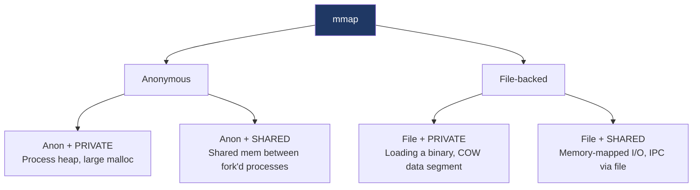

# Day 12 — mmap and shared memory

> **Week 2 · Memory**
> Reading: TLPI Chapters 45–49 (Memory Mappings, POSIX Shared Memory, Virtual Memory Operations)

## Why this matters

`mmap` is one of the most powerful syscalls in Unix. It unifies file I/O, shared memory, and dynamic allocation under one mechanism. Understanding its modes — and when to choose `mmap` vs. `read`/`write` — is a recurring interview topic and a tool you'll reach for in real systems work.

## 12.1 What does mmap do?

`mmap` creates a new VMA in the calling process's address space:

```c
void *mmap(void *addr, size_t length, int prot, int flags, int fd, off_t offset);
```

- **addr**: hint for where to place the mapping (NULL lets the kernel choose; common).
- **length**: size in bytes (rounded up to page size).
- **prot**: PROT_READ | PROT_WRITE | PROT_EXEC | PROT_NONE.
- **flags**: see below.
- **fd**: a file descriptor (or -1 for anonymous).
- **offset**: file offset (must be page-aligned).

Returns the chosen virtual address. The mapping persists until `munmap` or process exit.

The two crucial flag dimensions:

| Dimension | Options |
|-----------|---------|
| Backing | File-backed (fd is a file) vs. Anonymous (fd=-1, MAP_ANONYMOUS) |
| Sharing | MAP_SHARED (visible to other mappers) vs. MAP_PRIVATE (COW, isolated) |

That gives four combinations, each useful:



## 12.2 The four modes

### Anonymous private (`MAP_ANONYMOUS | MAP_PRIVATE`)

A region of zero-initialized memory, private to the calling process. This is what `malloc` uses for large allocations (typically > 128 KB on glibc). After fork, COW; otherwise isolated.

```c
void *p = mmap(NULL, 100*1024*1024, PROT_READ|PROT_WRITE,
               MAP_ANONYMOUS|MAP_PRIVATE, -1, 0);
```

### Anonymous shared (`MAP_ANONYMOUS | MAP_SHARED`)

A region of memory shared between this process and any children (after fork). Useful for parent-child IPC where you don't want a file backing it.

```c
void *p = mmap(NULL, 4096, PROT_READ|PROT_WRITE,
               MAP_ANONYMOUS|MAP_SHARED, -1, 0);
pid_t pid = fork();
if (pid == 0) {
    *(int*)p = 42;     // visible to parent
    exit(0);
}
wait(NULL);
printf("%d\n", *(int*)p);   // prints 42
```

### File-backed private (`MAP_PRIVATE`)

The file's contents become memory; the kernel reads from disk on fault. Writes go to private COW pages — the file is not modified.

```c
int fd = open("data.bin", O_RDONLY);
void *p = mmap(NULL, len, PROT_READ, MAP_PRIVATE, fd, 0);
// can read p[i] like an array
```

This is how the kernel maps executable segments (the `.text` section is `MAP_PRIVATE` with PROT_READ|PROT_EXEC; writes would COW but rarely happen).

### File-backed shared (`MAP_SHARED`)

The file's contents become memory; writes go back to the file. Multiple processes mapping the same file with `MAP_SHARED` see each other's changes.

```c
int fd = open("data.bin", O_RDWR);
void *p = mmap(NULL, len, PROT_READ|PROT_WRITE, MAP_SHARED, fd, 0);
((char*)p)[0] = 'X';   // modifies the file
```

This is the foundation of memory-mapped I/O and persistent shared memory.

## 12.3 mmap vs. read/write

When should you `mmap` a file vs. just `read` it?

| Aspect | read/write | mmap |
|--------|------------|------|
| Setup cost | Low (just `read`) | Higher (syscall + page-table setup) |
| Access pattern | Streaming | Random access |
| Multiple processes | Each has own buffer | Share page cache directly |
| Tiny file | read wins | mmap overhead dominates |
| Huge file | read with chunked buffer | mmap, no copy |
| Sparse access | wastes I/O | only faults pages you touch |
| Modifying | explicit write | direct memory write, msync |

The performance question: with `read`, the kernel does I/O into the page cache, then copies into your buffer (one extra memory copy per read). With `mmap`, your reads touch the page cache directly — no copy. For large files randomly accessed, this is a real win.

But: mmap is more complex (page faults, need to handle SIGBUS if the file is truncated under you, no clean way to detect EOF). For sequential streaming, plain `read` (or even better, `pread`) is simpler and just as fast in practice.

**Rule of thumb**: use `mmap` for random-access on large files, persistent data structures, or when sharing file contents between processes. Use `read`/`write` for streaming I/O, small files, or socket-like access patterns.

## 12.4 Anonymous mappings and malloc

glibc's `malloc` has a two-tier strategy:

- Small requests: served from a free list inside the heap, grown via `brk` (one big anonymous region).
- Large requests (default threshold: `M_MMAP_THRESHOLD`, ~128 KB): served by a fresh `mmap` of the right size.

Why two tiers? `brk` is cheap (no syscall per allocation) but can't release memory back to the OS until the top of the heap is freed (fragmentation can lock memory). `mmap` is more expensive per call but each allocation can be returned to the OS independently — `free` on a large region calls `munmap`.

You can see this:

```bash
strace -e trace=brk,mmap,munmap ./your_program 2>&1 | head -30
```

Lots of `brk` for typical small allocations; `mmap` for large ones.

## 12.5 POSIX shared memory: shm_open

Anonymous shared mmap only works between related processes (parent/child after fork). To share between unrelated processes, you need a name — POSIX shared memory provides this:

```c
// Process A: create/open shared object
int fd = shm_open("/myshm", O_CREAT | O_RDWR, 0600);
ftruncate(fd, 4096);
void *p = mmap(NULL, 4096, PROT_READ|PROT_WRITE, MAP_SHARED, fd, 0);
*(int*)p = 42;

// Process B (any time later): open same object
int fd = shm_open("/myshm", O_RDWR, 0);
void *p = mmap(NULL, 4096, PROT_READ|PROT_WRITE, MAP_SHARED, fd, 0);
printf("%d\n", *(int*)p);   // 42
```

`shm_open` returns a file descriptor backed by `tmpfs` (mounted at `/dev/shm`). The "name" is just a path under `/dev/shm`. The data lives in RAM (with possible swap), no real disk.

`shm_unlink("/myshm")` removes the name; the underlying memory is freed when the last mapping/fd goes away.

### Older alternative: SysV shm

`shmget`, `shmat`, `shmdt`, `shmctl`. Older API (1980s System V), still works but less convenient — keys instead of paths, awkward control via `shmctl`. POSIX is preferred for new code.

## 12.6 msync, MADV_*, and other operations

A few related calls:

- **`msync(addr, len, flags)`**: flush a `MAP_SHARED` mapping back to disk. Without this, writes are eventually written by the kernel, but timing is up to it. `MS_SYNC` blocks until done; `MS_ASYNC` schedules it.
- **`mprotect(addr, len, prot)`**: change permissions on an existing mapping. Useful for guard pages, JIT (write code, then make it execute-only).
- **`madvise(addr, len, advice)`**: hint to the kernel about access patterns:
  - `MADV_SEQUENTIAL`: read-ahead aggressively, drop pages quickly.
  - `MADV_RANDOM`: skip read-ahead.
  - `MADV_WILLNEED`: prefault.
  - `MADV_DONTNEED`: discard immediately (anonymous → freed; file-backed → drop cache).
  - `MADV_FREE`: anonymous; pages may be reclaimed but writes still work (no fault until reclaim happens).
  - `MADV_HUGEPAGE`: try to use huge pages here.
- **`mlock(addr, len)`**: pin pages in physical memory; never swap. Subject to RLIMIT_MEMLOCK.

## 12.7 Common patterns and pitfalls

### Pattern: reading a file via mmap

```c
int fd = open(path, O_RDONLY);
struct stat st;
fstat(fd, &st);
void *data = mmap(NULL, st.st_size, PROT_READ, MAP_PRIVATE, fd, 0);
close(fd);   // mapping persists; file stays referenced by VMA
// process data[0..st.st_size]
munmap(data, st.st_size);
```

Closing the fd is fine — the mapping holds a reference. The file is fully released when `munmap` is called or the process exits.

### Pattern: shared mmap-based counter (lock-free with atomics)

```c
// Set up:
int fd = shm_open("/counter", O_CREAT|O_RDWR, 0600);
ftruncate(fd, sizeof(_Atomic int));
_Atomic int *counter = mmap(NULL, sizeof *counter, PROT_READ|PROT_WRITE,
                            MAP_SHARED, fd, 0);

// Each process:
int old = atomic_fetch_add(counter, 1);
```

Multiple processes increment the same counter atomically. We'll cover atomics on Day 19.

### Pitfall: SIGBUS on truncated files

If you `mmap` a file and someone else `truncate`s it shorter, accessing the now-out-of-file region delivers `SIGBUS` (not `SIGSEGV`). Handle it or know the file's size is stable.

### Pitfall: holding fds open via mappings

Even after closing the fd, the kernel maintains a reference to the inode via the VMA. Be aware when looking at `lsof` for "open files" — mapped files count.

### Pitfall: 32-bit address space exhaustion

On 32-bit, you have only ~3 GB of user virtual address space. Mapping a 5 GB file isn't possible. On 64-bit, this isn't a real concern.

## Hands-on (30 minutes)

1. Write a program that mmaps a file and reads through it; compare to `read`-based version. For a 1 GB file:
   ```c
   // mmap version
   int fd = open(path, O_RDONLY);
   struct stat st; fstat(fd, &st);
   char *p = mmap(NULL, st.st_size, PROT_READ, MAP_PRIVATE, fd, 0);
   long sum = 0;
   for (off_t i = 0; i < st.st_size; i++) sum += p[i];
   ```
   Time both with `time` and compare.

2. Demonstrate shared anonymous mmap between parent and child:
   ```c
   int *shared = mmap(NULL, sizeof(int), PROT_READ|PROT_WRITE,
                      MAP_ANONYMOUS|MAP_SHARED, -1, 0);
   *shared = 0;
   if (fork() == 0) { *shared = 42; exit(0); }
   wait(NULL);
   printf("%d\n", *shared);  // 42
   ```

3. Use `/dev/shm` directly: `ls -l /dev/shm/`. Create a file: `dd if=/dev/zero of=/dev/shm/test bs=1M count=10`. See it in `df`: `df /dev/shm`.

4. Inspect a process's mmaps:
   ```bash
   pmap -X $$ | head -30
   ```
   Look for `Mapping` field — file paths or `[anon]` or `[stack]`.

5. Use `madvise` to drop pages:
   ```c
   madvise(p, len, MADV_DONTNEED);
   ```
   Touch the region again; observe new minor faults via `/proc/self/stat`.

## Interview questions

### Q1. What is mmap and what are its main uses?

**Answer:** `mmap` creates a virtual-memory mapping in a process's address space. The mapping is backed either by a file (so the file's bytes appear as memory) or anonymous (zero-initialized memory). Two sharing modes: `MAP_PRIVATE` (COW; writes go to private pages) and `MAP_SHARED` (writes are visible to other mappers, and for file-backed, write-through to the file).

Main uses:

1. **Loading executables and shared libraries**: the kernel `mmap`s ELF segments. The text segment is `MAP_PRIVATE` with PROT_READ|PROT_EXEC. Multiple processes loading the same library share the same physical pages.
2. **Large memory allocation**: glibc `malloc` uses `mmap` for allocations above ~128 KB. Each large block is its own `mmap`, freed independently with `munmap`.
3. **Fast file I/O for random access**: mapping a file and reading it as memory avoids the read+copy two-step of `read()` syscalls. For random access on large files, faster.
4. **Shared memory between processes**: `MAP_SHARED` with `shm_open` (for unrelated processes) or with `MAP_ANONYMOUS` (for parent-child).
5. **Memory-mapped databases**: LMDB, SQLite (in some modes), key-value stores. Persistent on-disk data accessed as in-memory structures.

The unifying mechanism: a VMA describes the mapping; the kernel populates pages on demand via faults.

### Q2. mmap vs. read — when do you use each?

**Answer:** Both work; the right choice depends on access pattern.

`read`/`write` is right for:
- **Streaming**: read sequentially through a file once. The buffer-and-copy overhead is negligible.
- **Small files**: setup cost of `mmap` (syscall, VMA creation, page-table updates) dominates.
- **Sockets and pipes**: you can't `mmap` these.
- **When you want explicit error handling**: `read` returns -1 with errno; `mmap` access errors come as SIGBUS.

`mmap` is right for:
- **Random access on large files**: each read is a memory access that hits the page cache directly. No double-buffering.
- **Sparse access**: only the pages you touch are paged in; rest stays on disk.
- **Multiple processes accessing the same file**: they share page cache directly, with one physical page in memory regardless of how many mappers.
- **Treating a file as a data structure**: pointers within the file work (with care).

The kernel's page cache is in play either way — `read` populates it through the buffered I/O path, `mmap` populates it through page faults. Memory-mapped I/O avoids one user-kernel copy per read; in CPU-bound code over very large files, this matters.

For real workloads, benchmark both. Some workloads see almost no difference (sequential scan); others see 2-3× (random scan over multi-GB files). Don't choose based on "mmap is faster" — it depends.

### Q3. How would you set up shared memory between two unrelated processes?

**Answer:** POSIX shared memory:

1. Process A: `int fd = shm_open("/myshm", O_CREAT|O_RDWR, 0600);` creates a shared-memory object backed by tmpfs at /dev/shm/myshm.
2. Process A: `ftruncate(fd, size);` sets the size.
3. Process A: `void *p = mmap(NULL, size, PROT_READ|PROT_WRITE, MAP_SHARED, fd, 0);` maps it.
4. Process B (any time later): `shm_open("/myshm", O_RDWR, 0)` opens the same object; `mmap` to access. They share physical pages.

To remove: `shm_unlink("/myshm")`. The data lives until the last mapping/fd is gone.

For synchronization, place a `pthread_mutex_t` in the shared region (initialized with `PTHREAD_PROCESS_SHARED` attribute), or use semaphores (`sem_open`). Or use atomics for lock-free coordination.

Alternatives:
- **Anonymous MAP_SHARED + fork**: only works for related processes. Simpler than shm_open if applicable.
- **SysV shm** (`shmget`/`shmat`): older API, still works, less convenient.
- **`memfd_create`** (Linux): creates an anonymous fd backed by RAM; can be passed to other processes via Unix domain socket fd-passing.
- **`/dev/shm/<file>`**: just a tmpfs mount, can use plain `open` and `mmap` — POSIX shm under the hood is doing this.

### Q4. What's the difference between MAP_SHARED and MAP_PRIVATE?

**Answer:** Both create a virtual mapping; they differ in how writes interact with backing.

- **`MAP_PRIVATE`**: writes are copy-on-write. The first write to a page allocates a private copy; subsequent writes go to that copy. Other processes mapping the same backing don't see the writes. The file (if file-backed) is never modified.
- **`MAP_SHARED`**: writes are visible to all processes mapping the same object. For file-backed, writes are eventually written to the file (or call `msync` to force).

Use cases:

- **`MAP_PRIVATE` with file**: loading a program — the executable code shouldn't be mutated, but the data segment uses COW so each process gets its own copy of variables.
- **`MAP_PRIVATE` anonymous**: large `malloc`. No backing, no sharing, just heap memory.
- **`MAP_SHARED` with file**: memory-mapped database, log file shared by readers and writers.
- **`MAP_SHARED` anonymous**: between fork-related processes. After fork, the mapping stays shared (vs. `MAP_PRIVATE` which COW-isolates).

A subtle point: `MAP_PRIVATE` COW only kicks in on write. Multiple processes reading the same `MAP_PRIVATE` file mapping share physical pages just like `MAP_SHARED`. The difference shows up only when someone writes.

`mmap` flags also include `MAP_FIXED` (force address; dangerous), `MAP_LOCKED` (mlock at creation), `MAP_POPULATE` (prefault), and `MAP_HUGETLB` (use huge pages).

## Self-test

1. You mmap a 4 GB file with `MAP_PRIVATE`. You write to one page. How much physical memory is consumed?
2. Two processes mmap the same file with `MAP_SHARED`. Process A writes. Does process B see the change immediately, eventually, or never?
3. What's the difference between `MAP_ANONYMOUS|MAP_SHARED` and `shm_open + mmap MAP_SHARED`?
4. After `mmap`, you `close(fd)`. Is the mapping still valid?
5. When does glibc `malloc` use `mmap` vs. `brk`?
