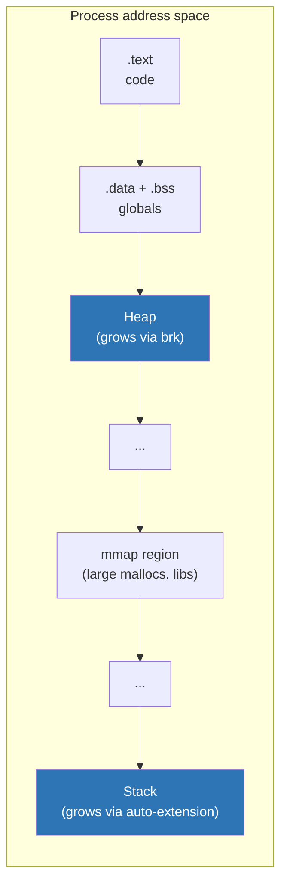
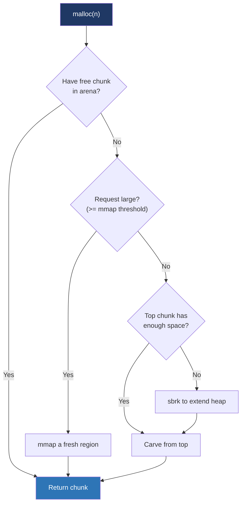

# Day 13 — Heap, stack, and allocators

> **Week 2 · Memory**
> Reading: OSTEP Chapter 17 (Free-Space Management); glibc malloc internals article

## Why this matters

`malloc` is one of the most-called functions in any C program. Understanding what it does — how it grows the heap, how it tracks free regions, when it gives memory back — turns "malloc just works" into a tool you can reason about for performance, fragmentation, and debugging. Stack basics matter equally: stack overflows are still common bugs.

## 13.1 The heap

The "heap" in Unix terminology is the region of address space managed by `malloc`. It's grown via two syscalls:

- **`brk` / `sbrk`**: extends the program break — the upper boundary of a contiguous region. Old, simple. Used by glibc for small allocations.
- **`mmap`**: gets a fresh region elsewhere in the address space. Used for large allocations (>~128 KB by default).



`brk(addr)` sets the break to `addr`; `sbrk(delta)` adjusts by `delta` and returns the old break. Both are syscalls but glibc calls them rarely — typically once per ~tens of allocations as the heap grows.

## 13.2 Stack growth

The stack is set up at process start with a small committed region (often 132 KB) and a much larger maximum (default 8 MB, set by `ulimit -s`). The kernel marks the VMA as `VM_GROWSDOWN` — when the process accesses an address just below the current stack, it faults; the kernel automatically extends the VMA downward.

The maximum is enforced strictly: hit the limit, and the next access is a SIGSEGV (stack overflow → segfault). You can change with `ulimit -s` or `setrlimit(RLIMIT_STACK)` before exec, or in pthreads via `pthread_attr_setstacksize`.

Each thread has its own stack. `pthread_create` mmaps a fresh region (default 8 MB) and uses it as the new thread's stack. Since this is just a regular mmap'd region, it doesn't auto-grow — the thread crashes hard if it exceeds the allocated size. Some libraries add **guard pages**: a page or two of PROT_NONE just below the stack to catch overflows cleanly.

## 13.3 What malloc actually does

A modern `malloc` (glibc, jemalloc, tcmalloc) is sophisticated. The main tasks:

1. **Track free regions** — what memory is currently unused and available.
2. **Choose where to satisfy an allocation** — find a free region big enough, prefer not to fragment.
3. **Grow the heap** when it has no free regions large enough.
4. **Return memory to the OS** when freed regions become large enough to bother.

The classical approach: a free list. Each free chunk has a header (size, next pointer) and an embedded pointer to the next free chunk. `malloc(n)` walks the list, finds a chunk ≥ n+header, splits if the chunk is much bigger, removes from the list, returns the address after the header.

Real malloc is more complex:

### glibc malloc (ptmalloc2)

- **Multiple "arenas"**: per-thread allocation regions. Reduces lock contention. Number of arenas typically scales with `ncpu`.
- **Bins**: chunks are organized by size class — a small chunk size has its own bin. `malloc` for a small request goes straight to the right bin.
  - **Fast bins**: single-linked LIFO, no merging on free, very fast.
  - **Small bins**: per-size, exact-fit.
  - **Large bins**: ranges, best-fit.
  - **Unsorted bin**: a transient holding area.
- **`mmap` threshold** (`M_MMAP_THRESHOLD`, default 128 KB and growing dynamically): allocations above this go straight to `mmap`. Each mmapped chunk is its own region; freeing it calls `munmap` so memory is immediately returned to the OS.
- **Top chunk**: the high end of the heap. Grows when needed via `sbrk`. Shrinks back via `sbrk` (negative) when enough is freed at the top.

### Other allocators

- **jemalloc**: used by Firefox, FreeBSD libc, Redis. Careful size-class design, low fragmentation, good multithreading.
- **tcmalloc** (Google): per-thread caches, large central heap, very fast for small allocations.
- **mimalloc** (Microsoft): newer; single-page-segregated free lists.

You can swap allocators via `LD_PRELOAD`:

```bash
LD_PRELOAD=/usr/lib/x86_64-linux-gnu/libjemalloc.so.2 ./your_program
```

For most workloads, jemalloc/tcmalloc beat glibc on multithreaded performance. For single-threaded simple programs, the difference is small.

## 13.4 Fragmentation

Fragmentation is the gap between memory allocated to the process and memory actually usable. Two flavors:

- **External fragmentation**: free memory is split into many small chunks, none big enough for the next request.
- **Internal fragmentation**: each allocation rounds up to a size class, wasting the difference.

External fragmentation is the killer. A long-running server that mallocs and frees in unpredictable patterns can end up with a heap many times the size of its actual working set. Some pathological patterns:

- Allocating many small objects, freeing every other one — leaves a "checkerboard" with no useful contiguous space.
- Long-running with mixed lifetime objects — short-lived allocations get interleaved with long-lived, fragmenting forever.

### Mitigation

- **Per-size pools / arenas**: keep small and large allocations separated.
- **Compaction**: garbage-collected languages can move objects; C allocators usually can't (pointers in user code don't know to update).
- **Restart**: long-running daemons sometimes restart periodically just to reset the heap.

glibc's `malloc_trim()` returns top-of-heap pages to the OS via `sbrk` (negative). Doesn't help if fragmentation is mid-heap.

## 13.5 Where malloc gets the memory

For each `malloc(n)`:



A free, similarly: most freed chunks go back to the arena's bins. Large freed chunks go straight to `munmap`. Periodically (or on `malloc_trim`), the top of the heap may shrink via `sbrk(-delta)`.

## 13.6 Common interview questions about malloc

You should be able to:

- Explain why `free` doesn't always reduce process RSS.
- Explain what happens on `malloc(0)` (returns either NULL or a unique pointer that can be passed to `free`).
- Explain **double free** (UB; modern allocators detect some cases but not all).
- Explain **use-after-free** (UB; sanitizers like ASan catch most).
- Describe how `realloc` works (try in-place; if not, malloc + memcpy + free).

## 13.7 Memory leaks and tools

A memory leak: allocation without corresponding free, growing over time. Tools:

- **Valgrind / Memcheck**: run program under emulation; reports leaks at exit. Slow but thorough.
- **AddressSanitizer (ASan)**: compile with `-fsanitize=address`; minor runtime overhead; reports leaks, OOB, UAF.
- **`malloc_stats()`** in glibc: dump arena stats.
- **`mallinfo2()`**: programmatic stats.
- **heaptrack** (KDE): trace every allocation, post-hoc analysis.

For production:
- **jemalloc profiling**: built-in heap profiler. `MALLOC_CONF=prof:true,prof_leak:true ./prog`; analyze with `jeprof`.
- **gperftools tcmalloc**: similar profiler, used at Google.

## 13.8 Stack overflow detection

Stack overflows are often silent — overwriting the next page of memory might happen to be heap and corrupt data. Defenses:

- **Stack canaries** (`-fstack-protector`): a known value placed before the return address; checked on function return; mismatch → abort. Catches stack-buffer overflows that overwrite the return address.
- **Guard pages**: a PROT_NONE page below each thread's stack. Overflow into the guard page triggers SIGSEGV cleanly.
- **`ulimit -s`**: smaller limit means less damage potential before failure.

Modern compilers enable stack protector by default for functions with stack buffers. Don't disable.

## Hands-on (30 minutes)

1. Trace allocations of a small program:
   ```bash
   strace -e trace=brk,mmap,munmap -c ./your_program
   ```
   Count of brk vs. mmap calls.

2. Watch heap grow with `cat /proc/$$/maps | grep heap` before and after a big allocation in a Python session.

3. Try jemalloc:
   ```bash
   LD_PRELOAD=/usr/lib/x86_64-linux-gnu/libjemalloc.so.2 your-program
   # benchmark vs. without
   ```

4. Demonstrate that free doesn't always shrink RSS:
   ```c
   #include <stdlib.h>
   #include <stdio.h>
   #include <unistd.h>
   int main() {
       printf("Start: "); fflush(stdout); sleep(2);
       void *bufs[100];
       for (int i = 0; i < 100; i++) bufs[i] = malloc(1024 * 1024);  // 100 × 1 MB
       printf("After malloc: "); fflush(stdout); sleep(5);
       for (int i = 0; i < 100; i++) free(bufs[i]);
       printf("After free: "); fflush(stdout); sleep(5);
       malloc_trim(0);
       printf("After malloc_trim: "); fflush(stdout); sleep(5);
       return 0;
   }
   ```
   In another terminal: `watch -n0.5 'cat /proc/$(pgrep your_prog)/status | grep VmRSS'`. Note RSS may not drop after `free` but does after `malloc_trim`.

5. Stack overflow demo:
   ```c
   void recurse(int n) { char buf[1024]; recurse(n + 1); }
   int main() { recurse(0); }
   ```
   Run, observe segfault. With `-fstack-protector-all`, compile and rerun: see "stack smashing detected" if any function has a buffer.

## Interview questions

### Q1. What does malloc do?

**Answer:** `malloc(n)` returns a pointer to at least `n` bytes of uninitialized writable memory. Internally, a modern allocator like glibc's ptmalloc2:

1. Picks an arena — a per-thread allocation region — to reduce lock contention between threads.
2. Looks for a free chunk in that arena's bins (lookup tables organized by chunk size). Fast bins (small sizes) and small bins (per-size) handle common cases in O(1).
3. If no suitable free chunk, takes from the "top chunk" (the upper end of the heap, owned by this arena).
4. If the top chunk is too small, extends the heap with `sbrk` (extends program break) or for large requests, calls `mmap` directly for a fresh region.
5. Updates internal bookkeeping; returns a pointer to the user-visible bytes (after the chunk header).

Each chunk has metadata — size, in-use flag, neighbor pointers — stored in headers immediately before the user pointer. `free` uses these to merge adjacent free chunks (coalescing) and put them back in the right bin.

The threshold for using `mmap` directly is `M_MMAP_THRESHOLD` — default starts at 128 KB and grows dynamically. Above this, each allocation gets its own mmapped region; freeing it `munmap`s, returning memory immediately to the OS. Below, allocations live in the heap.

### Q2. Why doesn't memory always get returned to the OS after free?

**Answer:** glibc's `malloc` keeps freed chunks in arena bins for reuse, rather than immediately returning to the OS. This is faster (no syscall on the next malloc that fits) and reduces page-table thrashing.

Memory returns to the OS in two cases:

1. **Large allocations** (above mmap threshold) were made via `mmap`; `free` calls `munmap`, immediately releasing.
2. **Small allocations**: only when the freed chunks are at the top of the heap. The allocator can call `sbrk` with a negative delta to shrink the program break. But chunks freed in the middle of the heap stay mapped — the heap is contiguous, can't have holes returned to the OS.

So a program that allocates 1 GB then frees most of it from the middle keeps a 1 GB RSS even though most chunks are free. Only `malloc_trim()` (or shrinking from the top) can give back top-of-heap pages.

This shows up in long-running daemons. Some teams "fix" leak-like behavior by restarting the process periodically — not because of true leaks but because of fragmentation that prevents the heap from shrinking.

To diagnose: `malloc_stats()` (glibc) or `mallinfo2()` programmatically. Or use jemalloc, which has more aggressive return-to-OS policies and built-in heap profiling.

### Q3. What's the difference between heap and stack?

**Answer:**

| Property | Stack | Heap |
|----------|-------|------|
| Allocation | Automatic (function call frame) | Explicit (`malloc`/`new`) |
| Lifetime | Function scope | Programmer-controlled |
| Speed | Trivial (move SP register) | Slower (allocator logic) |
| Size | Limited (default 8 MB on Linux) | Limited by virtual address space + RAM |
| Layout | LIFO, contiguous | Fragmented, free list |
| Per-thread | Yes (each thread its own stack) | Shared between threads of a process |

Implementation details:

- **Stack**: a single VMA per thread with `VM_GROWSDOWN`. The kernel auto-extends downward on access (until the limit). At process start, the main thread's stack is set up with command line, environment, and auxv.
- **Heap**: glibc's brk-based area is one big VMA grown via `sbrk`. Plus zero or more mmapped regions for large allocations.

When to use which:
- Local variables, small fixed-size buffers → stack. Free.
- Variable-size data, data outliving the function, data shared between threads → heap.

Don't return pointers to local stack variables — they're invalid after the function returns. Don't allocate huge buffers on the stack — overflow risk.

### Q4. What's a memory leak? How do you find one?

**Answer:** A memory leak is allocated memory that's no longer reachable by the program but hasn't been freed. The process keeps the memory allocated; over time, RSS grows without bound until the OOM killer or admin intervenes.

In C/C++, leaks happen by forgetting to `free`/`delete`. In garbage-collected languages, you can still leak by holding references that prevent collection (cache that never evicts, listeners not unregistered).

Diagnosis tools:

- **Valgrind Memcheck**: most thorough; runs the program under emulation, tracks every allocation. Slow (~10–30× slower) but precise: shows where leaked blocks were allocated and how many bytes.
- **AddressSanitizer**: compile with `-fsanitize=address -fsanitize=leak`. Minor runtime overhead (~2× memory, modest CPU). Reports at exit.
- **heaptrack**: KDE project; injects via LD_PRELOAD, samples allocations, GUI for analysis.
- **jemalloc / tcmalloc heap profilers**: in production. Sample-based, low overhead. Set `MALLOC_CONF=prof:true...` and dump profiles periodically; analyze with `jeprof`.
- **Manual**: log allocation sites, periodically diff RSS, look at `/proc/<pid>/smaps` to see which mappings are growing.

For long-running services, monitor RSS over time. A linear or stepwise upward trend with no leveling-off is the classic leak signature. A growth that levels off is more likely a cache or a fragmentation issue (see Q2).

A common red herring: jemalloc decay. After bursts of activity, jemalloc holds free chunks for a while before returning to the OS, so RSS lags behind logical usage. Use the allocator's stats API to distinguish "in-use" from "held free."

## Self-test

1. A program calls `malloc(16)` 1000 times. How many `brk` syscalls does the kernel see, approximately? Why?
2. After `free(p)`, can you safely use `*p`? What about reading the value at `p`?
3. What happens when a thread's stack hits its size limit?
4. Why is jemalloc often faster than glibc's malloc for multi-threaded servers?
5. What's "internal fragmentation" vs. "external fragmentation"? Which does a slab allocator address?
