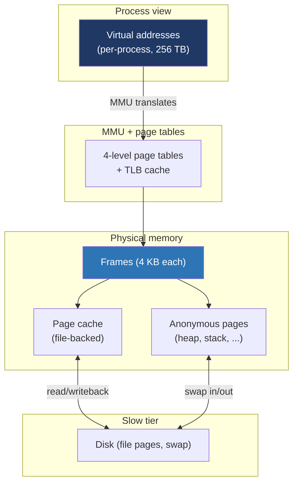

# Day 14 — Week 2 review and interview drill

> **Week 2 · Memory**
> No new reading. Consolidation day.

## Why this matters

Memory is the second-most-asked topic in systems interviews after concurrency. By the end of today, you should be fluent — able to walk through translation, faults, COW, and allocator behavior without notes.

## 14.1 The unifying mental model

Everything we covered Week 2 fits in this picture:
- **Day 8** (address spaces): virtual addresses and how the layout looks.
- **Day 9** (paging, TLB): the translation step and its caching.
- **Day 10** (page tables): the data structure that backs translation.
- **Day 11** (faults): what happens when translation can't proceed.
- **Day 12** (mmap): how pages get associated with files or anonymous memory.
- **Day 13** (heap/stack/allocators): how userspace asks for memory.

## 14.2 Common interview traps

**Trap 1: "malloc allocates physical memory."** Wrong. `malloc` reserves virtual address space and (for small) extends the heap via `brk`. Physical pages aren't assigned until first write (which faults, the kernel allocates a zero page).

**Trap 2: "Page tables are flat."** Wrong. They're a 4-level (or 5-level) tree. A flat table for 48-bit addresses would need 512 GB per process.

**Trap 3: "TLB and L1 cache are the same."** Different. TLB caches address translations; L1 caches data. A TLB hit can still miss in L1.

**Trap 4: "fork copies all memory."** Misleading. fork uses COW; physical pages are shared until written. Page tables are copied (and grown lazily).

**Trap 5: "After free, the OS gets the memory back."** Often false. glibc returns chunks to its arena, not the OS. RSS may stay high even after `free`. mmap'd allocations and top-of-heap shrinks are exceptions.

**Trap 6: "The stack and heap can collide."** Theoretically yes on small address spaces, in practice no on 64-bit (256 TB between them).

**Trap 7: "Each thread shares the heap and stack."** Half right. They share the heap (and all VMAs); each has its own stack. This is the most common confusion.

## 14.3 Long-form interview drill answer

**Question**: "Walk me through what happens, in detail, when a program does `int *p = malloc(1); *p = 42;`."

**Model answer** (3-5 minutes):

> First, `malloc(1)` is a libc function call, not a syscall. It runs in user space. malloc looks at its size class — 1 byte rounds up to the smallest allocatable chunk, typically 32 bytes including header. It looks at the per-thread arena's fast bins for a 32-byte free chunk. If one's there, pop and return. If not, look in small bins, large bins, the unsorted bin.
>
> Suppose there's no free chunk. malloc looks at the arena's "top chunk" — the high end of the heap. If it has 32 bytes available, carve from it; return the carve. If not, the top chunk needs to grow.
>
> To grow, malloc calls `sbrk` (which is itself a wrapper around the `brk` syscall). This is the first syscall in our story. The kernel:
> 1. Validates the request (within RLIMIT_DATA, doesn't collide with other VMAs).
> 2. Extends the heap VMA upward.
> 3. Returns the old break.
>
> Importantly, the kernel doesn't allocate physical pages yet. It just extended the VMA — virtual address space the process can use. The PTEs for those new addresses are still empty (Present=0).
>
> Back in malloc, the new top chunk has space; carve out 32 bytes; return the user-visible pointer (somewhere in that range). p now points to virtual memory that has been reserved but is unbacked.
>
> Now `*p = 42`. The CPU emits a write. The MMU walks the page tables. At the leaf level, it finds an empty PTE (or, if the entry exists, Present=0). The MMU raises a page fault.
>
> The kernel's page fault handler runs. It finds the VMA — yes, this address is in the heap VMA, with read+write permissions. So this is a legitimate fault, and it's an anonymous mapping.
>
> The handler `do_anonymous_page`:
> 1. Allocates a free physical page (one frame, 4 KB).
> 2. Zeros it (so the user doesn't see arbitrary kernel data).
> 3. Updates the PTE: frame number, Present=1, R/W=1, U/S=1.
> 4. Returns. The CPU re-executes the write instruction.
>
> This time, the MMU finds a present PTE, walks the cache, the write proceeds. The TLB now has a translation cached for this page.
>
> So a single `malloc(1) + assignment` involves potentially: 0 syscalls (if free chunks were available), 1 syscall + 1 fault (typical first allocation), and a tiny amount of physical memory (4 KB for the whole page even though we used 1 byte).

If you can give that answer fluently, your Week 2 is solid.

## 14.4 Mock interview drill

### Section A: definitions (1 min each)

1. What is a TLB?
2. What does mmap do?
3. What's a page fault, and what are the three kinds?
4. What's COW?
5. What does the heap look like at process start?

### Section B: mechanism walkthroughs (3 min each)

1. Walk me through a 4-level page-table walk on x86-64.
2. Walk me through what happens after `fork()` when the child writes to a page.
3. Walk me through what `malloc(1024)` does.
4. Walk me through how a memory-mapped file is read for the first time.
5. Walk me through what happens when a process tries to write to a read-only page.

### Section C: design and reasoning (5 min each)

1. A long-running daemon's RSS keeps growing. How would you investigate?
2. You have a 100 GB file you need random access on. mmap it or read in chunks? Why?
3. A multi-threaded program has high `dTLB-load-misses` in perf. What can you do?
4. Design a fast IPC mechanism between two unrelated processes for high-frequency small messages.
5. A process has 50% memory in `Shared` and 50% in `Anonymous`. What does that tell you?

## 14.5 Where you should be by end of Week 2

- You can sketch a process's address space from memory.
- You can walk through page-table translation step-by-step.
- You understand the difference between minor, major, and invalid faults.
- You can describe COW concretely, not just "lazy copy."
- You know when to use mmap vs. read.
- You can explain why `free` doesn't always shrink RSS.
- You can read `/proc/<pid>/maps` and `/proc/<pid>/status` and explain what each line means.

## 14.6 Sample model answers

**Q from A2: What does mmap do?**

`mmap` adds a new VMA to a process's address space and arranges for accesses to be backed by either a file or anonymous (zero-initialized) memory. The mode flags split into two dimensions: backing (file vs. anonymous) and sharing (`MAP_SHARED` vs. `MAP_PRIVATE`). File-backed shared writes go back to disk; file-backed private uses COW. Anonymous shared lets fork-related processes share; anonymous private is heap-like memory. Pages aren't loaded until faulted in. Used everywhere: program loading, large malloc, shared memory, memory-mapped databases, fast file I/O.

**Q from A4: What's COW?**

Copy-on-write: pages are shared between two processes (typically after fork) until one writes. The kernel marks PTEs read-only at fork; the first write faults; the kernel copies the page, makes one process's PTE writable. Pages that are never written stay shared, costing one physical copy. This is what makes `fork+exec` cheap — fork copies almost no data, exec discards everything. Also used by `mmap(MAP_PRIVATE)` for files.

**Q from B1: 4-level page table walk**

The 48-bit virtual address splits into five fields. The high 9 bits (47–39) index into the PML4 table whose physical address is in CR3. The next 9 bits index into the PDPT (linked from PML4 entry). The next 9 into the PD. The next 9 into the PT. The PT entry contains the physical frame number. Concatenate that with the low 12 bits (offset within the 4 KB page) to get the physical address. Each level's table is itself 4 KB with 512 entries of 8 bytes each. Permissions accumulate; if any level isn't Present or doesn't allow the access, the MMU raises a fault. The TLB caches the result so subsequent accesses to the same page skip the walk.

## 14.7 Where to focus revisions

- **Page tables fuzzy** → re-read Day 10. Draw the address split on paper.
- **Faults blurry** → re-read Day 11; do the experiment with `/proc/<pid>/stat`.
- **mmap modes confused** → re-read Day 12; for each of the 4 modes, write down a concrete use case.
- **malloc behavior surprising** → re-read Day 13; trace allocations with `strace -e trace=brk,mmap`.

## 14.8 What's next

Week 3 is concurrency. We'll cover:
- Race conditions and why concurrency is hard
- Mutex vs. spinlock
- Condition variables and semaphores
- Deadlock and lock ordering
- Memory models and atomics
- Signals and IPC mechanisms

Concurrency is the most-asked topic in systems-software interviews. Most candidates know "use a mutex" but cannot explain memory ordering, lock-free design, or why a particular bug is undefined behavior. Week 3 gets you to that level.
