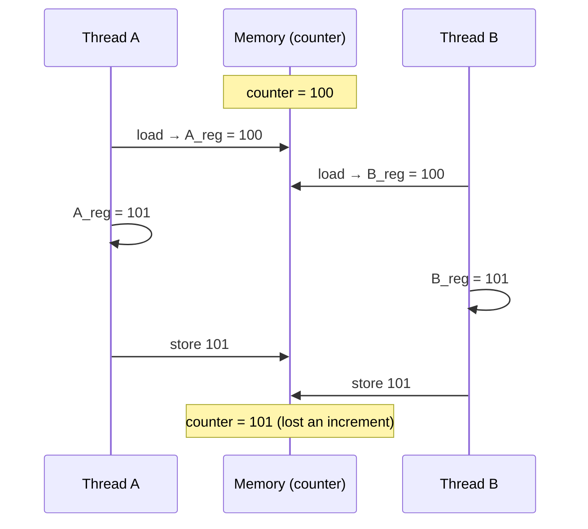

# Day 15 — The concurrency problem

> **Week 3 · Concurrency**
> Reading: OSTEP Chapters 26–27 (Concurrency Intro, Threads API)

## Why this matters

Concurrency is the most-asked topic in systems interviews, the cause of most production incidents, and the place engineers reveal whether they truly understand systems. This week we'll build up from "why is concurrent code hard" to lock-free programming. Today: the problem statement.

## 15.1 The simple example that isn't simple

```c
int counter = 0;
void *increment(void *arg) {
    for (int i = 0; i < 1000000; i++) counter++;
    return NULL;
}

int main() {
    pthread_t t1, t2;
    pthread_create(&t1, NULL, increment, NULL);
    pthread_create(&t2, NULL, increment, NULL);
    pthread_join(t1, NULL); pthread_join(t2, NULL);
    printf("%d\n", counter);   // expected: 2000000. Actual: ?
}
```

Run it. You'll get a number less than 2,000,000, and a different number each run. Sometimes much less.

Why? Because `counter++` is not one operation. It compiles to something like:

```
mov  counter, %eax    # load
add  $1, %eax         # increment
mov  %eax, counter    # store
```

Three steps. If thread A loads, then thread B loads (same value), both increment, both store — A's increment is lost.



This is a **race condition** — the result depends on the timing of operations between threads, and most timings give wrong answers.

## 15.2 Vocabulary

- **Race condition**: program correctness depends on relative timing of concurrent operations.
- **Critical section**: code that accesses shared state and must execute without interleaving.
- **Mutual exclusion**: only one thread at a time in a critical section.
- **Atomicity**: operation appears to happen all-at-once. `counter++` is not atomic; `atomic_fetch_add` is.
- **Visibility**: when a thread writes, when do other threads see it? (More about this on Day 19.)
- **Synchronization**: mechanisms that coordinate threads (locks, condition variables, atomics, barriers).

The minimum requirement to fix the counter example: make `counter++` atomic — either by wrapping it in a lock (mutex) or by using an atomic operation.

## 15.3 Why concurrent code is hard

Concurrency bugs share unpleasant properties:

1. **Non-determinism**: timing varies run to run. The bug shows up sporadically.
2. **Hard to reproduce**: rare scheduler interleavings cause it. Single-threaded testing won't reveal it.
3. **Easy to think you fixed it**: if it doesn't happen for a while, you might think you fixed it. You haven't.
4. **Compounding**: subtle interactions between unrelated locks become deadlock or live lock.

A typical production concurrency bug: works fine on the developer laptop, mostly fine in QA, fails 0.01% of the time in production where load is higher and the scheduler is more chaotic. Investigating means deploying tracing, sometimes intentionally adding delays, rarely getting a clean repro.

## 15.4 Three layers of concurrent thinking

To reason about concurrent code correctly, you need to think at three layers:

### Layer 1: race conditions and mutual exclusion

Multiple threads access shared state; you need to guarantee that updates to that state appear atomic from other threads' perspectives. The basic tool is the lock (mutex). The discipline is: identify what's shared, identify what operations need to be atomic, protect them.

### Layer 2: deadlock and livelock

Once you have locks, you can deadlock — cycles of "thread A holds X, wants Y; thread B holds Y, wants X". The discipline is lock ordering, lock-free design, or careful timeouts. (Day 18.)

### Layer 3: memory ordering

CPUs reorder memory operations for performance. Compilers reorder too. Without careful constraints, even a correct-looking algorithm can fail. Atomic types and memory barriers control this. (Day 19.)

A senior engineer needs to operate fluently at all three layers. Most engineers stop at layer 1.

## 15.5 The mental discipline

When you write concurrent code, ask yourself for every shared variable:

1. **What's the invariant?** What's true about this data that must always hold?
2. **What operations modify it?** List them.
3. **What operations read it?** List them.
4. **What protects the invariant?** A specific lock? Atomic operations? Single-writer assumption?
5. **Does any sequence of operations from concurrent threads break the invariant?**

If you can't answer those crisply, your code has a bug — even if it happens to work on your machine.

Senior systems engineers often work in terms of explicit invariants and explicit synchronization disciplines (e.g., "this counter is updated only while X lock is held; any reader must hold X lock or use the atomic-read operation"). Documenting these in code comments makes review possible.

## 15.6 What does atomicity mean for the hardware?

When you say `counter++` should be atomic, you mean: the load, increment, and store should appear to happen together; no other CPU can observe the intermediate state.

Hardware provides this via instructions:

- **`lock; add`** on x86: prefix the add with LOCK, asserting the bus (in old hardware) or holding the cache line (in modern hardware). Any other CPU's read sees either pre-add or post-add value, never partial.
- **`cmpxchg`** (compare-and-swap): atomic "if value is X, set to Y." Building block for many lock-free algorithms.
- **LL/SC** (load-linked/store-conditional) on RISC-V, ARM: load with a watch; later store-conditional fails if the address was modified meanwhile. Same expressive power as CAS.

In C, you don't write the LOCK prefix manually. You use atomic types (`<stdatomic.h>` in C11):

```c
#include <stdatomic.h>
atomic_int counter = 0;
// in each thread:
atomic_fetch_add(&counter, 1);   // atomic, lock-free
```

This compiles to `lock; add` (or equivalent). The `counter++` is now atomic. Your program prints 2,000,000.

## 15.7 The performance question

Atomic operations are slower than regular operations. Why?

- Cache coherence: an atomic op needs the cache line in **modified** state in the local CPU's cache. If another CPU has it, the line must be invalidated there first, then transferred. This costs ~50–200 cycles.
- Memory ordering: atomics often imply memory barriers (depending on the operation), which can stall pipelines.

A `counter++` becomes ~1 cycle in non-shared code; an atomic increment becomes 30–100 cycles when contended. Hot atomics on shared variables across many CPUs can become a serious bottleneck.

This motivates more sophisticated approaches:

- **Per-CPU counters**: each CPU has its own counter, increment locally; sum periodically. Common in kernel code (`per_cpu_counter`).
- **Sharding**: partition data across threads so they don't contend.
- **Lock-free data structures**: more complex, but avoid lock overhead.

We'll see these patterns in the rest of Week 3.

## 15.8 The classic patterns

You'll see these examples repeatedly:

- **Counter**: many writers, occasional reader. Atomic counter or per-CPU.
- **Producer/consumer**: one or more producers add to a queue; one or more consumers remove. Mutex + condition variable, or a lock-free queue.
- **Reader/writer**: many readers, occasional writers. Reader-writer lock or RCU.
- **Singleton initialization**: one thread initializes; others wait. `pthread_once` or double-checked locking.

Each has standard solutions you should know cold. We'll work through each this week.

## Hands-on (30 minutes)

1. Compile and run the broken counter example. Observe the lost updates.

2. Fix it three ways and compare performance:
   - Mutex around the increment.
   - Atomic counter (`atomic_fetch_add`).
   - Per-thread counter with final sum.

   ```bash
   gcc -O2 -lpthread version_a.c -o a
   time ./a
   ```

3. Use Helgrind (Valgrind's race detector):
   ```bash
   valgrind --tool=helgrind ./broken_version
   ```
   Observe the race report.

4. Try ThreadSanitizer:
   ```bash
   gcc -fsanitize=thread -O1 -lpthread broken.c -o broken_tsan
   ./broken_tsan
   ```
   Same race detected with much less overhead.

5. Look at the assembly of `counter++` vs. `atomic_fetch_add`:
   ```bash
   gcc -O2 -S file.c
   cat file.s
   ```
   Find the relevant instructions; note `lock` prefix on the atomic.

## Interview questions

### Q1. What's a race condition?

**Answer:** A race condition is a defect where program correctness depends on the relative timing of concurrent operations. Specifically, multiple threads access shared state, at least one writes, and there's no synchronization, so the final result depends on the unpredictable order of operations.

The classic example is `counter++` from multiple threads. Compiles to load-modify-store; if two threads load the same value, both increment, both store, one increment is lost. The result depends on whether the second thread's load happened before or after the first's store.

Race conditions are notorious because:
- They're often non-deterministic (different result each run).
- They're hard to reproduce (depends on scheduler timing).
- They may not manifest under low load but appear under high load.
- "Mostly works" creates false confidence.

The fix is mutual exclusion: protect the shared state with a lock so concurrent writers serialize. Or use an atomic operation if the modification fits a single atomic instruction (`atomic_fetch_add`).

Tools to detect: ThreadSanitizer (compile with `-fsanitize=thread`) or Helgrind (Valgrind plugin) — both observe runtime memory accesses and synchronization, flagging unsynchronized accesses.

### Q2. Is `i++` atomic?

**Answer:** No. `i++` is at least three machine instructions: load `i`, increment, store `i`. Between these, another thread can read or write `i`, leading to lost updates or inconsistent reads.

Even if it compiled to a single instruction, that single instruction wouldn't be atomic across CPUs without an explicit `lock` prefix (on x86) or equivalent on other architectures. Without the prefix, multiple CPUs can each have the cache line in shared state, both increment, and both write back — same lost update.

Making it atomic requires:
- A mutex around the increment (`pthread_mutex_lock`/`unlock`).
- Or an atomic type and operation: `atomic_int i; atomic_fetch_add(&i, 1);`
- Or in C++, `std::atomic<int> i; ++i;`

Atomic-ops are faster than mutexes for simple operations, but slower than non-atomic when uncontended. For high-contention counters across many CPUs, neither scales well — you'd want per-CPU counters that are summed periodically.

A subtle related point: `i = i + 1` and `i++` and `i += 1` are all non-atomic. There's no Way of writing a non-atomic-typed variable update that's atomic at the language level — atomicity requires explicit hardware/compiler support.

### Q3. What is mutual exclusion and why is it needed?

**Answer:** Mutual exclusion is the property that at most one thread executes a critical section at a time. A critical section is a region of code that operates on shared state and must execute atomically from other threads' perspectives — meaning, other threads must see either the pre-state or the post-state, never an intermediate.

Without mutual exclusion, race conditions occur. Example: two threads update a linked list. Mid-update the list is in an inconsistent state — pointers temporarily wrong. If a third thread reads during this window, it might dereference a NULL or a dangling pointer.

Mutual exclusion is provided by:

- **Mutex**: software lock; `lock` blocks if held by another thread; `unlock` releases.
- **Spinlock**: similar, but `lock` busy-waits instead of blocking. Useful for very short critical sections, especially in kernel code.
- **Lock-free algorithms**: use atomic operations (CAS, fetch-add) to update shared state without explicit locks. More complex, can be faster for some workloads.
- **Single-writer discipline**: only one thread writes; readers don't need locks (but may need ordering).

Mutual exclusion is one mechanism among several for synchronization. It's the right choice when you have a critical section with a few simple statements and you can't easily reformulate as atomic updates.

### Q4. Why are concurrent bugs so hard to find?

**Answer:** Several reasons compound:

1. **Non-determinism**: the bug requires a specific interleaving of operations across threads. The scheduler's choices vary; sometimes the bug-revealing interleaving happens, sometimes it doesn't. So the bug appears intermittently.

2. **Sensitivity to load and timing**: changing the timing — adding a print statement, running under a debugger, increasing CPU load, running on different hardware — can hide or expose the bug. "Heisenbugs" disappear when observed.

3. **Localization is hard**: the symptom (corrupted data, crash) may show up far from the actual race. The bug is in the lack of synchronization between thread A's operation and thread B's operation, possibly in totally different files.

4. **Compounding interactions**: as the system grows, lock interactions become complex. Two locks that never overlap in development can overlap in production at scale, creating new races or deadlocks.

5. **Memory model surprises**: even "obviously correct" lock-free code can be wrong due to compiler reordering or weak memory ordering on the CPU. Reasoning about these requires expertise most engineers lack (Day 19).

Strategies for finding them:

- **Systematic**: ThreadSanitizer is the modern hammer. Catches most data races with ~10× slowdown.
- **Logging and tracing**: log every lock acquire/release with thread ID; look for ordering inversions.
- **Stress testing**: many threads, high contention, in CI; let the scheduler explore interleavings.
- **Code review with explicit invariants**: review every shared variable and ask "what guarantees this is consistent?".
- **Static analysis**: tools like Coverity, RV-Predict, lockdep (in the kernel) catch some classes ahead of time.

The deeper answer: write code that doesn't have data races by design. Immutable data, message-passing, single-writer disciplines, channel-based concurrency. Locks should be a last resort.

## Self-test

1. The broken counter example from §15.1 prints "1,234,567" once and "1,876,543" the next run. What does this tell you about the bug?
2. Two threads both do `if (x == 0) x = 1;`. Without locking, what are the possible final values of x?
3. Explain the difference between a critical section and a race condition.
4. ThreadSanitizer reports "data race" between two reads of the same variable. Both threads only read. Is this a real bug?
5. You profile a multi-threaded program and see most CPU time in `lock cmpxchg`. What does this suggest? What might fix it?
