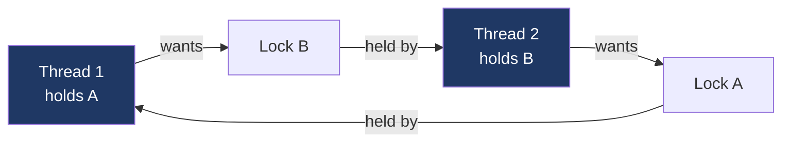

# Day 18 — Deadlock and lock ordering

> **Week 3 · Concurrency**
> Reading: OSTEP Chapter 32 (Common Concurrency Problems)

## Why this matters

Deadlock is the second-most-common concurrency bug after data races. It's particularly nasty: the system doesn't crash, it just stops making progress. Threads sit idle holding locks, waiting for each other forever. Today we cover the four conditions, prevention strategies, and detection.

## 18.1 The classic deadlock

```c
pthread_mutex_t lock_A, lock_B;

void *thread1(void *arg) {
    pthread_mutex_lock(&lock_A);
    sleep(1);   // simulate work
    pthread_mutex_lock(&lock_B);
    // ... do stuff with both ...
    pthread_mutex_unlock(&lock_B);
    pthread_mutex_unlock(&lock_A);
}

void *thread2(void *arg) {
    pthread_mutex_lock(&lock_B);    // acquires B first
    sleep(1);
    pthread_mutex_lock(&lock_A);    // wants A, but thread1 holds it
    // ...
}
```

After running both: thread1 holds A, wants B; thread2 holds B, wants A. Neither releases. Forever.



A cycle in the resource-allocation graph = deadlock.

## 18.2 The four conditions for deadlock (Coffman, 1971)

Deadlock requires all four simultaneously:

1. **Mutual exclusion**: resource is exclusive (one holder at a time).
2. **Hold and wait**: a thread holds a resource while waiting for another.
3. **No preemption**: resources can't be forcibly taken; only voluntarily released.
4. **Circular wait**: a cycle of threads each waiting on the next.

Break any one condition and deadlock is impossible. This is the basis of all prevention strategies.

## 18.3 Prevention strategies

### Strategy 1: Lock ordering (break circular wait)

Define a global ordering of locks. Always acquire in that order.

```c
// Convention: always acquire lower-addressed lock first.
void safe_two_locks(struct lock *a, struct lock *b) {
    struct lock *first = a, *second = b;
    if (a > b) { first = b; second = a; }
    pthread_mutex_lock(&first->mu);
    pthread_mutex_lock(&second->mu);
    // ...
    pthread_mutex_unlock(&second->mu);
    pthread_mutex_unlock(&first->mu);
}
```

Address-based ordering works for runtime-determined locks. For static locks, document an explicit order ("always acquire `accounts_lock` before `transactions_lock`") and enforce in code review.

This is the most common production approach. Linux kernel uses lockdep — a runtime tool that tracks lock-acquisition graphs and warns on order inversions.

### Strategy 2: Try-lock + back off (break hold-and-wait)

Use `trylock`; if it fails, release everything and retry.

```c
while (1) {
    pthread_mutex_lock(&a);
    if (pthread_mutex_trylock(&b) == 0) break;
    pthread_mutex_unlock(&a);
    sched_yield();   // or sleep briefly
}
// got both
```

Risks livelock — threads keep retrying without progress. Sometimes adds randomized backoff.

### Strategy 3: Big lock (break cycle by having one)

Use a single global lock for everything. Trivially deadlock-free (no second lock to deadlock with). Trivially scales badly. Ancient Linux had the "Big Kernel Lock" until ~2010 when it was finally removed; not a model to emulate.

### Strategy 4: Lock-free / lock-light design

No locks → no deadlock. Use atomics and lock-free algorithms (Day 19). Hard to design correctly; common in highly concurrent systems but not a general-purpose answer.

### Strategy 5: Avoid holding locks across blocking calls

A thread holding lock A that blocks on I/O for 100 ms means everyone else who wants A waits 100 ms. If the I/O is acquiring lock B that someone holds while waiting for A, deadlock. Releasing A before the I/O eliminates a cycle.

## 18.4 Lock ordering in practice

The kernel and most well-engineered userspace projects document lock orderings. Example from a hypothetical filesystem:

```
1. inode->i_mutex
2. dentry->d_lock
3. sb->s_lock
```

Always acquire in this order. Released in reverse. Code review enforces.

Lockdep (Linux kernel) actually checks at runtime. For each lock acquire, it remembers the set of locks already held; flags any acquire that would create a cycle in the graph. Has caught many subtle bugs in kernel code.

## 18.5 Other deadlock-like problems

### Livelock

Threads are running but making no progress. Like deadlock but without idleness. Two people in a hallway repeatedly stepping aside in the same direction.

In code: `trylock` + retry without backoff:

```c
while (!try_acquire_both(a, b))
    ;   // spin retry
```

Two threads doing this can synchronize their failures forever. Solution: randomized backoff.

### Starvation

A thread waits indefinitely while others continue working. Not a deadlock — system is making progress, just not for this thread. Common with priority schedulers, reader-writer locks (writer starves under continuous readers), some lock implementations.

### Priority inversion

Already covered Day 5. High-priority task waits on a lock held by low-priority; medium-priority preempts low; high stays blocked indefinitely.

## 18.6 Detection (post-hoc)

Even with discipline, deadlocks happen. Detection:

### gdb on a hung process

```bash
gdb -p <pid>
(gdb) thread apply all bt
```

Look for threads stuck in `pthread_mutex_lock` / `__lll_lock_wait` / similar. Map back to which lock each is waiting on.

### `pstack`

```bash
pstack <pid>
```

Quick stack dump of all threads. Same idea as gdb but no interactive.

### `strace`

```bash
strace -f -p <pid>
```

If processes are stuck in futex syscalls (`futex(0x..., FUTEX_WAIT, ...)`), they're waiting on locks. Check the addresses against your data structures.

### Logging

In production, instrument lock acquisition with a log. Hard in hot paths; can be done with a debug build.

### lockdep (kernel)

Built into Linux kernel debug builds. Reports "possible recursive locking detected", "lock ordering violation", etc. Enable in dev kernels.

## 18.7 The dining philosophers (classic example)

Five philosophers around a table, each with a fork to the left and a fork to the right. To eat, a philosopher needs both forks. Each grabs left first, then right. If all five grab their left at once, all hold one fork and wait for the right — deadlock.

Solutions:
- **Asymmetric**: philosopher 5 grabs right first. Breaks the cycle.
- **Resource hierarchy**: number forks; always grab lower-numbered first.
- **Try-lock + back off**: if can't get both, drop and retry.
- **Server**: a coordinator hands out forks (single-point bottleneck but deadlock-free).

This problem is a recurring interview question. Be prepared to walk through it and discuss multiple solutions.

## 18.8 Real-world deadlock examples

**Database**: transaction A holds row 1 lock, wants row 2; transaction B holds row 2, wants row 1. Database detects cycle and aborts one (rolls back). Most DBs do automatic detection.

**Filesystem**: process A holds `inode_a`, wants `inode_b`; process B vice versa. Linux's VFS uses lockdep extensively to catch ordering bugs in development.

**GUI + worker thread**: UI thread holds UI lock; calls into worker. Worker tries to update UI (needs UI lock). Classic UI deadlock. Resolved by always dispatching UI updates async via a queue.

**Nested mutex** (single-thread deadlock): A function takes lock M, calls another function that also tries to take M. Same thread, same lock → deadlock. Fix: recursive mutex (allows re-acquire by same thread) or restructure code.

## Hands-on (30 minutes)

1. Reproduce the classic deadlock from §18.1. Run it; observe both threads sleep forever. Use `gdb -p <pid>` and `thread apply all bt` to see them stuck.

2. Apply lock ordering: have both threads acquire A then B. Run again; no deadlock.

3. Try ThreadSanitizer on a deadlock-prone program:
   ```bash
   gcc -fsanitize=thread -O1 -lpthread deadlock.c -o dl_tsan
   ./dl_tsan
   ```
   ThreadSanitizer detects lock-order inversions even if the deadlock doesn't actually happen in this run.

4. Examine a deadlocked process with `strace`:
   ```bash
   strace -p <thread1_pid>
   strace -p <thread2_pid>
   ```
   Both stuck in `futex(...FUTEX_WAIT...)`. Note the futex address (the lock).

5. Implement dining philosophers with the resource hierarchy fix. Run with 5 threads. Verify no deadlock under stress.

## Interview questions

### Q1. What is deadlock? What are the four conditions?

**Answer:** Deadlock is a state in which a set of threads each hold resources and wait for resources held by others, forming a cycle. None can proceed. The system isn't crashed — it just makes no progress for the affected threads.

The four Coffman conditions, all required:

1. **Mutual exclusion**: resources can be held by at most one thread.
2. **Hold and wait**: a thread holds at least one resource while waiting for another.
3. **No preemption**: resources are released only voluntarily; can't be forcibly taken.
4. **Circular wait**: a cycle T1 → T2 → ... → TN → T1, where each thread waits on a resource held by the next.

Removing any one prevents deadlock. Most real-world solutions break **circular wait** through lock ordering: define a global order, always acquire in that order. Some break **hold-and-wait** with try-lock + backoff. Lock-free designs avoid mutual exclusion entirely (no locks → no Coffman conditions).

The classic example: thread 1 locks A, then tries B; thread 2 locks B, then tries A. With unlucky timing, both wait forever. Both held one lock and were waiting for another (hold-and-wait); the wait formed a cycle (circular wait). Locks have all four Coffman properties by their nature.

### Q2. How do you prevent deadlock?

**Answer:** Several strategies, each breaking one of the four conditions:

1. **Lock ordering** (most common): define a total order over all locks; always acquire in order. Breaks circular wait. Works for static locks (document in code) and dynamic (sort by address). The Linux kernel enforces with lockdep.

2. **Try-lock + back off** (breaks hold-and-wait): try to acquire all needed locks; if any fails, release everything and retry. Risks livelock; mitigate with randomized backoff. Good for unpredictable lock orderings.

3. **Coarse-grained / single lock** (breaks circular wait by having only one lock): trivially deadlock-free, terrible scalability. Old Linux had the BKL; modern kernel uses fine-grained locks throughout.

4. **Lock-free design** (no locks at all): use atomic operations, CAS-based algorithms. No locks → no deadlock. Hard to design correctly; common in performance-critical code (queues, allocators, RCU).

5. **Avoid blocking while holding locks**: don't do I/O, syscalls, or call into unknown code while holding a lock. Reduces the surface for accidental cycles.

6. **Use timeouts**: `pthread_mutex_timedlock` returns failure if the lock isn't acquired within a time. Forces deadlock to manifest as a recoverable error rather than a hang.

In practice, the gold standard for production is **strict lock ordering documented and code-reviewed**, supplemented with **lockdep-style runtime detection** in development builds. Lock-free is reserved for hot paths where measured. Try-lock + back off is for special cases.

### Q3. What's the dining philosophers problem? Solve it.

**Answer:** Five philosophers sit around a table, alternating with five forks. To eat, a philosopher needs both adjacent forks (left and right). Forks are exclusive — only one philosopher can hold a fork at a time. The naive algorithm — pick up left, then right — deadlocks if all pick up left simultaneously.

This abstracts a common pattern: threads acquiring multiple shared resources.

Solutions:

1. **Resource hierarchy / lock ordering**: number forks 0–4. Each philosopher always grabs the lower-numbered fork first. The philosopher between forks 0 and 4 grabs 0 first instead of 4. Breaks circular wait — there's no cycle in the partial order.

2. **Asymmetric**: most philosophers grab left first; one (the "odd one out") grabs right first. Same effect as resource hierarchy.

3. **Limit philosophers**: at most 4 (one fewer than forks) can be hungry at any time. With at most 4 trying to eat, at least one fork is always uncontested. Implement with a semaphore initialized to 4.

4. **Try-lock + back off**: each philosopher tries left, tries right with try-lock; if right fails, drop left and retry. Risks livelock without backoff.

5. **Centralized arbiter**: a "waiter" thread; philosophers ask permission to eat. Single-point bottleneck but clearly correct.

The resource-hierarchy solution is the textbook answer; matches real-world lock-ordering practices.

### Q4. A production system is deadlocked. How do you investigate?

**Answer:** Step-by-step:

1. **Confirm it's a deadlock** (vs. just slow): is the process making any progress? Is CPU idle while threads are stuck? Any I/O activity? `top`, `iotop`, `perf top`. A deadlocked process shows zero CPU.

2. **Get stack traces**:
   - `gdb -p <pid>` then `thread apply all bt` — see what every thread is doing.
   - `pstack <pid>` for a quick dump.
   - Look for threads stuck in `__lll_lock_wait` / `pthread_mutex_lock` / `futex_wait`.

3. **Identify the locks**: each waiting thread is on a futex. The futex address is the address of the lock word. Map it to your data structures using the symbol table (`info shared`) or by running `info reg` and tracing.

4. **Identify the holders**: for each contended lock, find the thread holding it. Often visible in the same gdb session: a thread is in user code (not waiting on a lock); it presumably holds the locks. Check internal lock state (mutex `__owner` field on glibc).

5. **Reconstruct the cycle**: thread A waits on lock X held by thread B; thread B waits on lock Y held by thread A. There's your cycle.

6. **Identify the bug**: where in the code did A acquire X then try Y; where did B do the reverse? Fix by enforcing consistent ordering.

7. **In post-mortem**: dump core (`gcore <pid>`) before killing; analyze with gdb later. Don't lose the evidence.

8. **In development**: enable ThreadSanitizer or lockdep-equivalent to catch ordering inversions before they cause production deadlocks.

For databases or other systems with built-in deadlock detection: check the system's deadlock log (most DBs log detected deadlocks with full context).

## Self-test

1. The four Coffman conditions are mutual exclusion, hold-and-wait, no preemption, and circular wait. Which condition does lock ordering break?
2. A program has only one mutex. Can it deadlock?
3. Two threads each acquire mutex A, then call a function that acquires mutex B. Same order. Can they deadlock?
4. Distinguish deadlock, livelock, and starvation.
5. Resource hierarchy (lock ordering) prevents deadlock. Why doesn't it cause starvation?
