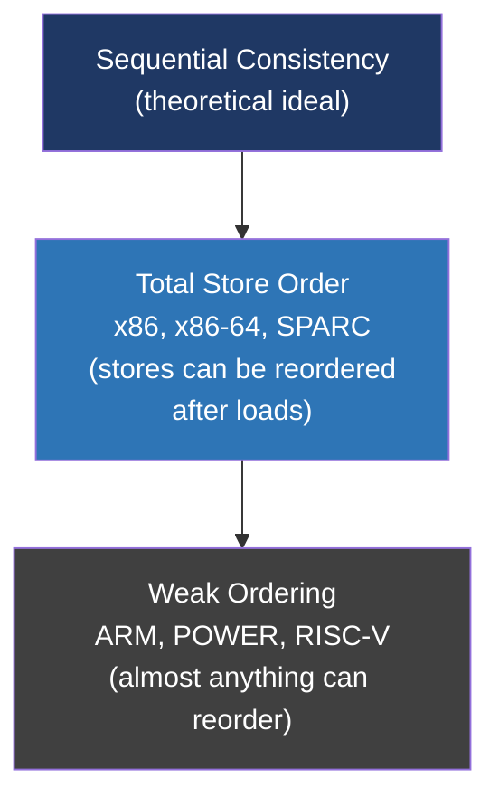
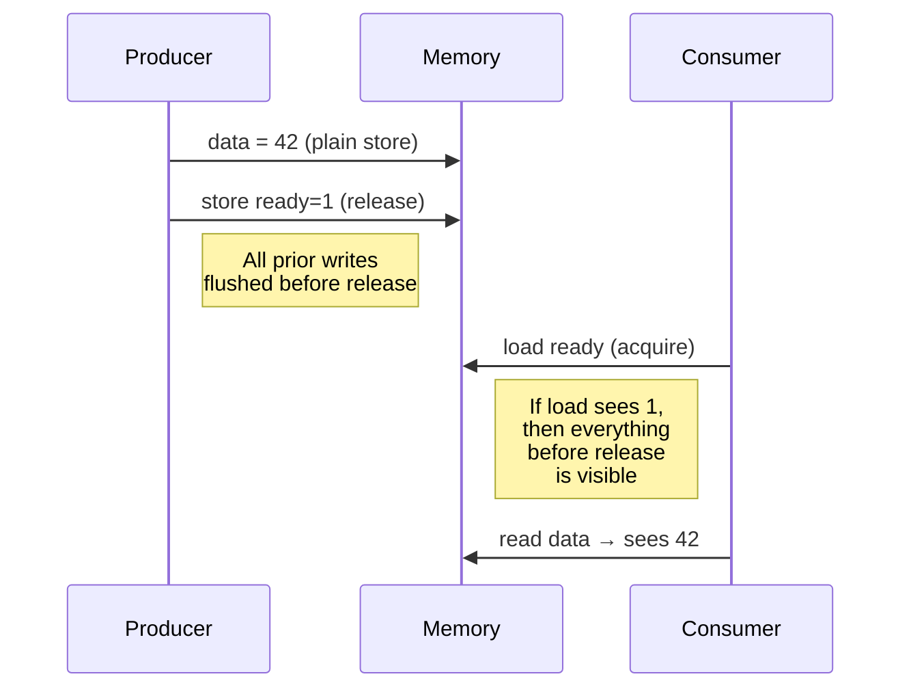

# Day 19 — Memory models and atomics

> **Week 3 — Concurrency, synchronization, IPC**
> Reading: OSTEP ch 28 (locks, the hardware part); McKenney *Is Parallel Programming Hard* ch 15 (memory ordering); cppreference on `std::memory_order`.

## Why this matters

You write `x = 1; y = 2;`. You assume another thread reading them sees `x = 1` first, then `y = 2`. **That assumption is wrong** on most modern CPUs. Compilers reorder. CPUs reorder. Caches make writes appear in different orders to different cores.

The "memory model" is the contract: given my program's source code, what orderings of memory operations am I allowed to observe? Without understanding this, your lock-free code is broken in ways that won't show up in testing — only in production, only sometimes, only on certain hardware.

This is interview gold. The candidate who can explain why a double-checked locking pattern is broken without `acquire`/`release` semantics stands out immediately.

## 19.1 The illusion of sequential consistency

The intuitive model — every thread's operations interleave in *some* global order, and every thread sees that order — is called **sequential consistency** (SC). It's what you'd expect if memory were a single shared variable accessed one operation at a time.

Real hardware doesn't give you this for free. Reasons:

1. **Store buffers.** When a CPU writes, the store goes into a per-core buffer first, only later draining to cache. Other cores can't see it yet.
2. **Out-of-order execution.** The CPU may execute instructions in a different order than the program text, as long as the *single-threaded* semantics are preserved.
3. **Compiler reordering.** The compiler reorders for optimization, again preserving single-threaded semantics.
4. **Cache coherence delays.** Even once a write reaches cache, propagating it to other cores' caches takes cycles.

The classic example:

```c
// Initially: x = 0, y = 0
// Thread 1:           Thread 2:
x = 1;                 y = 1;
r1 = y;                r2 = x;
```

Can `r1 == 0 && r2 == 0` after both threads finish? Under SC, no — at least one thread runs first, so at least one read sees the other's write. **Under x86, yes.** Both stores can sit in store buffers while the loads complete. ARM and POWER are even more aggressive.

## 19.2 Hardware memory models, briefly



**x86 (TSO):** stores happen in program order from the perspective of all cores. Loads can be reordered with earlier stores to *different* addresses. Roughly: "you can read past your own pending writes." Most multi-threaded code that's wrong on ARM happens to work on x86 by luck.

**ARM/POWER (weak):** loads, stores, and even dependent operations can reorder freely unless you insert barriers. Code ported from x86 to ARM that "worked fine" on x86 frequently breaks.

You don't program directly to either of these. You program to a **language memory model** — C11/C++11 atomics, Java volatile, Rust atomics — which compiles to the right barriers for the target CPU.

## 19.3 Why ordinary loads/stores aren't enough

```c
// BROKEN double-checked locking
struct Singleton *instance = NULL;

Singleton *get_instance() {
    if (!instance) {                    // (1) check
        lock(&init_lock);
        if (!instance) {                // (2) double check
            instance = create();        // (3) store
        }
        unlock(&init_lock);
    }
    return instance;                    // (4) return
}
```

What can go wrong? Step (3) — `instance = create()` — is really:

```
ptr = malloc(sizeof(Singleton));    // (3a)
init(ptr);                          // (3b) — set fields
instance = ptr;                     // (3c) — publish pointer
```

The compiler or CPU may reorder (3c) before (3b). Now another thread does step (1), sees a non-NULL `instance`, returns it, dereferences it — and sees uninitialized garbage.

The fix isn't a stronger lock. It's making (3c) an **atomic store with release semantics**, paired with an **acquire load** at (1). Atomics are how you tell the system "these particular operations are special; don't reorder around them."

## 19.4 The C11/C++11 atomic operations

```c
#include <stdatomic.h>

atomic_int counter = 0;

atomic_fetch_add(&counter, 1);              // ++counter, atomically
int v = atomic_load(&counter);              // read
atomic_store(&counter, 42);                 // write
int expected = 5;
atomic_compare_exchange_strong(&counter, &expected, 6);  // CAS
```

These do two things at once:

1. **Atomicity:** the operation is indivisible — no other thread sees a half-completed state.
2. **Ordering:** they create *happens-before* relationships you can rely on.

A "regular" `int x; x++` does neither. The increment is read-modify-write — three operations, interruptible. And it can be reordered freely with surrounding code.

## 19.5 Memory orders

C11/C++11 lets you ask for *less* ordering than full SC, in exchange for performance. The orders, weakest to strongest:

| Order | Meaning | Cost |
|---|---|---|
| `relaxed` | Atomic, no ordering guarantees | Cheapest |
| `acquire` (loads only) | Subsequent operations don't move before this load | Cheap on x86 |
| `release` (stores only) | Prior operations don't move after this store | Cheap on x86 |
| `acq_rel` | Both (for RMW) | Cheap on x86 |
| `seq_cst` | Sequential consistency — there's a global order | Most expensive |

**Default:** if you don't specify, you get `seq_cst`. Safe but sometimes wasteful.

```c
// Producer:
data = 42;                                          // ordinary write
atomic_store_explicit(&ready, 1, memory_order_release);  // publish

// Consumer:
if (atomic_load_explicit(&ready, memory_order_acquire)) { // observe
    use(data);  // guaranteed to see data == 42
}
```

The release/acquire pair guarantees: anything the producer wrote *before* the release becomes visible to a consumer that sees the release via an acquire load. This is the correct fix for double-checked locking.



## 19.6 Why `volatile` is not the answer

In C/C++, `volatile` does *not* mean "atomic" or "thread-safe." It means "don't optimize away accesses to this variable" — useful for memory-mapped device registers, useless for inter-thread synchronization. It provides:

- No atomicity (a `volatile long long` increment is still multiple instructions).
- No ordering with non-`volatile` accesses.
- No barriers in the generated code.

In Java, `volatile` *does* provide acquire/release semantics, which is a different language design. Don't carry that intuition to C++.

## 19.7 Compare-and-swap (CAS) and lock-free programming

CAS is the foundational atomic RMW: "atomically, if `*p == expected`, set `*p = new` and return success; otherwise return the current value." Hardware: `CMPXCHG` on x86, `LDREX/STREX` on ARM.

```c
int expected, desired;
do {
    expected = atomic_load(&head);
    desired = compute_new(expected);
} while (!atomic_compare_exchange_weak(&head, &expected, desired));
```

This is the ABA loop. It retries until no other thread interfered. Used in lock-free stacks, queues, ref counts. The catch (the "ABA problem"): if `head` was A, then changed to B, then back to A, your CAS succeeds even though the world changed. Solutions: hazard pointers, RCU, generation counters.

Lock-free programming is *hard*. For most production code, well-engineered locks beat hand-rolled lock-free structures. Use lock-free for genuinely contended hot paths where measurement justifies the complexity.

## Hands-on (30 minutes)

1. Write a counter incremented by 4 threads, 1M times each:
    - Version A: plain `int x; x++;`
    - Version B: `atomic_int x; atomic_fetch_add(&x, 1, memory_order_relaxed);`
    - Version C: same with `memory_order_seq_cst`.
    Time each. Verify A loses increments. Compare B and C — `relaxed` should be faster, especially on ARM.
2. On Linux, run `objdump -d` on a small program with `atomic_store(_Atomic int*, 1, memory_order_seq_cst)` vs. `memory_order_release`. On x86, look for `mfence` or `xchg` (seq_cst) vs. plain `mov` (release).
3. Write a Peterson's algorithm implementation with plain ints, then with atomics. Run with thread sanitizer (`gcc -fsanitize=thread`). Plain ints will report races.
4. Read the `mm/rwsem.c` or `kernel/locking/qspinlock.c` source. Notice how every shared field is accessed via `READ_ONCE`/`WRITE_ONCE` or `atomic_*` — never plain loads/stores.
5. Read the cppreference page on `std::memory_order`. Memorize the relationships.
6. Sketch why double-checked locking with `volatile` (in C++) is broken on ARM but accidentally works on x86.

## Interview questions

**1. What is the memory model, and why can't I just rely on writes being visible immediately?**

> The memory model is the formal specification of what orderings of memory operations a thread can observe. The naive expectation — that writes appear immediately in program order to every other thread — is called sequential consistency, and modern hardware doesn't provide it for free because it's slow. Instead, CPUs use store buffers, out-of-order execution, and per-core caches that gain massive throughput in exchange for letting writes appear out of order to other cores. On top of that, the compiler reorders code during optimization. So when I write `a = 1; b = 2;`, another thread might see `b == 2` while still seeing the old value of `a`. The memory model defines exactly what's allowed and what isn't, and gives me primitives — atomic operations with explicit ordering — to enforce the orderings I need.

**2. What's the difference between `volatile` and atomic in C++? Why isn't `volatile` enough for thread synchronization?**

> `volatile` in C++ tells the compiler "don't optimize away accesses to this variable" — it forces actual loads and stores rather than caching the value in a register. That's useful for memory-mapped device registers, where reading the same address twice in a row genuinely returns different values. But it gives you nothing for thread safety: it doesn't make multi-instruction operations atomic, and it doesn't insert any memory barriers, so the CPU and other threads can still see operations out of order. To synchronize between threads, you need atomic types — `std::atomic<T>` — which guarantee both atomicity of the operation and the memory ordering you specify. Java's `volatile` happens to mean something stronger, closer to C++'s `std::atomic` with sequential consistency, which causes a lot of confusion when people move between languages.

**3. Explain release/acquire ordering. Why is it cheaper than sequential consistency?**

> Release and acquire are paired ordering constraints. A release store says: "all my prior writes complete before this store becomes visible." An acquire load says: "all my subsequent reads happen after this load completes." When a release store is paired with an acquire load on the same variable — and the load actually observes the store — everything the producer thread wrote before the release is guaranteed visible to the consumer after the acquire. This is exactly what you need to publish data: write the data, then release-store a flag; the reader acquire-loads the flag and then reads the data. It's cheaper than sequential consistency because seq_cst additionally requires a *single global ordering* that all threads agree on, which means stronger barriers — on x86, an `mfence` for seq_cst stores versus a plain `mov` for release. On weakly-ordered hardware like ARM, the difference is even larger. So release/acquire gives you exactly what producer-consumer code actually needs without paying for the global ordering you don't.

**4. What's the ABA problem, and how is it handled?**

> The ABA problem shows up in lock-free algorithms that use CAS. The idea: thread T1 reads value A from a shared pointer. Before T1 can act, thread T2 changes the pointer to B and then back to A. T1 now does its CAS expecting A, sees A, succeeds — but the meaning of A has changed. In a lock-free stack, this can mean T1 successfully pops the head, but the node it just popped was already freed and reallocated for something else. Standard mitigations are hazard pointers — each thread publishes the pointers it's currently dereferencing so other threads know not to free them — and RCU, where memory is only freed after a grace period during which all readers have moved on. Another approach is generation-tagged pointers: pack a counter into unused bits of the pointer that increments on every modification, so even if the address comes back, the tag has changed and CAS fails. The kernel uses RCU heavily for this. In application code, the simpler answer is usually: don't write lock-free data structures from scratch. Use library implementations or use locks.

## Self-test

1. Why does `memory_order_seq_cst` cost more than `memory_order_release`?
2. Show a code example where x86's TSO model lets a behavior happen that's forbidden under SC.
3. What barriers does a release store compile to on x86? On ARM?
4. Why is double-checked locking with `volatile int initialized` broken in C++?
5. When would you prefer relaxed atomics over release/acquire?
