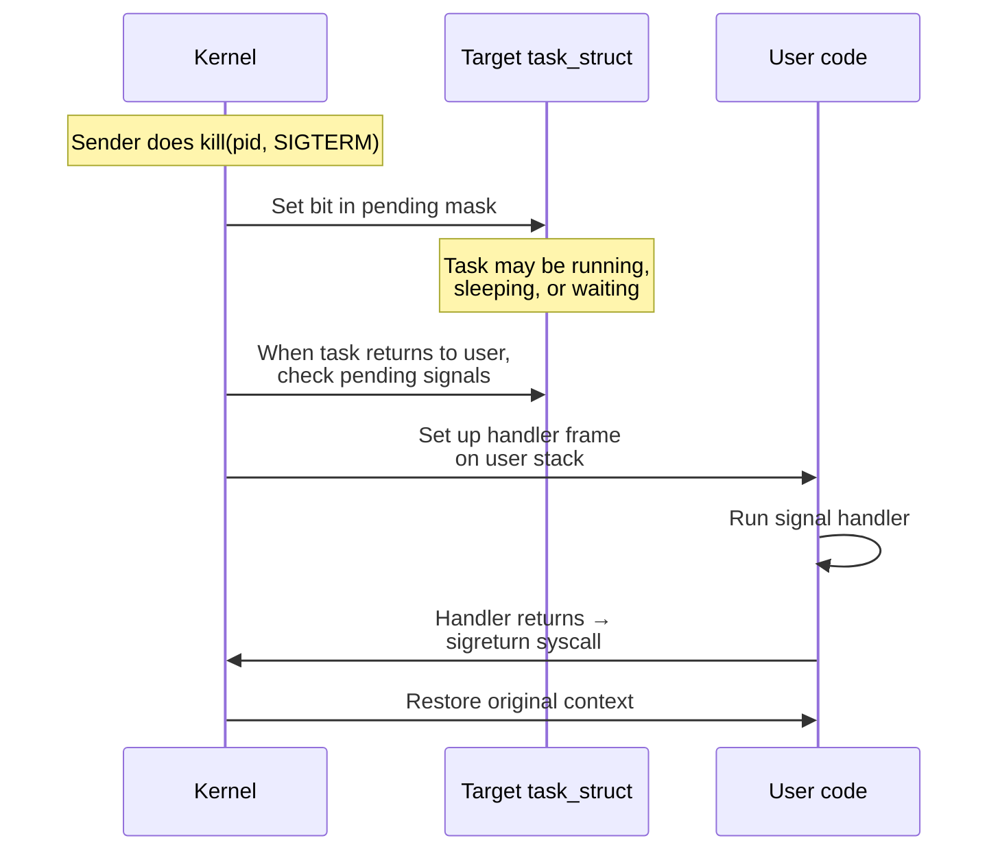
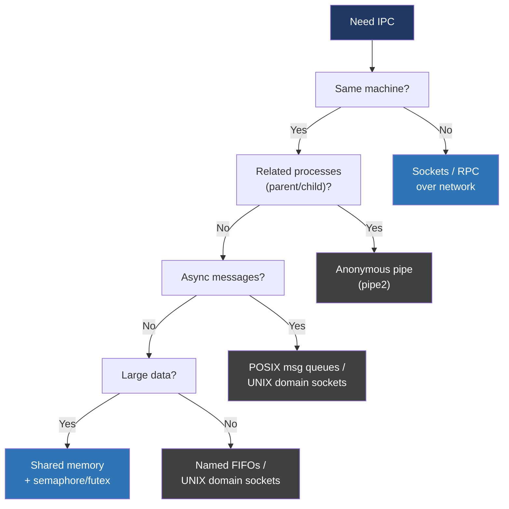

# Day 20 — Signals and IPC

> **Week 3 — Concurrency, synchronization, IPC**
> Reading: TLPI ch 20–22 (signals); ch 43–48 (POSIX/SysV IPC, pipes, message queues, shared memory).

## Why this matters

You can't build real systems without inter-process communication. A web server hands work to backend processes. A shell pipes commands. A daemon receives configuration reloads via signals. Every one of these uses an IPC mechanism, and each has different cost, semantics, and gotchas.

Signals deserve special attention because they're the most misunderstood Linux feature. Half the bugs in production daemons trace back to someone calling something unsafe in a signal handler.

## 20.1 Signals: what they are

A signal is a **software interrupt** delivered to a process. The kernel — or another process — generates one, the kernel marks it pending in the target's task_struct, and the next time that task runs in user mode, the kernel diverts it to a handler before resuming.



Standard signals like `SIGINT`, `SIGTERM`, `SIGKILL`, `SIGSEGV`, `SIGCHLD` each have a default action: terminate, ignore, stop, or core-dump. You can override with `sigaction()` (use this — `signal()` is legacy with portability problems).

`SIGKILL` and `SIGSTOP` cannot be caught, blocked, or ignored. That's how `kill -9` always works.

## 20.2 Why signal handlers are dangerous

A handler can run **at almost any point** in your program — between any two instructions, including in the middle of `malloc`, in the middle of `printf`, in the middle of acquiring a mutex.

Suppose your main code is in `malloc` holding malloc's internal lock. A signal arrives, your handler runs, and your handler calls `printf` — which calls `malloc`. Deadlock. Or your handler calls `free` on something `malloc` is mid-modifying. Heap corruption.

The fix: signal handlers must only call **async-signal-safe** functions. The list is short — see `man 7 signal-safety`. It includes things like `write`, `_exit`, `read`, `kill`, `sigaction`, and a handful of others. Notably **not** safe: `printf`, `malloc`, `free`, `pthread_mutex_lock`, anything that uses errno without saving it, almost everything else.

The standard pattern: handler sets a `volatile sig_atomic_t` flag. Main loop checks the flag and acts.

```c
volatile sig_atomic_t got_sigterm = 0;

void handler(int sig) { got_sigterm = 1; }

int main() {
    struct sigaction sa = { .sa_handler = handler };
    sigaction(SIGTERM, &sa, NULL);
    while (!got_sigterm) {
        do_work();
    }
    cleanup();
}
```

## 20.3 Signal-safe alternatives

Modern Linux gives you better options:

- **`signalfd`** — turn signals into file descriptor reads. Now your event loop just `read`s from the fd; no handler needed. Pairs well with `epoll`.
- **`pselect` / `ppoll`** — atomically unmask signals and wait. Closes the race window between checking a flag and sleeping.
- **`self-pipe trick`** — handler does `write(pipe_fd, "x", 1)`. Main loop reads from the pipe in its `select`/`poll` — works on systems without `signalfd`.

```c
int sfd;
sigset_t mask;
sigemptyset(&mask);
sigaddset(&mask, SIGTERM);
sigprocmask(SIG_BLOCK, &mask, NULL);  // block normal delivery
sfd = signalfd(-1, &mask, 0);

// Now poll/epoll on sfd alongside other fds
```

This is the right answer for any non-trivial daemon.

## 20.4 IPC mechanisms — the menu



| Mechanism | Throughput | Setup | Notes |
|---|---|---|---|
| Anonymous pipe | High | Easy | Parent/child only, byte stream, one-way |
| Named pipe (FIFO) | High | Easy | Filesystem entry, byte stream |
| UNIX domain socket | High | Easy | Bidirectional, datagram or stream, can pass fds |
| POSIX message queue | Medium | Medium | Priority, fixed-size messages |
| SysV message queue | Medium | Awkward | Legacy, IPC keys, mostly avoid |
| Shared memory + sync | Highest | Hardest | Zero-copy, but you handle synchronization |
| TCP/UDP socket | Network speeds | Easy | Same machine via loopback works fine |

## 20.5 Pipes and FIFOs

`pipe(fds)` creates a pair: `fds[0]` for reading, `fds[1]` for writing. Combined with `fork`, this is the foundation of shell pipelines.

Properties:
- Byte stream, no record boundaries.
- Default buffer is 64 KB on Linux (`/proc/sys/fs/pipe-max-size`).
- Writes <= `PIPE_BUF` (4096) are atomic; larger may interleave with concurrent writers.
- Reading from a pipe with no writers returns 0 (EOF).
- Writing to a pipe with no readers gets `SIGPIPE` (default: terminates) or `EPIPE` if blocked.

A FIFO (`mkfifo`) is the same idea but with a filesystem name, allowing unrelated processes to connect.

## 20.6 UNIX domain sockets

The Swiss army knife of local IPC. API identical to network sockets, address family `AF_UNIX`. Three special abilities:

1. **Bidirectional.** One socket, both directions.
2. **Pass file descriptors** between processes via `SCM_RIGHTS`. This is how `systemd` hands sockets to spawned services, how Chrome's sandbox passes file handles to the renderer.
3. **Pass credentials** (UID/GID/PID of peer) via `SO_PEERCRED` — useful for authentication.

```c
// Server
int s = socket(AF_UNIX, SOCK_STREAM, 0);
struct sockaddr_un addr = { .sun_family = AF_UNIX };
strcpy(addr.sun_path, "/tmp/myservice");
bind(s, (struct sockaddr*)&addr, sizeof(addr));
listen(s, 5);
int c = accept(s, NULL, NULL);
```

For new code, prefer UNIX sockets over POSIX/SysV message queues.

## 20.7 Shared memory

Two processes both `mmap` the same region. Reads and writes go directly to physical memory — no kernel copy. Fastest IPC possible.

Two flavors:
- **POSIX:** `shm_open()` to create/open a name, `mmap()` to map it. Cleaner API.
- **SysV:** `shmget()`/`shmat()`. Older, key-based, persists in kernel until explicitly removed.

Shared memory by itself is just memory — you still need synchronization. Options:
- POSIX semaphore in shared memory (`sem_init` with `pshared=1`).
- pthread mutex with `PTHREAD_PROCESS_SHARED` attribute, placed in the shared region.
- Plain futexes if you're feeling brave.

```c
int fd = shm_open("/myshm", O_CREAT | O_RDWR, 0600);
ftruncate(fd, sizeof(struct shared_data));
struct shared_data *p = mmap(NULL, sizeof(*p),
    PROT_READ | PROT_WRITE, MAP_SHARED, fd, 0);
// Both processes now mmap the same; writes are immediately visible
```

Shared memory is the right answer for high-throughput IPC: video frames, audio, large protocol buffers between cooperating processes.

## 20.8 SysV vs POSIX IPC

For pipes/FIFOs, there's no difference — both are POSIX. For message queues, semaphores, and shared memory there are two parallel APIs:

- **SysV** (`msgget`, `semop`, `shmget`): older, integer keys via `ftok()`, kernel-resident, persists across process exit, listed in `ipcs`. Awkward.
- **POSIX** (`mq_open`, `sem_open`, `shm_open`): newer, named like files (`/myname`), saner API, also persistent.

In new code, default to POSIX. Read SysV when you have to maintain old code or read kernel internals.

## Hands-on (30 minutes)

1. Write a server that handles `SIGTERM` for graceful shutdown using `signalfd`. Compare the code with the same logic using a flag-based handler.
2. Reproduce the danger: write a signal handler that calls `printf` in a tight loop, raise the signal repeatedly, watch it deadlock or corrupt output.
3. Build a parent-child pipeline: parent forks, child runs, communicates via `pipe()`. Send 10 MB through. Use `time` to measure.
4. Same data through a UNIX domain socket. Then through shared memory + semaphore. Compare throughput.
5. Run `ipcs -a` to list SysV IPC objects. Run `ls /dev/shm/` to see POSIX shared memory segments.
6. Read `man 7 signal-safety` — bookmark it. You will revisit this list.

## Interview questions

**1. Why are signal handlers so restricted in what they can call? What's the right pattern for using signals?**

> Signal handlers can run at almost any instruction boundary in the program. That means if a signal arrives while the main code is inside `malloc` holding malloc's internal lock, and the handler also calls `malloc`, you deadlock — or worse, corrupt the heap because the data structures malloc was modifying are in an inconsistent state. The same applies to almost any library function that has internal state. The rule is that handlers may only call async-signal-safe functions, which is a short list defined in POSIX: `write`, `_exit`, `read`, basic syscalls, and a few others. Notably `printf`, `malloc`, `free`, and almost all of pthreads are not safe. The conventional safe pattern is: install the handler, have the handler set a `volatile sig_atomic_t` flag and return immediately, and have the main code's event loop check the flag and act on it. The modern Linux pattern is even better: block the signal, create a `signalfd`, and read from it like any other file descriptor in your event loop. That way there's no asynchronous handler at all.

**2. How would you choose between a pipe, a UNIX domain socket, and shared memory?**

> Pipes are the simplest answer when one process produces data and another consumes it, especially if they're parent and child. They're a one-way byte stream with a small buffer. Use them for shell-pipeline-style flows: command output to command input.
>
> UNIX domain sockets are bidirectional, work between unrelated processes via a filesystem path, can do datagrams or streams, and can pass file descriptors between processes — which is unique and powerful. They're the right default for arbitrary local IPC: client/server protocols, daemons, anything with a request/reply shape. Modern systems lean heavily on them.
>
> Shared memory is for the highest-throughput cases where copying through the kernel matters. Two processes `mmap` the same region and read/write directly. The catch is you have to synchronize access yourself with cross-process mutexes, semaphores, or atomic operations, and you have to be careful about layout and alignment. Use shared memory when profiling shows that copy overhead is real — for example, video pipelines, sample-rate audio, or shipping large protocol-buffer messages between cooperating processes. Don't reach for it as a default; locks across processes are harder to get right than locks within one.

**3. Why might you prefer `signalfd` to a traditional signal handler?**

> Traditional handlers run asynchronously at any instruction, which is why the safety rules are so restrictive. With `signalfd`, you block the signal first so it never delivers to a handler, then you create a file descriptor that becomes readable when the signal would have been delivered. Now the signal is just data on a fd, and you handle it in your normal event loop alongside socket reads, timer fds, and everything else. There's no async context, no special safety rules, no race window between checking a flag and going back to sleep. It composes naturally with `epoll`. The downside: it's Linux-specific, so portable code still needs the traditional pattern.

**4. What is `SIGPIPE` and why does it exist?**

> `SIGPIPE` is sent to a process when it writes to a pipe or socket whose read end has been closed. The default action is to terminate the process. The reason it exists is the shell pipeline use case: `find / | head` — when `head` reads its 10 lines and exits, you want `find` to stop walking the filesystem rather than keep running uselessly. `SIGPIPE` accomplishes this. The downside is that it surprises servers: if a client disconnects mid-write, your server gets `SIGPIPE` and dies. Servers always either ignore it (`signal(SIGPIPE, SIG_IGN)`) or use `MSG_NOSIGNAL` on `send()` calls, then check for `EPIPE` on the return value and handle it explicitly. This is one of the things every TCP server has to remember.

## Self-test

1. Why are `SIGKILL` and `SIGSTOP` uncatchable? What design problem does that solve?
2. Show how to use a self-pipe to make `select` aware of a signal.
3. What does `SCM_RIGHTS` let you do over a UNIX domain socket?
4. Why are POSIX IPC objects named `/something` rather than full paths?
5. When does shared memory beat a UNIX socket and when is the socket fine?
