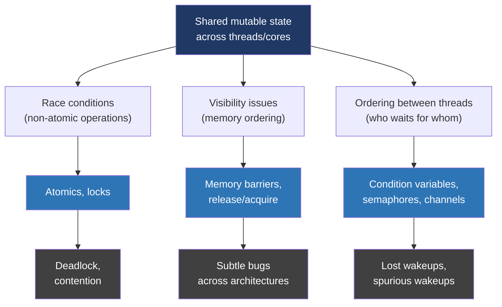
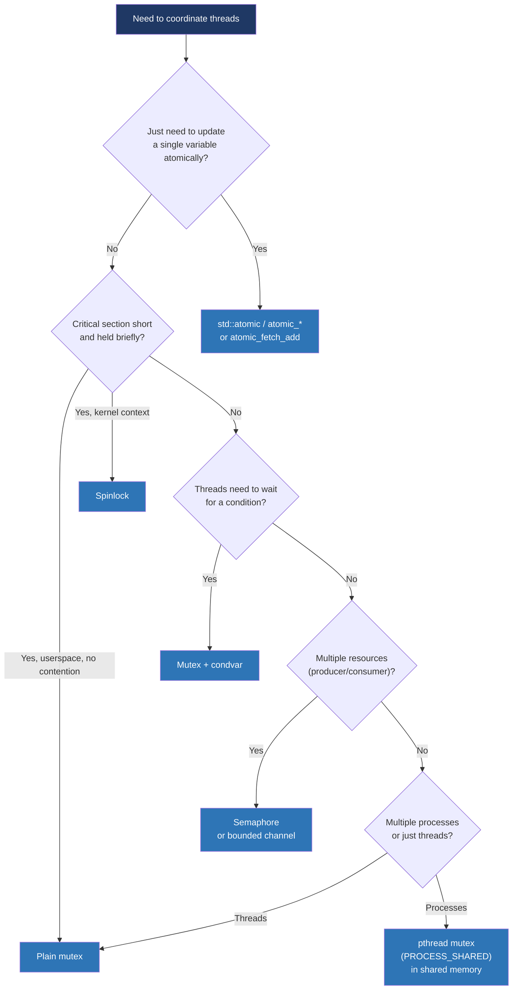

# Day 21 — Week 3 review and interview drill

> **Week 3 — Concurrency, synchronization, IPC**
> Reading: skim back over OSTEP locks/condition vars chapters; re-read your own notes from days 15–20.

## Why this matters

Concurrency is the single largest source of interview rejections. Candidates either know it or visibly don't. The mental model from this week — race conditions need atomicity, mutexes serialize, condition variables coordinate, deadlock comes from circular waits, memory orders define visibility — is the spine of every concurrency answer.

Today is about welding it together.

## 21.1 The unified mental model



Three kinds of problems, three kinds of tools, three classes of bugs that follow from each.

## 21.2 Decision flowchart for synchronization choice



## 21.3 The ten classic bugs to recognize

| # | Bug | Recognize by |
|---|---|---|
| 1 | Race on read-modify-write | `count++` or `if (x) { x = ... }` from multiple threads |
| 2 | Lost wakeup | Signal sent before wait, no flag check |
| 3 | Missing condvar loop | `if (cond) wait()` instead of `while (cond) wait()` |
| 4 | Lock acquired in different orders | Code path A: lock1, lock2. Path B: lock2, lock1 |
| 5 | Signal handler calls non-async-safe function | Handler calls `printf`, `malloc`, etc. |
| 6 | Forgotten `volatile sig_atomic_t` | Compiler optimizes out the check, infinite loop |
| 7 | Double-checked locking without memory barriers | Reader sees pointer, dereferences uninitialized memory |
| 8 | Recursive lock acquisition | Holding mutex M, calling function that re-locks M |
| 9 | Holding lock during slow operation | Lock held across I/O, RPC, sleep |
| 10 | Spinlock held while sleeping | Kernel spinlock + a function that may schedule |

## 21.4 Quick problem warmups

**Q.** A shared counter is incremented by 4 threads, each doing 1M increments. Final value is sometimes less than 4M. Why?

> `count++` is read-modify-write, three steps: load, add, store. Two threads can both load the same value, both add 1, both store the same result — one increment lost. Fix: `atomic_fetch_add` or a mutex-protected increment.

**Q.** A producer pushes to a queue, signals a condvar. A consumer waits, gets signaled, pops — and gets nothing.

> Either: the consumer didn't hold the mutex during the wait + check (so the producer enqueued and signaled in between), or the consumer used `if` instead of `while` (spurious wakeup, or another consumer raced ahead). Fix: hold the mutex, loop on the predicate, only exit the loop when the predicate is true.

**Q.** Code holds lock A then tries to acquire lock B. Other code path holds B then tries A. Both threads stall.

> Classic AB-BA deadlock. Fix: enforce a global lock ordering. Address-based ordering (`lock(min(a,b)); lock(max(a,b));`) works when locks are dynamically chosen.

**Q.** A daemon's `SIGTERM` handler calls `cleanup()` which calls `printf` and `free`. Sometimes the daemon hangs on shutdown.

> Signal handler called non-async-safe functions; if the signal interrupted `malloc`, the second `free` corrupts the heap or deadlocks. Fix: handler sets `volatile sig_atomic_t shutdown = 1`. Main loop checks and runs cleanup itself.

## 21.5 Mock interview drill

### Section A: Concurrency fundamentals (10 min)

**A1.** What's the difference between a race condition and a data race?

> A data race is the formal language-level concept: two threads access the same memory without synchronization, at least one is a write. C++ and Java both make data races undefined behavior. A race condition is broader and more informal: the program's behavior depends on timing in a way the programmer didn't intend. You can have race conditions without data races — for example, two threads both atomically check-then-act on a flag, where the check and act aren't atomic together. So data race is a strict subset. The fix for both is the same family of tools, but you can have a race condition in code that has no data races.

**A2.** When would you use a spinlock instead of a mutex?

> Spinlocks are for when blocking is more expensive than spinning. That's almost always inside the kernel, where the lock holder won't be preempted (or where you've disabled preemption), the critical section is very short, and putting the thread to sleep would mean a context switch costing thousands of cycles for a lock that releases in tens. In userspace, almost never — a userspace spinner can be preempted while spinning, and now it's spinning waiting for someone who isn't even running. Pthread mutexes already adapt: they spin briefly on contention and only fall back to a futex sleep if the spin doesn't succeed. So the right answer for userspace is "use a mutex; it does the right thing."

### Section B: Memory model and atomics (10 min)

**B1.** Explain release/acquire ordering. Give a code example where it matters.

> Release-acquire is the ordering pair you use to publish data from one thread to another. A release store guarantees all writes earlier in program order have completed before the store is visible. An acquire load guarantees all reads later in program order start after the load. So the pattern is: producer writes data, then does a release store on a flag; consumer does an acquire load of the flag, sees it set, then reads data. If the acquire load observes the release, all the producer's prior writes are visible.
>
> Concrete example: lock-free initialization.
> ```c
> // Producer:
> data = compute();
> atomic_store_explicit(&ready, 1, memory_order_release);
>
> // Consumer:
> if (atomic_load_explicit(&ready, memory_order_acquire))
>     use(data);
> ```
> Without release/acquire, the consumer can see `ready == 1` but `data` not yet written — the writes can be reordered. With them, the contract holds. Sequential consistency would also work but adds an unnecessary global ordering, costing more on every access.

**B2.** Why isn't `volatile int x` good enough for thread synchronization in C++?

> Two reasons. First, `volatile` doesn't make operations atomic — `volatile long long x; x++;` is still a load, an add, and a store, and the increment can be lost. Second, `volatile` doesn't insert memory barriers, so even if the access itself isn't elided, the surrounding code can be reordered around it. `volatile` was designed for memory-mapped device registers, where you need every access to actually happen, but you're talking to a single hardware register and ordering across multiple variables isn't the concern. For thread synchronization you need `std::atomic`, which gives you both atomicity and explicit memory ordering. Java's `volatile` does provide ordering, which is why people coming from Java assume C++'s does too — that confusion is a frequent source of bugs.

### Section C: Deadlock and design (10 min)

**C1.** A bank has accounts. `transfer(A, B, amount)` locks both accounts, debits A, credits B, unlocks both. Two simultaneous calls to `transfer(account1, account2, ...)` and `transfer(account2, account1, ...)` deadlock. How do you fix it?

> Enforce a global lock ordering. Since account objects are addresses in memory, lock them in address order: lock the one with the lower address first. Both calls now try to acquire `min(account1, account2)` first, then `max(account1, account2)`. The deadlock cycle can't form. In code:
> ```c
> void transfer(Account *a, Account *b, int amount) {
>     Account *first = a < b ? a : b;
>     Account *second = a < b ? b : a;
>     lock(&first->m);
>     lock(&second->m);
>     a->balance -= amount;
>     b->balance += amount;
>     unlock(&second->m);
>     unlock(&first->m);
> }
> ```
> If you can't choose an ordering at compile time, you can use `try_lock` and back off on failure, but that's more complex and can livelock. Address ordering is simpler and always correct here.

**C2.** Design a thread-safe bounded blocking queue. Explain the pieces.

> One mutex, two condition variables, plus the underlying buffer and a size counter. The mutex protects the queue's data. One condvar — `not_full` — is what producers wait on if the queue is full. The other — `not_empty` — is what consumers wait on if the queue is empty.
>
> `enqueue(item)`: lock the mutex; while size equals capacity, wait on `not_full` (atomically releases the mutex and sleeps); add the item; increment size; signal `not_empty` to wake one consumer; unlock.
>
> `dequeue()`: lock the mutex; while size is zero, wait on `not_empty`; remove an item; decrement size; signal `not_full`; unlock; return the item.
>
> Three things to get right: the wait must be inside a `while` loop, not `if`, both for spurious wakeups and because another consumer might have already drained the queue when you wake up. The signal must happen while still holding the mutex, or use `signal_all` carefully if there are multiple waiter classes. And the entire enqueue/dequeue, including the predicate check, must happen under the mutex — releasing it briefly between check and action reintroduces the race.

### Section D: IPC and signals (5 min)

**D1.** A web server needs to gracefully reload its configuration on `SIGHUP`. What's the right pattern?

> The wrong pattern is to do the reload in the signal handler — it'll call non-async-safe functions like `fopen` and `malloc` and either deadlock or corrupt state. The right pattern depends on the architecture. Traditional: handler sets a `volatile sig_atomic_t reload_requested = 1`. The main loop, between handling requests, checks the flag and reloads. Modern: block `SIGHUP`, create a `signalfd` for it, add it to the `epoll` set. Now the reload is just another fd-readable event in the event loop, no async context, no safety restrictions on what you can call. Either way, the actual work happens synchronously from a known program point.

## 21.6 What I should be able to draw without notes

1. The three kinds of synchronization problems and which tool solves each.
2. A futex-based mutex: the fast path (CAS) and the slow path (kernel wait queue).
3. The producer/consumer pattern with mutex + two condvars.
4. The four conditions of deadlock.
5. The release/acquire ordering diagram from day 19.
6. The classic signal-handler safety trap and the `signalfd` alternative.

## 21.7 Common interview confusions

| Confusion | Reality |
|---|---|
| "Mutex is a binary semaphore." | Related but mutexes have ownership; semaphores don't. |
| "atomic_int x means x++ is safe." | True for *the increment*, but combined check-then-set still races. |
| "I just need a memory barrier here." | You almost certainly need release/acquire, not raw fences. |
| "volatile is for thread safety." | No. atomic is for thread safety. |
| "RWLock is always faster than mutex for read-heavy." | Often false; RWLocks have their own contention. Profile. |
| "fork in a multi-threaded program is fine." | No. Only async-signal-safe functions safe between fork and exec. |

## Hands-on (30 minutes)

1. Implement the bounded queue. Test with multiple producers and consumers. Verify no items lost or duplicated.
2. Reproduce the AB-BA deadlock. Then fix with address ordering. Use `gdb` to verify both threads are blocked at the right spots before the fix.
3. Build a small daemon: blocks `SIGTERM` and `SIGHUP`, reads `signalfd` in `epoll`. `SIGTERM` exits, `SIGHUP` reloads config. Run with multiple signals to verify.
4. Run thread sanitizer (`gcc -fsanitize=thread`) on a piece of code with a known race. Make sure it reports it. Now fix it.
5. Sketch (on paper or text) the solutions to all four mock-drill questions before checking the answers.

## Self-test

1. Produce two threads that increment a counter, one with a mutex, one with `atomic_fetch_add`. Compare runtime under low and high contention.
2. Why does putting `wait` inside `if (predicate)` instead of `while (predicate)` lead to bugs even without spurious wakeups?
3. What's the cheapest way to publish a single immutable value from one thread to many readers?
4. Show the lock acquisition order that lets two `transfer` calls deadlock and the order that prevents it.
5. What signal-safe technique replaces a traditional handler in a modern Linux daemon?
