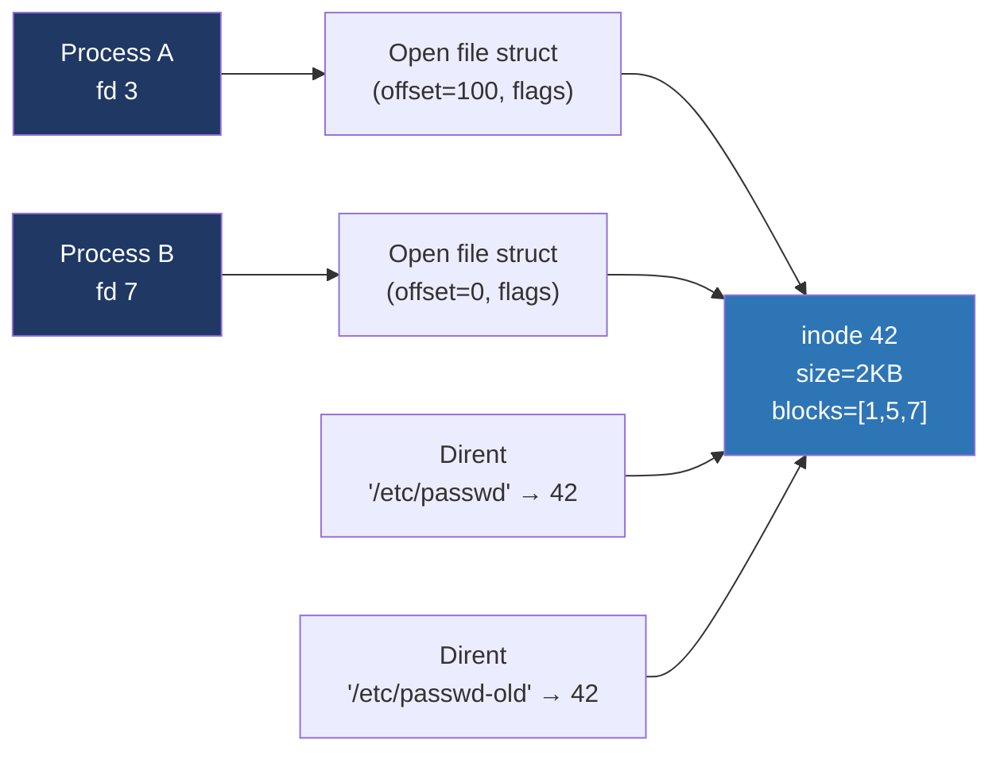
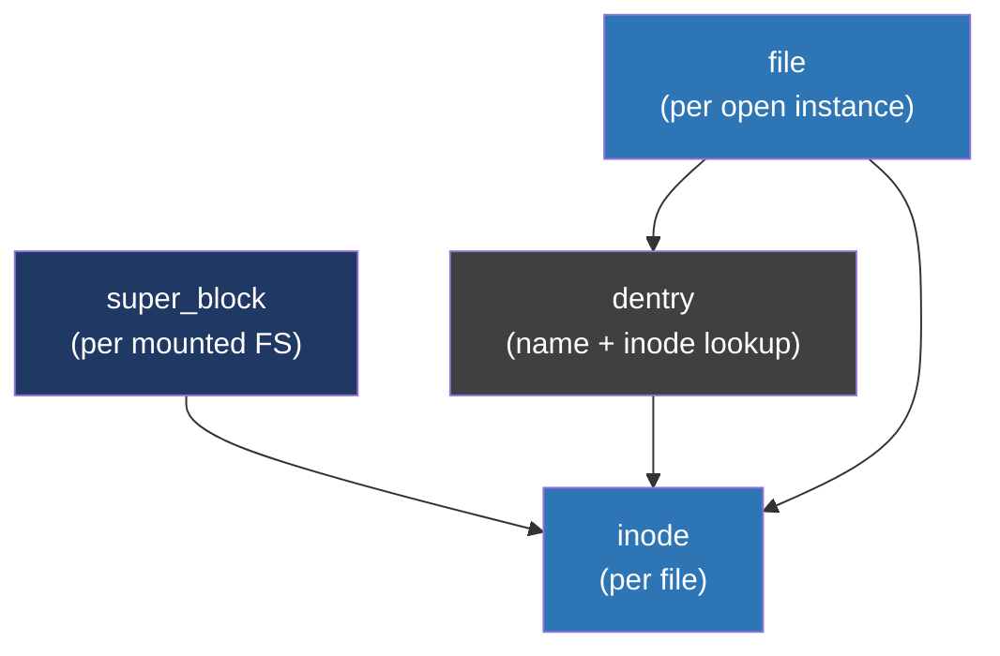

# Day 22 — Files, inodes, directories

> **Week 4 — I/O, filesystems, networking, synthesis**
> Reading: OSTEP ch 39–40 (files and directories, FS implementation); TLPI ch 4, 14, 18; LKD ch 13 (VFS).

## Why this matters

Every Linux process touches files. Sockets, pipes, devices, even memory in `/proc` — all of them are accessed through the file API. The `int fd` you pass to `read()` is the gateway to half of what an OS does.

The interview probes you know the *layers*: from the user's `open("/etc/passwd")` down to a block on a disk, what are the data structures, what does the kernel cache, and what happens when something goes wrong. This is also where the "what's a hard link vs symlink" question lives — and a lot of candidates fumble it.

## 22.1 The classical Unix model

Three core objects:

- **Inode.** The actual file. Contains metadata (permissions, owner, size, timestamps) and pointers to data blocks. Has a unique number within the filesystem.
- **Directory.** A file whose contents are a list of (name, inode-number) pairs. Directories are just files with a special format.
- **File descriptor.** A per-process integer indexing into a kernel table. The entry points to an open-file structure that points to the inode.

A "filename" is just a name in some directory pointing to an inode. Multiple names can point to the same inode (hard links). The file's identity is the inode, not the name.



This decoupling — name → inode → data — is why hard links exist, why you can `unlink` a file someone else has open, why two processes can share a file's seek position via `fork`, and why inode numbers show up in `ls -i`.

## 22.2 What's in an inode

```c
struct inode {
    umode_t            i_mode;        // permissions + file type
    unsigned int       i_uid, i_gid;
    loff_t             i_size;
    struct timespec64  i_atime, i_mtime, i_ctime;
    unsigned int       i_nlink;       // hard link count
    unsigned long      i_ino;         // inode number
    struct super_block *i_sb;         // filesystem
    struct address_space *i_mapping;  // page cache
    const struct inode_operations *i_op;
    const struct file_operations *i_fop;
    // ... pointers to data blocks (filesystem-specific) ...
};
```

`i_nlink` is the hard link count. Reach zero and the file's blocks become free (eventually — see open file rules below).

The `i_op` and `i_fop` function pointer tables are how the VFS abstracts over different filesystems. ext4, xfs, btrfs all fill these in differently; the rest of the kernel calls through them and doesn't care which FS it is.

## 22.3 Hard links vs symlinks

| Property | Hard link | Symlink |
|---|---|---|
| Stores | Just a name pointing to existing inode | A new inode whose data is a path string |
| Cross filesystems | No (inode numbers are FS-local) | Yes |
| Dangling possible | No (target must exist when created) | Yes (target may be missing) |
| Affects link count | Yes (`i_nlink`) | No |
| `ls -l` shows | Just a regular entry | `lrwxrwxrwx ... -> /target` |
| Following on unlink | The link IS the file | Resolved at access time |
| Permission semantics | Inherits inode permissions | Symlink permissions usually ignored; target's apply |

Two pitfalls:

- `unlink("/path/to/file")` only removes one name. The data goes when the *last* name is gone *and* no process has the inode open. This is why you can `tail -f` a log that's been rotated — the rotated file still exists as long as `tail` has it open.
- A symlink to `/tmp/foo` becomes a useless dangling pointer if `/tmp/foo` is removed. A hard link wouldn't.

## 22.4 The Linux VFS

The Virtual Filesystem layer is the kernel's plug-in interface. Several object types:



- **`struct super_block`** — one per mounted filesystem (the root of `/`, `/home`, `/proc`, etc.). Holds FS-wide metadata.
- **`struct inode`** — one per open file. May or may not currently exist on disk depending on FS.
- **`struct dentry`** — directory entry; caches name → inode lookups. The dcache is one of the kernel's most heavily used caches.
- **`struct file`** — an open-file instance. Holds offset, mode flags, references the dentry and inode.

When you call `open("/etc/passwd")`, the kernel walks the path one component at a time. For each component it looks up a dentry (cached, ideally). On dcache miss, it asks the filesystem to read the directory and find the name. Once it has the inode, it allocates a `struct file`, installs it in your process's fd table, and returns the index.

## 22.5 The fd table

Each process has a file descriptor table — an array indexed by fd number, each entry pointing to a `struct file`. Three reserved descriptors:

- 0 — stdin
- 1 — stdout
- 2 — stderr

`dup(fd)` allocates a new fd pointing to the same `struct file` (so they share the offset). `dup2(oldfd, newfd)` is the same but with a chosen new fd, used by shells when redirecting (`./prog > out` does `int f = open("out"); dup2(f, 1); close(f);`).

The `struct file` is reference-counted. `close(fd)` removes the fd entry and decrements the refcount; only when the count hits zero is the file actually released. This is why `dup`'d fds and `fork`-inherited fds keep working after the original is closed.

## 22.6 What `read()` actually does

```c
ssize_t n = read(fd, buf, 4096);
```

1. Trap into kernel via syscall.
2. Look up `struct file` by fd.
3. Call `file->f_op->read_iter` (or `read`).
4. The FS-specific implementation looks at the inode's data blocks.
5. **The page cache.** The kernel checks if the requested file blocks are already in memory as pages. If yes — copy out, done. If no — schedule a disk read, sleep, copy out when complete.
6. Update `file->f_pos` (the offset).
7. Return bytes read to user.

The page cache means the *second* read of the same data is essentially free. We'll cover the cache in detail tomorrow.

## 22.7 Permission checking

Every open and access goes through permission checks against the inode's `mode` (the rwxrwxrwx bits) and uid/gid. Linux has additional layers:

- **Capabilities** — fine-grained subdivision of root power (CAP_NET_ADMIN, CAP_SYS_PTRACE, etc.). A process can have a subset.
- **POSIX ACLs** — per-user/per-group permissions beyond the basic three.
- **LSM (Linux Security Modules)** — SELinux, AppArmor, etc., layer additional checks.
- **Mount flags** — `noexec`, `nosuid`, `ro` apply to the whole filesystem.

The basic check first: are you the owner? group member? other? Then check the right rwx triple.

## 22.8 Special filesystems

`/proc`, `/sys`, `/dev`, `tmpfs`, `cgroupfs`, `bpffs` — these aren't backed by disk. They're virtual filesystems that present kernel state through the same VFS API.

- `/proc/<pid>/maps` — that process's memory layout (we used this in week 2).
- `/proc/<pid>/fd/` — that process's open file descriptors.
- `/sys/devices/...` — device tree.
- `/dev/null`, `/dev/zero` — software pseudo-devices.

This uniformity is the "everything is a file" Unix philosophy in practice. A debugger reads memory by opening `/proc/<pid>/mem`. A monitor reads `/proc/stat`. The same `read()` syscall works on all of them.

## Hands-on (30 minutes)

1. Run `ls -i /etc/passwd /etc/passwd` (with hard links if available, e.g., `ln /tmp/a /tmp/b` then `ls -i`). Verify the inode numbers match.
2. Open a file in one terminal (`tail -f /tmp/foo`), `unlink` it in another, watch what `tail` keeps doing. Run `ls -l /proc/<pid>/fd/` to see the deleted file still referenced.
3. Read `/proc/<pid>/maps` for an arbitrary running process. Identify the regions: text, data, heap, stacks, shared libraries. Match what you saw on day 8.
4. Run `strace -e openat,read,write,close cat /etc/hostname`. Note every syscall: openat, read, write, close — the whole life of a file in one trace.
5. Use `lsof` to list open files for a process. Note that pipes, sockets, devices all show up alongside regular files.
6. Make a symlink to a path that doesn't exist. Run `ls -l` (the symlink shows). Run `cat` on it (fails). Compare with a hard link, which can't be made to a missing target.

## Interview questions

**1. What's the difference between a hard link and a symlink?**

> A hard link is just an additional directory entry pointing to the same inode. The file has multiple names, all equally real — there's no "original." When you remove a name with `unlink`, the inode's link count drops; the actual data goes only when the count hits zero and no one has it open. Hard links can't cross filesystems because inode numbers are filesystem-local, and they can't point to directories (with rare exceptions) because that would make cycles.
>
> A symlink, by contrast, is a separate inode whose contents are a string — the path of its target. When you access through it, the kernel resolves the path each time. Symlinks can cross filesystems, can point to nonexistent paths (they just become dangling), and can point to anything. They're more flexible but the indirection costs an extra lookup, and they can be broken by moving the target. Mental model: hard link is another name for the same file; symlink is a sticky note that says "the file you want is over there."

**2. What is a file descriptor, really? What does the kernel store?**

> A file descriptor is an integer that indexes into a per-process table maintained by the kernel. The table entry points to a kernel `struct file`, which holds the open-file state: the current offset for read/write, flags from `open` like O_NONBLOCK or O_APPEND, the reference count, and pointers to the underlying inode and the operations table that says how to read, write, seek, and so on. So the integer 3 in your process and the integer 3 in another process are completely different things — they index different tables. The `struct file` is what they might share, since `fork` and `dup` cause multiple fds to point to the same struct, which is why those copies share their seek offset.

**3. What does the VFS layer do? Why is it useful?**

> The VFS — Virtual Filesystem — is the kernel's abstraction layer that presents a single uniform interface to user code, no matter what the underlying filesystem is. Every filesystem implementation, whether ext4, xfs, btrfs, NFS, or virtual ones like /proc and tmpfs, registers a set of function pointer tables — `inode_operations`, `file_operations`, `super_operations` — and the VFS's job is to handle the syscalls and call into those tables. So when user code does `open` followed by `read`, the kernel doesn't need ext4-specific or xfs-specific paths in its main code; it walks the VFS objects and dispatches via function pointers. This is what makes "everything is a file" work: pipes, sockets, /proc entries, character devices all plug into the same machinery. From an interview perspective, the key insight is that VFS lets you think about the kernel without knowing which filesystem you're on, and lets you understand why /proc behaves like a filesystem even though it's just kernel data structures wearing a directory disguise.

**4. Why can you `tail -f` a file that's been rotated and deleted?**

> Because Unix decouples filenames from files. The file is the inode and its data blocks; the filename is just a pointer in some directory entry. When `logrotate` renames `app.log` to `app.log.1` and creates a new empty `app.log`, the inode underneath `app.log.1` is the same inode `tail` already has open via its file descriptor. When the rotated file is eventually deleted, that's just removing the name `app.log.1` from the directory; the inode's link count goes to zero, but `tail` still holds an open reference, so the data blocks aren't freed. `tail` keeps reading from the same inode. Only when `tail` finally closes the fd or exits does the kernel release the file. This is why on Linux, "deleting" a busy file doesn't free disk space, and you'll see things like deleted log files holding gigabytes still allocated until the process holding them is restarted — `lsof | grep deleted` reveals these.

## Self-test

1. Why does `i_nlink` reaching 0 not immediately free disk space if a process has the file open?
2. What is a dentry, and why does Linux cache them aggressively?
3. Show the syscalls a shell does to implement `cmd > out.txt`.
4. Why are `/proc` and `/sys` "filesystems"?
5. What happens when you `ln src dst` and `src` is on a different mount than `dst`?
