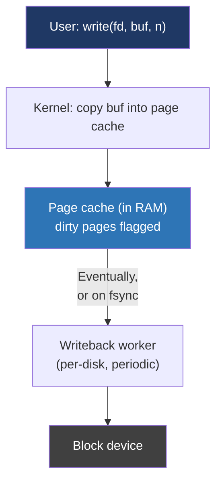
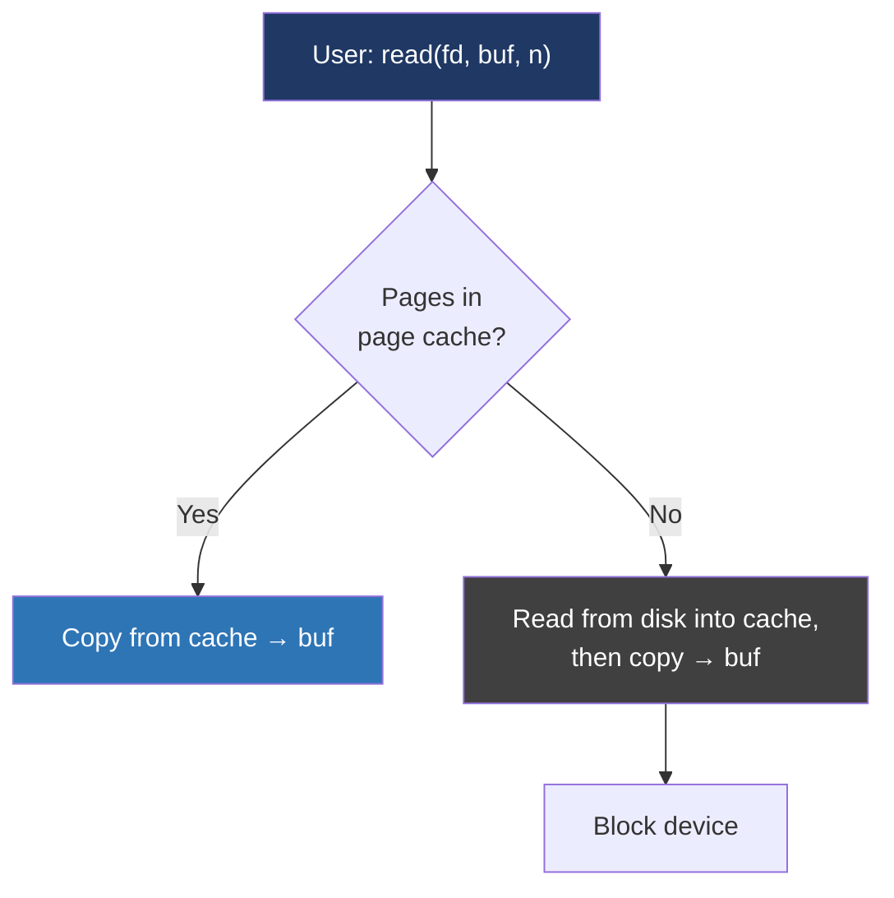

# Day 23 — The page cache and fsync

> **Week 4 — I/O, filesystems, networking, synthesis**
> Reading: OSTEP ch 39–43 (FS, journaling); LKD ch 16 (page cache and writeback); LWN articles "An async page fault on Linux" and "Improving Linux fsync".

## Why this matters

When you call `write()`, the data is **not on disk**. It's in RAM. If you pull the power cord, the write is gone. Most production data-integrity bugs come from someone who didn't understand this.

The page cache is also the single largest performance system in the kernel. It's why your second `grep` over the same files is 100× faster than the first. It's why a database server with 64 GB of RAM and a 30 GB working set never touches disk for reads after warmup.

Interviewers care about both: do you know how the cache works, and do you know what `fsync` actually guarantees?

## 23.1 The big picture



Reads work the mirror image:



The page cache is just normal RAM, indexed by (inode, offset-in-file) → page. On read, hits cost a copy (or a memory map); misses cost an actual disk I/O. On write, the page is updated and marked **dirty**, then later (or on demand) flushed to disk.

## 23.2 What's in `/proc/meminfo`

```
$ cat /proc/meminfo
MemTotal:       16306872 kB
MemFree:          812440 kB
MemAvailable:   10128528 kB
Buffers:          184236 kB
Cached:          8543912 kB    ← page cache for regular files
Dirty:             47812 kB    ← dirty pages waiting to be flushed
Writeback:             0 kB    ← currently being flushed
```

`MemAvailable` is closer to "what programs can actually use" than `MemFree`. The kernel will happily evict cache pages to make room for processes — cache is never charged against you.

`Dirty` is what you should monitor. If it grows huge and you crash, that's data lost. The kernel has tunables — `dirty_ratio`, `dirty_background_ratio` in `/proc/sys/vm/` — that bound how much dirty data can accumulate before writeback triggers.

## 23.3 Buffered vs direct I/O

Default I/O goes through the page cache. This is **buffered I/O**. The flow:

- `write()` → copy into kernel page → return. Disk write happens later.
- `read()` → copy from kernel page → return. If miss, read from disk first.

You can opt out with `O_DIRECT`: I/O bypasses the page cache and goes directly between user buffer and disk. This is for databases that have their own buffer pool and don't want double-caching, or for niche workloads where the cache hurts more than helps.

`O_DIRECT` requires aligned buffers (typically 512-byte or page-aligned), which is annoying. For 99% of code, buffered I/O is the right answer.

## 23.4 The lie of `write()`

This is the crucial point. After `write()` returns, the data is in the page cache, **not** on disk. If you crash:

- The kernel writes its dirty pages out periodically (default 5 seconds for the bulk of it, 30 seconds max for any individual page) and on memory pressure.
- A clean shutdown calls `sync()` to flush everything.
- An unclean shutdown — power loss, kernel panic — loses anything still dirty.

Most applications don't care: a temp file, a build artifact, a log line. If we lose the last second of data on crash, fine. But databases, filesystems, payment systems, anything that promises durability must explicitly tell the kernel to flush.

## 23.5 fsync, fdatasync, sync_file_range

Three primitives, increasing precision:

| Call | Flushes |
|---|---|
| `sync()` | All dirty data on the entire system |
| `fsync(fd)` | All dirty data + metadata for this file |
| `fdatasync(fd)` | All dirty data for this file (skips metadata if not needed for read) |
| `sync_file_range(fd, off, n, flags)` | A specific range; advanced control |

`fsync` is the standard durability primitive. After `fsync` returns, your data is on stable storage — assuming the storage didn't lie. (Disks have their own caches; some cheap ones lie about flushes. Server-grade storage usually has battery-backed cache and honors `fsync`.)

```c
int fd = open("important.dat", O_WRONLY | O_CREAT, 0600);
write(fd, data, size);
fsync(fd);            // data now durable
close(fd);
```

`fdatasync` skips updating metadata that isn't needed to find/read the data. For example, if `mtime` changed but the file size didn't, `fdatasync` may skip updating the inode. Faster, slightly weaker.

## 23.6 The directory durability trap

If you create a file with `open(O_CREAT)`, write, `fsync`, and crash — the file might not exist after reboot. `fsync` flushes the file's data. It does **not** guarantee the *directory entry* that names it is on disk.

The full durable-create pattern:

```c
fd = open("file.tmp", O_WRONLY | O_CREAT, 0600);
write(fd, data, size);
fsync(fd);
close(fd);

rename("file.tmp", "file.dat");

// Open the directory containing file.dat and fsync it
int dirfd = open("/path/to/dir", O_RDONLY);
fsync(dirfd);
close(dirfd);
```

The `rename` is atomic — after rename, either the new file exists at that name or the old one does, never neither. `fsync` on the directory ensures the rename itself reaches disk. SQLite, etcd, every database does some variant of this dance.

This is why interview questions like "how do you safely write a config file" have non-trivial answers: write tmp, fsync tmp, rename, fsync directory.

## 23.7 Writeback details

Linux writeback is performed by per-block-device kernel threads (`flush-N:M` or `kworker`). They wake periodically and write out dirty pages. They also wake when:

- A page has been dirty too long (`dirty_expire_centisecs`).
- Total dirty memory exceeds `dirty_background_ratio` (default 10% of available memory) — start writing in background.
- Dirty memory exceeds `dirty_ratio` (default 20%) — **block writers** until catching up. This is why you sometimes see your `dd` slow down dramatically; you've hit the dirty limit.

Tuning these matters for write-heavy workloads. A database might want lower thresholds to spread writes evenly; a build server might want higher to absorb bursts.

## 23.8 Write barriers and ordering

Modern filesystems (ext4, xfs) use journaling. A typical write:

1. Update the journal with the intended changes.
2. After the journal entry is durable, apply the changes to the filesystem proper.
3. Eventually mark the journal entry done.

If the system crashes, on next mount the FS replays the journal, ensuring the FS is consistent. The journal has to be durable *before* the changes are applied — that ordering is enforced by **write barriers**, which tell the disk "everything before this point must be on stable storage before anything after."

ext4 in `data=ordered` mode (default) journals metadata and ensures data is written before the metadata that references it. Other modes — `data=writeback`, `data=journal` — make different trade-offs. For most users the default is right.

## 23.9 readahead

When you read a file sequentially, the kernel notices and prefetches ahead. This is why streaming a large file is fast even on slow disks: by the time you finish reading bytes [0..N], bytes [N..2N] are already in cache.

You can hint this with `posix_fadvise`:

- `POSIX_FADV_SEQUENTIAL` — I'll read in order; prefetch aggressively.
- `POSIX_FADV_RANDOM` — random access; don't prefetch.
- `POSIX_FADV_DONTNEED` — flush from cache after reading; useful for one-pass scans of huge files (backup tools, etc.).
- `POSIX_FADV_WILLNEED` — preload these pages now.

Most code doesn't bother, but for code that streams hundreds of GB, `POSIX_FADV_DONTNEED` after each chunk prevents trashing the cache.

## Hands-on (30 minutes)

1. `dd if=/dev/zero of=/tmp/big bs=1M count=512`. Watch `Cached` and `Dirty` in `/proc/meminfo` during and after. Then `time cat /tmp/big > /dev/null`. Repeat — second run is much faster (cache hit).
2. Create a small program: write 1 MB, `fsync`, write another 1 MB, no fsync. Force a hard reboot (in a VM). Confirm the first MB survived, the second may not.
3. Observe `dirty_ratio` in action: write a multi-GB file via a slow path, watch `Dirty` grow until your writes block.
4. Run `strace -e fsync sqlite3 db.sqlite "INSERT ..."` — note how often a database actually fsyncs, and on which fds.
5. Compare `dd` with and without `oflag=direct`. The direct version doesn't fill the page cache (verify with `/proc/meminfo`).
6. Run `iostat -x 1` while a heavy workload runs. Watch `wMB/s` and the await/util columns; correlate with the writeback behavior you've read about.

## Interview questions

**1. What does `write()` actually guarantee, and what's the difference from `fsync()`?**

> `write()` returns once the kernel has accepted the data — but "accepted" means copied into the kernel's page cache, not written to disk. The page cache is in RAM. After `write()` returns, your data is visible to other processes (they'll see it in subsequent reads), but if the machine loses power, the data is gone. The kernel will eventually flush the dirty pages to disk on its own schedule, typically within seconds, but there's no guarantee. `fsync(fd)` is what gives you durability: it blocks until the kernel has told the storage device to flush all the file's dirty data and metadata, and the device has acknowledged. After `fsync` returns successfully, the data has reached stable storage. Databases and any system that promises durability call `fsync` at carefully chosen points; everyone else relies on the cache being lazily flushed and accepts the small window of risk.

**2. You're writing a config file safely — describe the steps.**

> The naive approach — `open` the file truncating, write the new contents, close — is wrong because if you crash mid-write, you have a half-written config that might not be parseable, and the old version is gone. The standard safe pattern is write-then-rename: open a temp file in the same directory, write the new config, `fsync` the temp file to make sure the data is durable, close it, then atomically rename the temp file over the real path. The rename is guaranteed atomic by the filesystem — at any point either the old file or the new file exists at that name, never neither. Finally, `fsync` the directory itself, because `fsync` on the file doesn't guarantee the rename has hit disk; the directory entry is metadata of the directory, not the file. After all that, you have crash-safe replacement: a crash at any point leaves either the old config or the new one intact, and after recovery you'll never see a partially-written file.

**3. What's the page cache and why does it matter for performance?**

> The page cache is the kernel's in-memory cache of file data, indexed by file and offset. When you read a file, the kernel first checks if the requested pages are in the cache; if so, it just copies them to your buffer with no disk I/O. If not, it reads from disk into the cache and then copies to you. Writes go into the cache too, marked as dirty, and the kernel flushes them to disk asynchronously. This matters enormously: cold reads are limited by disk speed — maybe a few hundred MB/s on SSD, much less on spinning rust — but cached reads run at memory bandwidth, tens of GB/s. The cache is also why "free memory" is misleading on Linux; the kernel uses essentially all available RAM as page cache, which is exactly what you want. If a process needs memory, the kernel evicts clean cache pages without penalty. The downsides are that buffered writes give a false sense of durability — the data isn't on disk yet when `write` returns — and that the cache competes with explicit application caches like a database's buffer pool, which is why databases often use `O_DIRECT` to opt out of the page cache.

**4. Suppose you've written a file and called `fsync`. The system crashes. Is your data definitely there on reboot?**

> Probably, but with caveats. `fsync` instructs the kernel to flush the dirty pages and metadata, and the kernel issues a flush command to the storage device that should make the data durable. The catches are: first, some cheap consumer storage devices have lied about flushes historically — they acknowledge the flush before the data is actually written to non-volatile media to look fast in benchmarks. Server-grade storage with battery-backed cache, or modern NVMe with proper firmware, doesn't lie about this. Second, `fsync` only affects the file's data and metadata. If you created a new file, `fsync` on the file may not ensure the directory entry that points to the file has reached disk; you need a separate `fsync` on the parent directory. Third, errors on writeback can be lost — there's a known issue called "fsync errors" where if the kernel detects a write error after `write` has already returned, the next `fsync` reports it but a subsequent `fsync` may report success. Modern Linux has improved this but it's still a sharp edge. So the answer is: with proper hardware and the directory-fsync pattern, yes; in adversarial conditions, there are known holes that databases work around carefully.

## Self-test

1. Why does `cat largefile > /dev/null` get faster on the second run?
2. What's the difference between `fsync` and `fdatasync`? When would you use each?
3. Why must a durable file replacement also `fsync` the directory?
4. What happens when `Dirty` exceeds `dirty_ratio`?
5. When would `O_DIRECT` be the right choice?
