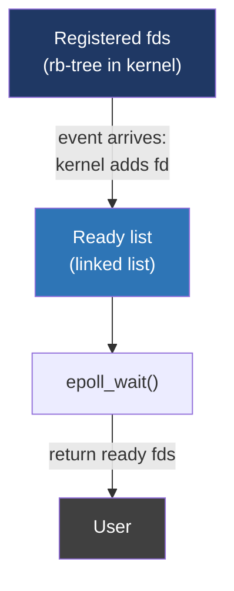
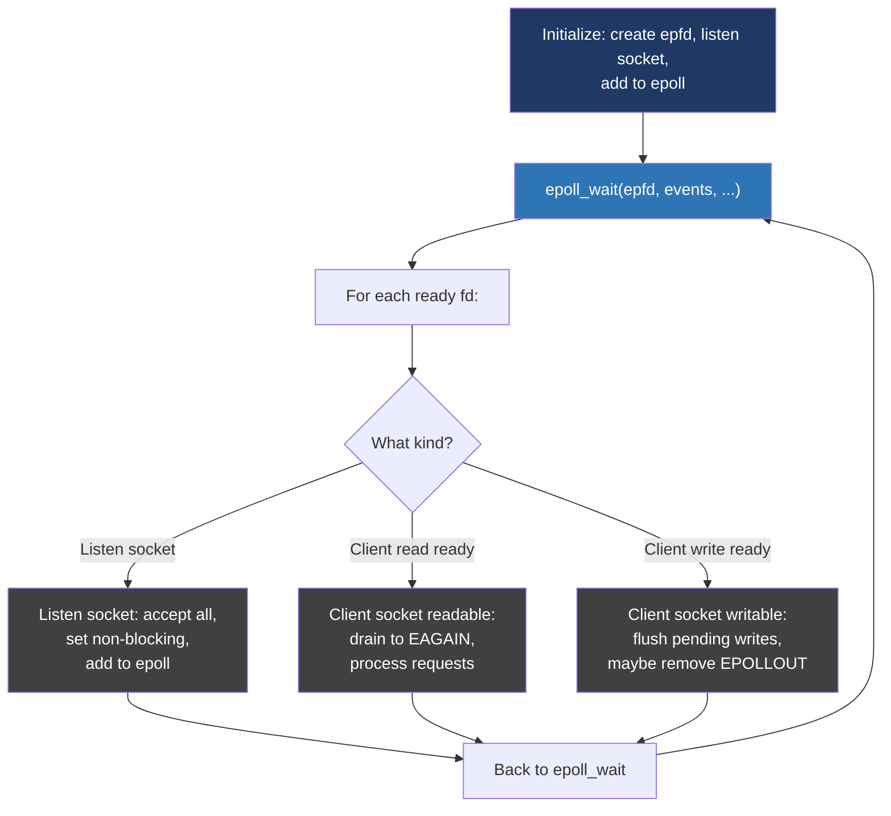

# Day 24 — Blocking, non-blocking, epoll

> **Week 4 — I/O, filesystems, networking, synthesis**
> Reading: TLPI ch 63 (alternative I/O); LWN articles on io_uring; the original "C10K problem" by Dan Kegel (1999, still relevant background).

## Why this matters

How does a single thread serve 100,000 connections? Not by having 100,000 threads — most of them would be sleeping. The answer is **event-driven I/O**, and the path from `select()` to `epoll()` to `io_uring` is one of the longest-running performance stories in Unix.

This is asked constantly in interviews for backend systems roles. "How does Nginx handle so many connections" is a softball. "Explain edge-triggered vs level-triggered epoll" is the screening filter.

## 24.1 The blocking model

```c
int s = socket(...);
bind(s, ...);
listen(s, ...);
while (1) {
    int c = accept(s, ...);
    handle(c);  // read, process, write, close
}
```

This serves one client at a time. Adding clients means either spawning a thread per connection (the Apache prefork model) or a process per connection. Both work for hundreds of clients; both fall over at thousands.

A thread costs ~8 MB of address space (default stack), plus kernel scheduling overhead. 10,000 threads = 80 GB of virtual memory — fine on 64-bit, but the working sets, scheduling overhead, and context switching make it pathological.

## 24.2 Non-blocking I/O

`fcntl(fd, F_SETFL, O_NONBLOCK)` makes a fd non-blocking. Now `read()` either returns data or returns `-1` with `errno == EAGAIN` (or `EWOULDBLOCK`). It never sleeps.

Non-blocking alone isn't useful — you'd just spin trying every fd in turn, burning CPU. The real trick is combining non-blocking I/O with a **multiplexer** that says "tell me which fds are ready right now."

## 24.3 select and poll: the legacy

`select(nfds, &readfds, &writefds, &errfds, &timeout)`:

```c
fd_set rfds;
FD_ZERO(&rfds);
FD_SET(sock, &rfds);
select(sock + 1, &rfds, NULL, NULL, NULL);
if (FD_ISSET(sock, &rfds)) { /* readable */ }
```

Problems:

1. **`FD_SETSIZE` cap** — typically 1024. Hard limit, baked into the bitmap size.
2. **O(n) every call** — kernel scans every fd in the set, every call.
3. **Re-supply every call** — kernel doesn't remember the set; you re-pass it each time.

`poll()` removes the FD_SETSIZE limit by using an array of `struct pollfd` instead of bitmaps, but is still O(n) per call. Both are fine for tens of fds, terrible for thousands.

## 24.4 epoll

`epoll` is Linux's answer (kqueue is BSD's; IOCP is Windows'). The model:

1. `epoll_create1(0)` — get an epoll fd. This is a kernel object that holds a set of fds you're interested in.
2. `epoll_ctl(epfd, EPOLL_CTL_ADD, fd, &event)` — add a fd. Pass a struct describing what events to wait for.
3. `epoll_wait(epfd, events, max, timeout)` — block until *some* of the registered fds have events. Returns only the ready ones.

```c
int epfd = epoll_create1(0);
struct epoll_event ev = { .events = EPOLLIN, .data.fd = sock };
epoll_ctl(epfd, EPOLL_CTL_ADD, sock, &ev);

struct epoll_event events[64];
int n = epoll_wait(epfd, events, 64, -1);
for (int i = 0; i < n; i++) {
    handle(events[i].data.fd);
}
```



Why is this O(1) per active fd, not O(n) per call? Because the kernel tracks events as they happen (each fd's event mask triggers a callback when readable/writable), maintaining a ready list. `epoll_wait` just returns from the ready list.

## 24.5 Edge-triggered vs level-triggered

This is the question that separates candidates who've used `epoll` from those who've read about it.

- **Level-triggered (LT, default).** `epoll_wait` returns the fd whenever it is ready. If you read 100 of 1000 available bytes and call `epoll_wait` again, the fd is still ready, you get notified again. Like `select`/`poll`.
- **Edge-triggered (ET, set with `EPOLLET`).** `epoll_wait` returns the fd only on a *transition* — when it goes from not-ready to ready. After that, you must drain everything. If you don't, you'll never be notified again until *more* data arrives.

```c
struct epoll_event ev = { .events = EPOLLIN | EPOLLET, .data.fd = sock };
```

ET is more efficient (fewer wakeups) but harder to use. Pattern: when ET notifies, loop reading until `read` returns `EAGAIN`, indicating the buffer is empty. Same for writes — write until `EAGAIN`.

```c
while (1) {
    n = read(fd, buf, sizeof(buf));
    if (n > 0) handle(buf, n);
    else if (n == 0) { closed(fd); break; }
    else if (errno == EAGAIN) break;  // drained
    else { error(); break; }
}
```

ET requires non-blocking fds — otherwise the loop blocks waiting for more data and you never come back. Pair ET with O_NONBLOCK always.

## 24.6 The single-threaded event loop pattern

This is the heart of Nginx, Redis, Node.js, and most modern servers:



One thread, one loop, every fd handled cooperatively. As long as no individual handler blocks (no slow file I/O, no synchronous DNS, no `pthread_mutex_lock` waits), this scales to hundreds of thousands of connections per thread.

For multi-core, run one event loop per core. Either each loop has its own listen socket (`SO_REUSEPORT`) or a master accepts and load-balances.

## 24.7 Dealing with disk I/O

`epoll` works for sockets and pipes. **It does not work for regular files.** A regular file `read` always "succeeds" (eventually) but may block on disk I/O for tens of milliseconds. There's no way for `epoll` to tell you "this file is not ready."

Historically the workaround was a thread pool: dispatch disk I/O to worker threads. Linux `aio_*` (POSIX AIO via libaio) is a partial answer for direct I/O but limited.

`io_uring` (added in 5.1, mature by 5.6+) is the modern answer. It's a single ring-buffer interface for *all* I/O — disk, network, anything — fully asynchronous, batched, with optional kernel polling. We'll touch on it below.

## 24.8 io_uring, briefly

`io_uring` consists of two ring buffers shared between user and kernel:
- **Submission queue (SQ):** user fills with operations to perform.
- **Completion queue (CQ):** kernel fills with results.

```c
struct io_uring ring;
io_uring_queue_init(256, &ring, 0);

struct io_uring_sqe *sqe = io_uring_get_sqe(&ring);
io_uring_prep_read(sqe, fd, buf, size, offset);
io_uring_submit(&ring);

struct io_uring_cqe *cqe;
io_uring_wait_cqe(&ring, &cqe);
// cqe->res is the read result
```

Advantages:
- One syscall (`io_uring_enter`) submits and reaps many operations, amortizing syscall cost.
- Optional `IORING_SETUP_SQPOLL` mode runs a kernel thread that polls the SQ with no syscall at all.
- Works for files, network, fsync, accept, basically everything.

Adoption is rising fast in databases, networking stacks, and high-performance storage.

## 24.9 Comparison

| Mechanism | Year | Scaling | Notes |
|---|---|---|---|
| select | ~1983 | O(n), capped at FD_SETSIZE | Portable, but ancient |
| poll | ~1986 | O(n), no cap | Better than select, still O(n) |
| epoll (Linux) | 2002 | O(active) | The default for Linux servers |
| kqueue (BSD) | 2000 | O(active) | BSD/macOS equivalent |
| IOCP (Windows) | NT4 | Async completions | Windows equivalent |
| io_uring | 2019 | True async, batched | Eats epoll's lunch over time |

For Linux interviews, "epoll, with non-blocking sockets, in a single-threaded event loop, one per CPU core, with `SO_REUSEPORT`" is the canonical modern answer. Mention `io_uring` as the future.

## Hands-on (30 minutes)

1. Write a tiny TCP echo server using `epoll`. Add `EPOLLIN`, accept clients, read+write back. Test with `nc localhost <port>` from multiple terminals.
2. Add `EPOLLET` to the same server. Read until `EAGAIN`. Verify it still works correctly under sustained load (`ab` or `wrk`).
3. Forget the read-until-EAGAIN loop and verify the bug: client sends 1 KB, server reads 256 B and waits for the next event — never comes.
4. Profile a `select`-based server vs `epoll`-based with 5,000 idle connections + a few active. Note how `select` burns CPU just iterating its fds.
5. Read the source of a small `epoll` server like `microhttpd` or `picohttpd`. Map the structure to the diagram above.
6. (Optional) Try `liburing` with a small read benchmark. Compare vs blocking `pread` and vs an `epoll`-based scheme.

## Interview questions

**1. Why doesn't `select` scale to thousands of connections?**

> `select` has two problems: a hard fd-number cap of `FD_SETSIZE`, typically 1024 on Linux, baked into the size of the fd_set bitmap; and O(n) cost per call where n is the number of fds you pass in. Every time you call `select` with 5,000 fds, the kernel walks every fd in the set, checks its readiness, and walks back to fill in the result bitmap, even if only one fd is actually active. So the cost grows linearly with the number of monitored fds, regardless of how many are doing anything. `poll` fixes the cap by using an array of pollfd structs instead of a bitmap, but the O(n) cost is the same. `epoll` solves this by having the kernel track readiness incrementally: when an event happens on a registered fd, the kernel puts it on a ready list, and `epoll_wait` just returns the ready list. Cost is proportional to the number of *active* fds, not the number registered. That's how an `epoll`-based server handles 100,000 connections at the same cost as it handles 100, as long as most of them are idle.

**2. Explain the difference between edge-triggered and level-triggered epoll.**

> Level-triggered, the default, behaves like `select` and `poll`: `epoll_wait` returns an fd whenever it's currently ready. So if a socket has 10 KB of data and you only read 1 KB, the next `epoll_wait` call still returns that socket as readable, because there's still data. It's forgiving — partial reads work, and you can call `epoll_wait` between reads.
>
> Edge-triggered changes the contract: `epoll_wait` returns an fd only on a transition, when it goes from not-ready to ready. After that, the kernel won't tell you again until something *new* happens. So if you read 1 KB and stop, the remaining 9 KB sits there and you never get notified, because there's been no new event. The discipline is: when ET notifies, you must drain the fd completely — read in a loop until `read` returns `EAGAIN`, telling you the buffer is empty. Similarly for writes. ET requires non-blocking fds, otherwise the drain loop will block.
>
> ET is more efficient — fewer redundant wakeups — but unforgiving. The win is biggest with high event rates and many connections; the failure mode is that one missed drain and that fd is stuck forever. Most production servers use ET because the savings matter at scale.

**3. How does `epoll` interact with disk file I/O?**

> It doesn't, really. `epoll` is designed around the "is this fd ready, will I block if I read" question, and that question doesn't apply to regular files: a `read` on a regular file is going to "succeed" — it's just a question of whether it takes 100 nanoseconds (cache hit) or 10 milliseconds (disk read). The kernel can't sensibly say "this file is not ready," so `epoll` just always reports regular files as ready. If you call `read` and there's a cache miss, your thread blocks on disk I/O, defeating the whole event-loop pattern.
>
> The classical workaround is a thread pool: the event loop dispatches disk I/O to worker threads, which do blocking reads, and signal the main loop on completion via a pipe or eventfd. Linux `aio` was an attempt at native async file I/O but only works for `O_DIRECT` and is widely considered limited. The modern solution is `io_uring`, which provides true async I/O for both files and network through ring-buffer-based submission and completion queues. Servers built on `io_uring` don't need a thread-pool fallback for disk I/O.

**4. What is `SO_REUSEPORT` and why is it useful for scaling?**

> `SO_REUSEPORT` is a socket option that lets multiple sockets bind to the *same* address and port simultaneously, with the kernel load-balancing incoming connections across them. Without it, only one socket can bind to `0.0.0.0:80` — so a multi-threaded server with one event loop per core has to either share a single accepting socket (with a contended `accept` syscall) or use a master process that accepts and dispatches.
>
> With `SO_REUSEPORT`, each event loop creates its own socket bound to the same port. The kernel hashes incoming SYNs across the bound sockets, so each loop accepts its own subset of connections with no shared state and no contention. This is what Nginx and modern servers use for clean per-core scaling. The kernel's hashing also means connections are stable on a thread for their lifetime, which helps cache locality. The downside is that connection distribution is hash-based, not load-aware — if some connections are heavier than others, you can get hot threads. But for typical request-response workloads, it's close to optimal.

## Self-test

1. Why does `EPOLLET` require `O_NONBLOCK`?
2. Show the read loop pattern that goes with edge-triggered epoll.
3. What's in the `epoll_event` `data` field, and why is it a union?
4. How does `io_uring` reduce syscall overhead compared to `epoll` + read?
5. When is a thread-per-connection model still the right answer?
