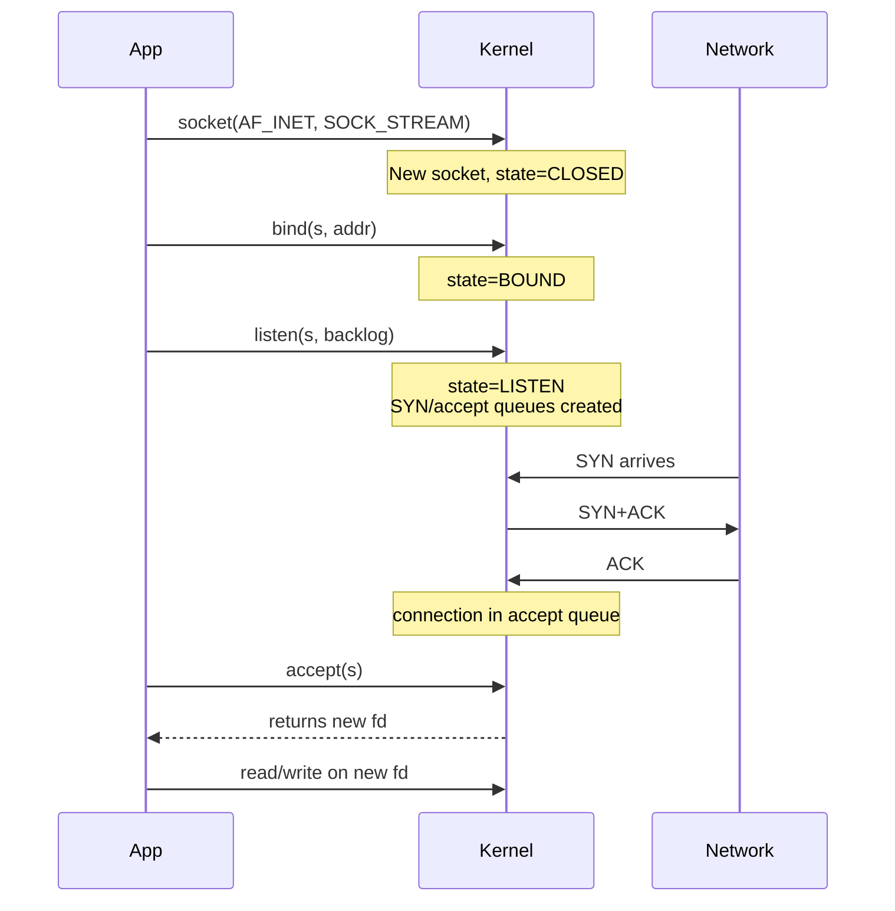
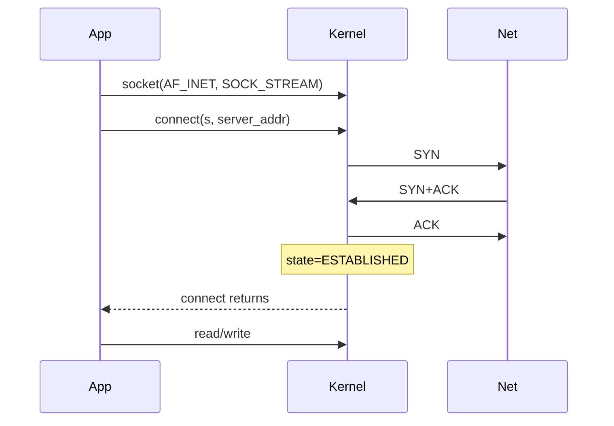
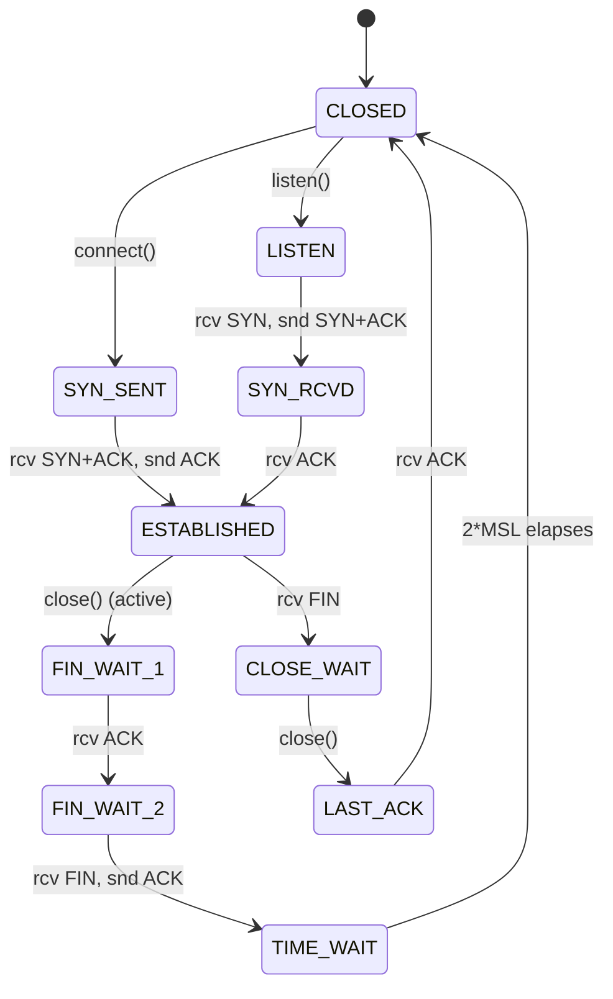

# Day 25 — Sockets and TCP

> **Week 4 — I/O, filesystems, networking, synthesis**
> Reading: TLPI ch 56–59 (sockets, TCP/IP); Stevens *UNIX Network Programming* vol 1 ch 2–4 if you have it; the TCP RFCs (793 plus updates) for reference.

## Why this matters

TCP is the protocol of the internet, but in interviews it's about three things: the state machine, the API surface, and the gotchas. Why is `TIME_WAIT` long? What does `SO_REUSEADDR` do? Why does `accept` block when `listen` has already been called?

If you've used sockets without thinking deeply, today is the day you cement the model.

## 25.1 The socket API in three pictures

**Server:**

**Client:**

The crucial thing: the server has *two* sockets — the listening one (`s` from `socket()`/`listen()`) and a new one for each accepted connection (`accept()` returns a new fd). The listener never carries data; it only spawns connections.

## 25.2 The TCP state machine

The two sides:
- **Active close** (the side that calls `close` first): goes through `FIN_WAIT_1 → FIN_WAIT_2 → TIME_WAIT`. Sits in `TIME_WAIT` for 2*MSL (typically 60 seconds on Linux).
- **Passive close** (the side that receives the FIN): goes through `CLOSE_WAIT → LAST_ACK → CLOSED`. No `TIME_WAIT`.

## 25.3 The three-way handshake

The connection establishment:

1. Client sends **SYN** with initial sequence number X.
2. Server sends **SYN+ACK** with its initial sequence Y, acknowledging X+1.
3. Client sends **ACK** acknowledging Y+1.

After this, both sides have agreed on starting sequence numbers and the connection is ESTABLISHED. The handshake exists to detect packet replay, agree on sequence numbers, and confirm both sides can send and receive.

`connect()` returns once the client side has done step 3. `accept()` returns once the server side has received step 3 (the connection is in the accept queue).

## 25.4 The four-way close

Either side can close. Each side closes its half independently — TCP is bidirectional and each direction is closed separately:

1. Side A sends **FIN**.
2. Side B sends **ACK**. Now A→B is closed, but B can still send to A.
3. Side B sends **FIN** (whenever it's done sending).
4. Side A sends **ACK**. Both halves closed.

This is why you see `CLOSE_WAIT` on a side that hasn't called `close` yet — the peer closed their write end, you're being told, but you haven't closed your write end, so the connection isn't fully torn down. Lots of `CLOSE_WAIT` in `netstat` usually means the application has a bug: it's not closing connections after the peer has hung up.

## 25.5 TIME_WAIT — why it exists

After the active closer sends the final ACK, it waits 2*MSL (Maximum Segment Lifetime, typically 30 seconds, so 2*MSL = 60). Why?

- **Old packets.** A delayed retransmission of a packet from the old connection might arrive. If the same (src_ip, src_port, dst_ip, dst_port) tuple were immediately reused for a new connection, the old packet could be misinterpreted as part of the new one. Waiting 2*MSL ensures any in-flight packets from the old connection have died.
- **Final ACK reliability.** If the final ACK is lost, the peer will retransmit its FIN. The active closer has to be in TIME_WAIT to respond with another ACK. If we'd already moved to CLOSED, we'd respond with RST, which the peer would interpret as an error.

The cost: you can run out of ephemeral ports if you make many connections quickly. Servers can also accumulate TIME_WAIT entries if they're the active closer for many short connections. Mitigations:

- **Make the client close first.** Servers shouldn't accumulate TIME_WAIT.
- **`SO_REUSEADDR`** lets you bind to a port that's in TIME_WAIT (by another socket).
- **`tcp_tw_reuse`** sysctl lets the kernel reuse TIME_WAIT entries for new outgoing connections (with timestamp protections).
- Avoid `tcp_tw_recycle` — removed in 4.12, was unsafe with NAT.

## 25.6 SO_REUSEADDR vs SO_REUSEPORT

Different options, often confused:

| Option | What it does |
|---|---|
| `SO_REUSEADDR` | Lets you `bind()` to an address+port combination that has a recent connection in TIME_WAIT. **Does not** let multiple sockets actively listen on the same port. |
| `SO_REUSEPORT` | Lets multiple sockets bind to the same address+port and actively listen; kernel load-balances incoming connections across them. |

`SO_REUSEADDR` is the "I just restarted my server and don't want to wait 60 seconds to bind" option. `SO_REUSEPORT` is the "I want N event loops each with their own listener" option.

## 25.7 The send/receive buffers

Each socket has a kernel-side send buffer and receive buffer. `write()` copies from user buffer into kernel send buffer and returns; the kernel transmits asynchronously. `read()` copies from kernel receive buffer to user buffer.

Buffer sizes matter for throughput. The bandwidth-delay product (link bandwidth × round trip time) is roughly the buffer size you need to keep the pipe full. Linux auto-tunes by default, but you can tune with `/proc/sys/net/ipv4/tcp_rmem` and `tcp_wmem`.

## 25.8 Nagle's algorithm and TCP_NODELAY

**Nagle's algorithm:** if there's already unacknowledged data in flight and the new chunk is small, hold it briefly to combine with future writes. This reduces tinygram traffic from poorly-written applications.

**Delayed ACK:** the receiver delays ACKs briefly hoping to piggyback on a response packet.

The pathological combo: a chatty protocol with small writes interacts badly. Nagle holds the small write waiting for an ACK; the receiver delays the ACK waiting for data; you get a 40 ms or 200 ms stall.

Solution: `setsockopt(s, IPPROTO_TCP, TCP_NODELAY, ...)` disables Nagle for that socket. SSH, X11, and most interactive protocols set this. HTTP/1.1 servers usually don't because pipelining benefits from Nagle.

## 25.9 Common errors

| Error | Meaning |
|---|---|
| `ECONNREFUSED` on connect | Nobody listening on that port |
| `ETIMEDOUT` on connect | No SYN+ACK came back; server unreachable |
| `EHOSTUNREACH` | Routing says we can't reach there |
| `EPIPE` on write | Other side closed its read end (or whole connection); SIGPIPE also fires |
| `ECONNRESET` on read | Other side sent RST (forced close, or app crashed) |
| `EADDRINUSE` on bind | Another socket is bound; SO_REUSEADDR may help if it's TIME_WAIT |

## 25.10 Half-closed connections

`shutdown(s, SHUT_WR)` closes only the write end, sends FIN, but you can still read. Useful for protocols where you finish sending the request, then want to read the entire response with the peer knowing your input is done — HTTP/1.0 with `Connection: close` works this way.

`shutdown(s, SHUT_RD)` closes only read; rarely used. `shutdown(s, SHUT_RDWR)` is like `close` but doesn't free the fd.

## Hands-on (30 minutes)

1. Write a tiny TCP echo server and client. Connect, exchange, close. Watch `ss -t` (or `netstat -t`) to see the state transitions.
2. Make the client connect, send data, and exit immediately. Observe the server's socket in `CLOSE_WAIT` until the server closes it.
3. Force a `TIME_WAIT`: server is the active closer. Watch with `ss -ant | grep TIME-WAIT`.
4. Try restarting your server quickly. Without `SO_REUSEADDR`, you'll see `EADDRINUSE`. Add it, restart works.
5. Generate small writes in a loop. With Nagle on (default), watch `tcpdump`; you'll see writes coalesced. Set `TCP_NODELAY`; watch each write go out as its own segment.
6. Capture a connection setup with `tcpdump -i lo port 1234 -nv`. Identify SYN, SYN+ACK, ACK. Then `close` and identify the FINs.

## Interview questions

**1. Walk through what happens when a client calls `connect()` to a server.**

> The client kernel allocates a TCP control block, picks an ephemeral source port if one wasn't bound, and sends a SYN packet to the server with an initial sequence number. The connect call typically blocks (or fails immediately if non-blocking, returning `EINPROGRESS`). The server's kernel, if there's a listening socket on the destination port and there's room in the SYN queue, allocates state and replies with a SYN+ACK carrying its own initial sequence and acknowledging the client's. The client receives this, sends an ACK, and connect returns successfully — the connection is `ESTABLISHED` from the client's perspective. On the server, the connection is now in the accept queue; the next time the server thread calls `accept`, it pulls the connection out of the queue and gets back a new fd. The listening socket itself never carries data; only the per-connection fds do. If the server's accept queue is full, additional ACKs are dropped or get connection-refused depending on settings — that's why a slow accept loop can cause client timeouts even when the SYN/SYN+ACK exchange is fine.

**2. What is `TIME_WAIT` and why does it exist?**

> `TIME_WAIT` is the state the active-closing side of a TCP connection enters after sending the final ACK in the four-way close. It sits there for 2 times the maximum segment lifetime, typically 60 seconds, before the socket is fully released. There are two reasons. First, packets from the old connection might still be in flight in the network — a delayed retransmission, for example. If we immediately reused the same four-tuple of source IP, source port, destination IP, destination port for a new connection, the stale packets could be misinterpreted as belonging to the new connection. Waiting 2*MSL guarantees any in-flight packets have either arrived or been dropped by routers due to TTL expiration. Second, the final ACK might be lost. If it is, the peer will retransmit its FIN, expecting another ACK. We need to be in `TIME_WAIT` to respond; if we'd already gone to `CLOSED`, we'd send a RST and confuse the peer.
>
> The cost is real: a busy server that's the active closer for short-lived connections accumulates TIME_WAIT entries and can run out of ephemeral ports for outbound connections. The fix is usually architectural — make the client close first — combined with `SO_REUSEADDR` for fast restarts and `tcp_tw_reuse` for outgoing connection slots.

**3. What's the difference between `SO_REUSEADDR` and `SO_REUSEPORT`?**

> `SO_REUSEADDR` lets you `bind()` to an address-and-port that has a previous connection lingering in TIME_WAIT. Without it, restarting a crashed server gives you `EADDRINUSE` for up to 60 seconds. With it, you can bind immediately even if the prior connection is still draining. It does *not* let two sockets simultaneously listen on the same port; only one of them gets connections.
>
> `SO_REUSEPORT` is different: it lets *multiple* sockets bind to the exact same address and port at the same time, and the kernel hashes incoming connections across them. This is the modern primitive for per-core scaling: your server runs N event loops, each opens its own listening socket with `SO_REUSEPORT`, and the kernel load-balances. No shared accept-queue contention, no master-process accept loop. Nginx, HAProxy, and most modern servers use it.
>
> Both options must be set before `bind()`, and both have to be set on every socket that wants to share. `SO_REUSEADDR` is for restart-friendliness; `SO_REUSEPORT` is for parallel scaling.

**4. Why does TCP have a three-way handshake instead of two?**

> The handshake serves three purposes. First, both sides need to agree on initial sequence numbers — these are random per-connection and protect against accepting old packets from a previous incarnation of the same connection. Second, both sides need to confirm that the *other* side is actually receiving — the server needs to know its SYN+ACK got through, otherwise a forged SYN with a spoofed source could cause it to allocate connection state for a peer that doesn't exist. Third, both sides need to know the other is alive and willing to communicate.
>
> A two-way exchange — client sends, server replies — only confirms one direction. The client knows the server received the SYN, but the server doesn't know whether its SYN+ACK arrived. The third packet, the client's ACK, closes the loop: now the server knows the connection is real before it commits resources for data transfer. There's also a defense angle: SYN floods exploit the asymmetry of an established connection requiring server state, and SYN cookies are a clever workaround that lets the server defer state allocation until the third ACK arrives.

## Self-test

1. Why does the *active* closer accumulate TIME_WAIT, not the passive closer?
2. What does `accept()` actually return — what's the listener vs. accepted socket?
3. Show the syscall sequence for a server that handles one connection at a time.
4. Why is `TCP_NODELAY` important for SSH but not for bulk file transfer?
5. What does `ECONNRESET` mean, and how does it differ from `EPIPE`?
