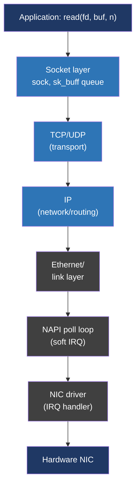
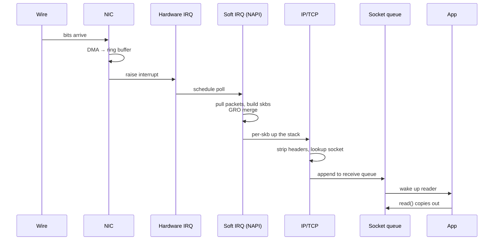

# Day 26 — How a packet flows

> **Week 4 — I/O, filesystems, networking, synthesis**
> Reading: LKD ch 17 (devices and modules), the Linux network stack documentation (kernel.org/doc/html/latest/networking/); LWN articles on NAPI, GRO, XDP.

## Why this matters

Yesterday was the socket API. Today is what happens *underneath*: from electrons hitting a NIC to your `read()` returning. This is the layer interviewers probe when they ask "explain how a packet gets to your process," and it's also where performance lives — every modern networking optimization (NAPI, GRO, XDP, busy polling) is about reducing the cost of this path.

You don't need to write kernel network drivers. You do need to know the layers, where the costs are, and what knobs exist.

## 26.1 The layers, top down

Receive side goes bottom up. Send side goes top down. The unit of data crossing every layer is the **`sk_buff`** — the Linux socket buffer struct.

## 26.2 The sk_buff (skb)

`struct sk_buff` is the kernel's universal packet container. Every packet on every layer is an skb. It has:

- A pointer to the actual data buffer (which may be page-aligned for DMA).
- Pointers into that buffer marking layer boundaries (`mac_header`, `network_header`, `transport_header`, `data`, `tail`).
- A linked-list pointer for queueing (skbs live on receive queues, send queues, retransmit queues, etc.).
- Reference counting and a sea of metadata (protocol, mark, priority, hashed flow ID, etc.).

When a packet moves up the stack, the layer pointers shift but the buffer is *not copied*. The IP layer parses the IP header by reading at `network_header` and bumps `network_header` past it. TCP does the same. Eventually data reaches the socket and is queued for the user.

The skb is one of the kernel's hottest objects. Allocations and frees for every packet add up; lots of effort goes into pooling and recycling them.

## 26.3 The receive path: from wire to user

### Step 1: Hardware

Packet arrives on the NIC. The NIC uses DMA to write the packet directly into a kernel-supplied buffer (the **RX ring**), then raises an interrupt.

### Step 2: Hardware IRQ handler

The driver's IRQ handler runs on whatever CPU the NIC is configured to interrupt. It does the minimum: acknowledge the interrupt, schedule a soft-IRQ (NAPI poll), return.

### Step 3: NAPI poll (soft IRQ)

NAPI ("New API," now ancient) is the technique to avoid one-interrupt-per-packet under high load. The driver, via NAPI, says "interrupt me, then I'll poll for as many packets as I can up to a budget." Under heavy load you get one interrupt and many packets per CPU wakeup. The poll runs in soft-IRQ context (`NET_RX_SOFTIRQ`).

In the poll, packets are pulled off the RX ring, wrapped into `sk_buff`s, and pushed up to the network stack.

### Step 4: GRO

Generic Receive Offload tries to merge consecutive packets in a flow into one big skb before handing up. If 10 TCP packets of 1460 bytes each arrive back-to-back belonging to the same flow, GRO merges them into one ~14 KB skb. The whole stack above only sees one packet, with corresponding savings in per-packet overhead.

### Step 5: IP layer

Strip the Ethernet header. Look at the IP header. Check checksum (often offloaded to hardware), TTL, destination. If destination is local, route to local delivery. If forwarding is enabled, route out another interface.

### Step 6: TCP/UDP layer

For TCP, find the matching socket via the four-tuple (src IP, src port, dst IP, dst port). Look up in a hash table. Apply TCP rules: in-window data goes onto the receive queue, ACKs update send state, etc.

### Step 7: Socket queue

Data is appended to the socket's receive queue (`sk_receive_queue`). If a process is sleeping in `read()`/`recv()`/`epoll_wait()` waiting, wake it up.

### Step 8: User space

`read()` returns. Or `epoll_wait()` returns this fd as readable.

## 26.4 The send path

Largely the mirror, but with extra layers:

1. `write()`/`send()` copies user data into a kernel skb (or several).
2. TCP layer adds TCP header, manages send buffer, checks congestion window, etc.
3. IP layer adds IP header, decides routing, fragments if needed.
4. Queueing discipline (qdisc) — Linux's traffic control. By default a simple FIFO; you can install fancier ones (`fq`, `cake`, etc.) for fairness or rate limiting.
5. NIC driver hands the skb to hardware via DMA.
6. NIC transmits, raises an interrupt on completion, the driver frees the skb.

**TSO/GSO** (TCP Segmentation Offload, Generic Segmentation Offload) are the send-side analog of GRO: the kernel hands the NIC a giant 64 KB skb, the NIC splits it into MTU-sized segments on the wire. Big saving on per-packet stack cost.

## 26.5 Soft IRQs and CPU pinning

Soft IRQs run on whatever CPU got the hardware interrupt. By default modern NICs spread interrupts across CPUs (RSS — Receive Side Scaling — uses a hash on the flow tuple). This parallelizes receive across cores.

You can pin specific NIC queues to specific CPUs, which combined with `SO_REUSEPORT` and per-core event loops gives you a clean per-core pipeline: hardware queue → soft IRQ → kernel stack → socket → event loop, all on the same CPU, all cache-hot.

This kind of architecture is what high-throughput servers (50 Gbps+) actually use.

## 26.6 Where the time goes

Rough cost numbers, modern hardware, per packet:

| Step | Cost |
|---|---|
| NIC DMA + interrupt | hundreds of ns |
| Driver/NAPI/GRO | low microseconds |
| IP+TCP processing | low microseconds |
| Socket queue + wakeup | low microseconds |
| Syscall + copy to user | ~1 microsecond |
| Total kernel overhead | a few microseconds |

This is fast in absolute terms but adds up at high packet rates. At 14M packets/sec (line rate for 10 Gb with 64-byte packets), even 1 µs per packet would consume 14 cores. Hence all the offloads (GRO/TSO), busy polling options, and bypass technologies.

## 26.7 XDP and bypass

**XDP (eXpress Data Path)** runs eBPF programs on packets *before* they're allocated as full sk_buffs, right after the driver receives them. You can drop, redirect, or modify packets at line rate. Use cases: DDoS filtering, load balancing, custom firewalls. Cilium and Katran are big XDP consumers.

**DPDK / kernel-bypass.** Userspace applications take over the NIC entirely, polling it directly without kernel involvement. Used in NFV, high-frequency trading, software routers. Trades flexibility for raw throughput.

For most servers, the kernel stack with the standard offloads is fast enough. Reach for XDP/DPDK only when measurement justifies it.

## 26.8 Tools to see this happening

- `ip -s link` — per-interface counters (rx/tx packets, errors, drops).
- `ethtool -S eth0` — driver-level stats, including ring depth, interrupt counts.
- `tcpdump`/`tshark` — packet capture. Runs at the link layer (mostly).
- `ss -i` — socket-level info, including TCP window, RTT, retransmits.
- `mpstat -P ALL 1` — per-CPU usage; spot soft-IRQ ("%soft") on specific CPUs.
- `bpftrace -e 'tracepoint:net:netif_receive_skb { @[comm] = count(); }'` — count packets by destination process.

## Hands-on (30 minutes)

1. Run `tcpdump -i lo -nv 'port 1234'` while running a TCP echo client/server on that port. Identify the layers in the captured packets — Ethernet (lo has none, so just IP), IP, TCP.
2. Run `ip -s link show eth0` (or your active interface). Record rx_bytes. Browse a webpage. Run again. Note the increase.
3. Run `cat /proc/softirqs`. Note the `NET_RX` row showing per-CPU counts. Watch which CPUs get the work.
4. Look at `/proc/interrupts | head -2; grep eth /proc/interrupts`. See which CPUs your NIC is interrupting.
5. Run `ss -i` and pick a TCP connection. Note `cwnd`, `rtt`, `bbr`/`cubic` (the congestion control), `bytes_sent`/`bytes_received`.
6. (Curious mode) `ethtool -k eth0` shows feature flags: GRO, TSO, GSO, etc. These are the offloads we discussed.

## Interview questions

**1. Walk me through what happens, end to end, when a TCP packet arrives at a server and is delivered to the application's `read()`.**

> The packet arrives at the NIC over the wire. The NIC has been programmed in advance with DMA descriptors pointing to kernel memory, so it writes the packet bytes directly into kernel buffers — the RX ring — and raises a hardware interrupt on a particular CPU. The driver's interrupt handler is intentionally minimal: it acknowledges the interrupt and schedules a soft IRQ to do the real work. The soft IRQ runs the NAPI poll: it walks the RX ring, wraps each packet in an `sk_buff`, the kernel's universal packet container, and pushes it up the stack. Before going up, GRO may merge several consecutive packets in the same flow into one big skb to amortize per-packet costs.
>
> Up the stack, the IP layer strips the Ethernet header, validates the IP header, and routes the packet. For local delivery, it hands the skb to TCP. TCP looks up the matching socket via the four-tuple of source IP, source port, destination IP, destination port — typically a hash lookup. It validates sequence numbers, updates connection state, and either drops the data on the floor (out of window), processes ACKs, or appends the payload to the socket's receive queue.
>
> If a process is currently blocked in `read()` or `epoll_wait()` waiting on this socket, it gets woken up. The process runs again, the syscall completes, and the kernel copies data from the receive queue into the user buffer the process passed in. From the application's view, `read` just returned with bytes. From the kernel's view, that's something like a few microseconds of stack work plus a context switch.

**2. What is GRO and why does it help?**

> Generic Receive Offload is the receive-side optimization where consecutive packets in the same flow are merged into one large skb before being pushed up the stack. So if ten 1460-byte TCP segments arrive back-to-back belonging to the same connection, instead of ten trips up through IP, TCP, and the socket layers, GRO combines them into one ~14 KB skb that goes up the stack once. The TCP layer sees one bigger arrival and handles it in one operation.
>
> The win is that fixed per-packet costs — protocol header parsing, socket lookup, ACK processing — get amortized across many packets' worth of payload. At line rate, this can be the difference between a CPU getting saturated by interrupt handling and having spare capacity. The flip side: it adds a small amount of latency, because packets are held briefly to be merged. Most servers want the throughput.
>
> The send-side analog is TSO/GSO: hand the NIC a 64 KB skb, let the hardware split it into MTU-sized segments. Same idea, opposite direction.

**3. Why might network performance scale poorly past one core, and what fixes it?**

> By default, all NIC interrupts go to one CPU, which means all soft IRQs and stack processing for incoming packets happen on that one core, regardless of how many cores the system has. So you can have a 32-core machine handling all its network traffic on CPU 0 while CPUs 1–31 idle. The first fix is RSS — Receive Side Scaling — where the NIC has multiple hardware receive queues, each of which can interrupt a different CPU. The NIC hashes incoming packets by their flow tuple to pick a queue, so packets from the same connection always go to the same CPU, preserving cache locality, but different connections distribute across cores.
>
> The second part is the application: even if RSS spreads packets across CPUs, if all those packets end up in the same socket being read by one thread, the bottleneck just moves. So you combine RSS with `SO_REUSEPORT` — multiple listening sockets on the same port, kernel load-balances connections across them — and one event loop per core. Now you have a clean per-core pipeline from NIC queue through soft IRQ through TCP through socket through event loop, all on the same CPU, all cache-hot. This is what high-throughput servers actually look like.

**4. What is the `sk_buff`, and why does it exist?**

> The `sk_buff` is the Linux kernel's universal packet container — every packet on every protocol layer is represented by an skb. It holds a pointer to the actual packet bytes, plus offsets marking the boundaries between layers (where Ethernet ends and IP begins, where IP ends and TCP begins, etc.), plus metadata like the protocol, the inbound interface, the flow hash, reference counts, and queue linkage.
>
> The reason to centralize on one structure is that packets move through many subsystems — drivers, IP, TCP, qdisc, sockets — and each needs to operate on the same packet without repeatedly copying or reformatting it. The skb's design means that as a packet moves up the stack, the layer offsets shift but the underlying buffer is not touched. IP parses its header by reading at the network_header offset, then bumps the offset past the IP header so TCP starts where it expects. The buffer itself is page-aligned for efficient DMA from NICs.
>
> The skb is one of the kernel's hottest data structures. Per-packet allocations and frees were a performance bottleneck for years, which is why the kernel has elaborate skb caches and recycling, why GRO exists to reduce skb count, and why XDP — which operates *before* the skb is even allocated — exists for ultra-high-throughput cases.

## Self-test

1. Why is the hardware IRQ handler kept short, deferring work to a soft IRQ?
2. What does GRO merge, and what does TSO split?
3. How does RSS distribute incoming packets across CPUs?
4. Where does TCP find the socket for an incoming packet?
5. What's the difference between XDP and the normal network stack?
