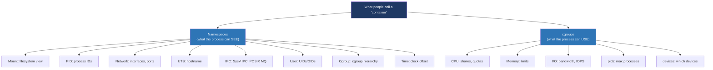
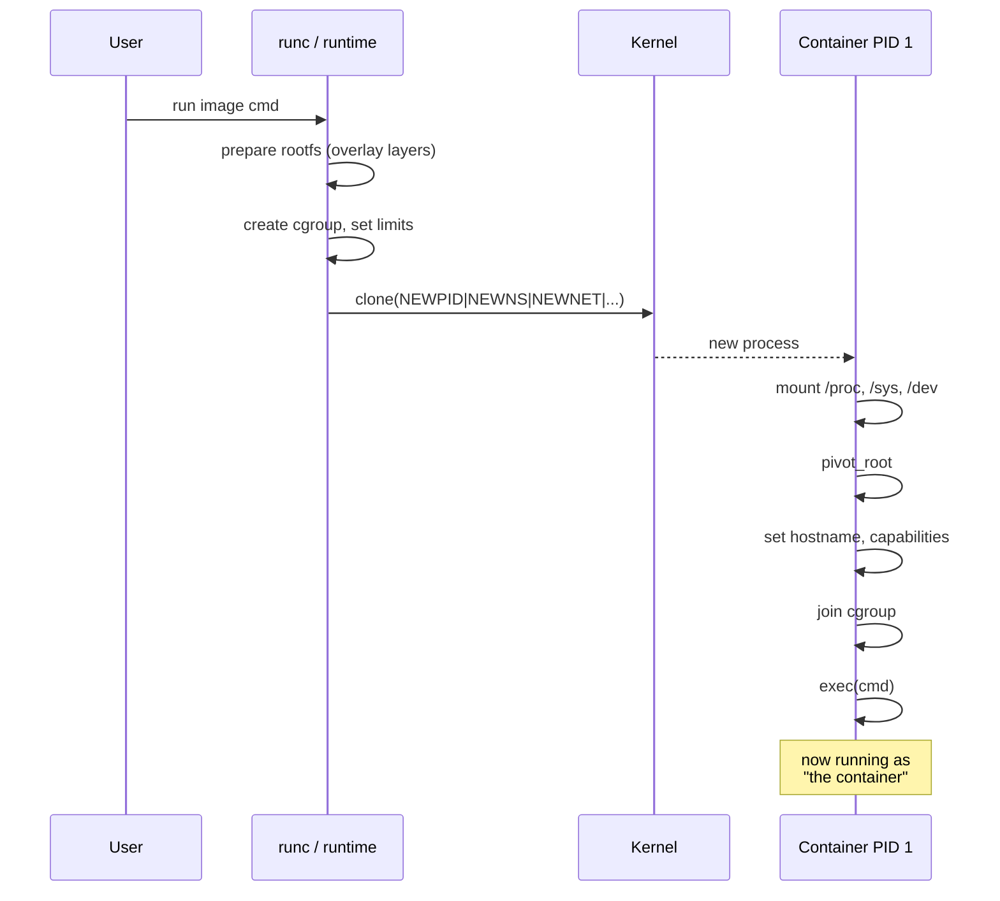

# Day 27 — Containers: namespaces and cgroups

> **Week 4 — I/O, filesystems, networking, synthesis**
> Reading: man pages `namespaces(7)`, `pid_namespaces(7)`, `mount_namespaces(7)`, `user_namespaces(7)`, `cgroups(7)`; LWN's namespace and cgroup series.

## Why this matters

"Containers" is a marketing word. The kernel has no concept of a container — only **namespaces** and **cgroups**, which combined create the illusion. Understanding the primitives is what separates someone who *uses* Docker from someone who can debug it, design a runtime, or interview for an infrastructure role.

The interview question is some variant of "what's a container, really?" Your answer should walk through the kernel building blocks. Saying "it's like a lightweight VM" is a wrong answer.

## 27.1 The two ingredients



A container is a process (and its children) running with:
- A set of namespaces giving it an isolated view of the system.
- A cgroup limiting its resource consumption.
- Usually a chrooted-style filesystem root via the mount namespace.
- Often capability and seccomp restrictions for security.

That's it. No hypervisor, no separate kernel, no virtualization. The kernel is shared. Container processes are just regular Linux processes wearing namespaces.

## 27.2 Namespaces

A namespace virtualizes a particular kernel resource. Processes in the same namespace see the same instance of that resource; processes in different namespaces see different instances.

The eight namespaces:

| Namespace | What it isolates |
|---|---|
| **mount** | The set of mount points / filesystem view |
| **PID** | Process IDs (PID 1 inside, mapping to some other PID outside) |
| **network** | Interfaces, IP addresses, routes, sockets, ports |
| **UTS** | Hostname and domain name |
| **IPC** | SysV IPC objects, POSIX message queues |
| **user** | UIDs and GIDs (this enables rootless containers) |
| **cgroup** | The cgroup hierarchy view |
| **time** | CLOCK_MONOTONIC and CLOCK_BOOTTIME offsets (newer) |

You create one with `clone(... | CLONE_NEWxxx ...)` or `unshare()`, and join one with `setns()`.

```c
// Run a function in a new PID + mount + UTS namespace
int flags = CLONE_NEWPID | CLONE_NEWNS | CLONE_NEWUTS | SIGCHLD;
clone(child_func, stack + STACK_SIZE, flags, NULL);
```

### PID namespace example

The first process in a new PID namespace has PID 1 inside. From outside, it has some other PID (say 2847). When this process forks, its children get PIDs 2, 3, 4 inside while having different PIDs outside.

```
Outside view:                Inside container:
  PID 2847 (bash)              PID 1 (bash)
  PID 2848 (python)            PID 2 (python)
  PID 2849 (worker)            PID 3 (worker)
```

PID 1 inside has special responsibilities — same as PID 1 on a regular Linux system. It must reap zombies (so containers usually run a tiny init like `tini` or `dumb-init`), and if it dies, all other processes in the namespace are killed.

### Network namespace example

A new network namespace starts with only a loopback interface, and even that is down. The container can create interfaces, but for actual connectivity to the outside world, you need to plumb it: typically with a `veth` pair where one end lives in the host namespace and the other in the container's, plus iptables/nftables rules and routes.

Docker's default networking uses a bridge (`docker0`) on the host side, with each container's veth attached.

### User namespace

The cleverest one. A user namespace lets a process map UIDs from inside to outside. So inside the namespace you can be UID 0 (root!), but outside you map to UID 1000 (a normal user). You can create file systems, bind ports below 1024, install packages — all believing you're root, but the kernel knows you're not, and won't let you do anything that affects resources outside your namespace.

This is the foundation of rootless containers (Podman, recent Docker). A regular user can spawn containers without needing actual root on the host.

## 27.3 cgroups

Namespaces give a process an isolated *view*. cgroups give the kernel a way to *limit* a process group's resource use.

cgroup hierarchies live under `/sys/fs/cgroup/`. cgroup v2 (unified hierarchy, what almost all modern systems use) puts everything under one tree:

```
/sys/fs/cgroup/
├── cgroup.controllers           (which controllers exist)
├── system.slice/
│   └── docker-abc123.scope/
│       ├── cgroup.procs         (PIDs in this cgroup)
│       ├── cpu.max              (CPU quota)
│       ├── memory.max           (memory limit)
│       ├── memory.current       (current memory use)
│       └── io.max               (IO limits)
└── user.slice/
```

Controllers (the resource limiters):

| Controller | Limits |
|---|---|
| `cpu` | CPU time (shares, quotas) |
| `memory` | RAM use, including page cache attribution |
| `io` | Block I/O bandwidth and IOPS |
| `pids` | Maximum number of processes |
| `cpuset` | Which CPUs/NUMA nodes the cgroup may use |
| `devices` (v1) / BPF (v2) | Which device nodes are accessible |

Setting a limit is just writing to a file:

```bash
# Create a cgroup
mkdir /sys/fs/cgroup/myapp
echo "200M" > /sys/fs/cgroup/myapp/memory.max
echo "$$" > /sys/fs/cgroup/myapp/cgroup.procs   # add this shell
```

Now this shell and all its descendants are capped at 200 MB. Allocate more, and the OOM killer fires *within* the cgroup. The rest of the system is unaffected.

cgroup v1 vs v2: v1 had separate hierarchies per controller, which made some combinations of policies impossible to express. v2 unified everything into one hierarchy. Some old code (older Docker, older Kubernetes) still uses v1, but new systems use v2.

## 27.4 What the runtime actually does

When you run `docker run alpine ls`, the runtime — `runc` underneath — does roughly:

1. **Pull image** if not present. Image is layered tarballs.
2. **Set up rootfs.** Unpack/overlay layers into a directory. Bind in `/proc`, `/sys`, `/dev`, etc.
3. **`clone()`** with all the namespace flags, with the new process running a setup function.
4. The setup function:
   - Mounts proc, sys, dev inside.
   - `pivot_root()` to make the rootfs the new `/`.
   - Configures hostname, network interfaces.
   - Sets capabilities, seccomp filters.
   - Joins the cgroup that was set up for it.
   - `exec()` the actual command (`ls`).
5. **Wait** on the process. Forward signals, return exit code.

That's it. There's no daemon doing magic. There's no kernel module specific to containers. It's namespaces + cgroups + a bit of bookkeeping.



## 27.5 What containers don't isolate

Several things are shared:

- **Kernel.** Everyone shares one kernel. A kernel exploit lets you escape.
- **System time** (without time namespace) — a privileged container could change the clock for all.
- **Some `/proc` entries** that aren't namespaced (used to be more; recent kernels namespace more).
- **Hardware** — devices, CPUs, RAM, I/O bandwidth, even if cgroups limit how much you get.

A bad container can DoS the host by exhausting non-cgrouped resources, by crashing the kernel via a bug, by filling up disk if no quotas are set. Containers are not security boundaries the way VMs are. For multi-tenant security, you want either VMs or specialized container runtimes (gVisor, Kata, Firecracker microVMs).

## 27.6 OCI: the standards

The Open Container Initiative defines two specs:

- **Image spec.** What's in a container image: layered tarballs, manifest, config.
- **Runtime spec.** What a runtime takes as input (a `config.json` describing what to run) and how it should set things up.

`runc` is the reference implementation of the runtime spec. Docker, Kubernetes (via containerd or CRI-O), Podman — all of them ultimately invoke an OCI runtime to actually launch containers.

## Hands-on (30 minutes)

1. Run `unshare -p -f --mount-proc bash`. Now run `ps`. You'll see only your shell as PID 1. Exit, see the surrounding host's processes again.
2. List your shell's namespaces: `ls -l /proc/$$/ns/`. Each link points to a unique inode-namespace identifier.
3. Run `docker run -it alpine sh`, then in another terminal find the docker process and inspect its `ns/` links. See that they differ from your own.
4. Look at `/sys/fs/cgroup/`. Browse the hierarchy. Find a Docker container's cgroup if Docker is running.
5. Manually limit memory: create a cgroup as in 27.3, add a shell, run `stress-ng --vm 1 --vm-bytes 500M`. Watch the OOM killer fire within the cgroup.
6. Read the output of `cat /proc/self/cgroup` to see your shell's cgroup path. Compare with `systemd-cgls` for a tree view.

## Interview questions

**1. What's a container, really? How does it differ from a VM?**

> A container is a process or group of processes running on the host kernel with two kinds of isolation. First, namespaces — these virtualize specific kernel resources so processes inside see their own version: their own filesystem mounts, their own PID space where they're PID 1, their own network interfaces, their own UID space, their own hostname. Second, cgroups — these limit what the processes can consume: CPU shares and quotas, memory limits, I/O bandwidth, max number of processes. The combination produces what looks like an isolated machine from the inside.
>
> The key difference from a VM is that containers share the host kernel. There's no hypervisor, no second OS. A VM runs a complete guest kernel on virtualized hardware, costing real overhead but providing strong isolation — a kernel bug in the guest doesn't affect the host. A container is just a regular process with a fancy view of the world; it's much faster to start and lighter on resources, but a kernel exploit in the host kernel can give you full access. So VMs are a security boundary suitable for multi-tenant; standard containers are an isolation boundary suitable for trusted workloads. For untrusted multi-tenant container workloads, people use either VMs underneath (every pod its own microVM, like Firecracker), or sandboxing runtimes like gVisor that intercept syscalls.

**2. What namespace types are there, and what does each isolate?**

> Eight in modern Linux. Mount namespaces give the process its own view of mount points — what's mounted where on the filesystem tree. PID namespaces give a separate PID number space, so the first process in a new PID namespace is PID 1 inside while having some other PID outside, and child processes get fresh small PIDs. Network namespaces give isolated network stacks: separate interfaces, routes, iptables rules, sockets, port number space. UTS namespaces isolate the hostname and domain. IPC namespaces isolate System V IPC objects and POSIX message queues. User namespaces isolate UID and GID space, with a mapping between inside and outside IDs — this is what enables rootless containers. cgroup namespaces isolate the view of the cgroup hierarchy. Time namespaces let processes see different `CLOCK_MONOTONIC` and `CLOCK_BOOTTIME` offsets, useful for migration.
>
> The container runtime composes whichever subset of these it needs. A typical container uses all of them. Some specialized cases — sidecars sharing a network namespace with another container, for instance — opt out of network isolation deliberately.

**3. What are cgroups for, and how are they different from namespaces?**

> Namespaces control what a process can *see*. cgroups control what it can *use*. They're complementary: a process can be in a network namespace where it sees only its own interfaces, but without a cgroup, nothing prevents it from spawning a million threads and exhausting host RAM. Conversely, a process can be in a memory cgroup limited to 100 MB but if it shares the host's mount namespace, it can read every file on the system.
>
> A cgroup is a group of processes plus a set of resource controllers — CPU, memory, I/O, pids, cpuset, and a few others. The kernel charges resource use against the cgroup and enforces the configured limits. CPU controller might give the cgroup a quota of 1.5 CPUs worth of time per second. Memory controller might cap RAM at 256 MB; exceed that and the cgroup-scoped OOM killer fires. The hierarchy is a tree, with limits inheriting and being further constrained at each level. cgroup v2 is the modern unified version where everything lives in one tree under `/sys/fs/cgroup/`.

**4. What stops a container from escaping its isolation? What kinds of attacks are possible?**

> Several layers. Namespaces hide most of the host from the container's view. cgroups limit resource consumption. The container's filesystem is typically a separate root via `pivot_root`, so even file paths look different. The kernel drops most capabilities — you can't load kernel modules, change the host's network, see other processes, etc. Seccomp filters block specific syscalls that aren't needed; AppArmor or SELinux add another mandatory access control layer.
>
> But the kernel is shared. So the attack surface is: kernel bugs that let an unprivileged process escalate, especially in syscalls a container can still make; mistakes in the runtime that leave a container with too many privileges (running with `--privileged`, mounting `/var/run/docker.sock`, sharing PID namespace with the host); shared resources outside cgroup control that can be exhausted to DoS the host; and cross-namespace leaks via `/proc` or `/sys` paths that aren't fully namespaced. There's a constant trickle of CVEs in this space: someone finds a way to escape a container via a kernel bug or a misconfiguration.
>
> If isolation needs to hold against actively malicious code, you don't rely on plain containers. You use VMs (Firecracker, Cloud Hypervisor) or syscall-interception sandboxes (gVisor) that don't share the host kernel attack surface. The cloud providers running multi-tenant container services use one of these underneath; "containers" at that scale are usually a microVM in disguise.

## Self-test

1. What's the difference between PID 1 inside a PID namespace and PID 1 on the host?
2. Why are user namespaces the foundation of rootless containers?
3. Show the cgroup files you'd write to limit a process to 1 CPU and 500 MB RAM.
4. What does `pivot_root` do that `chroot` doesn't?
5. Why is "container escape" a real concern but "VM escape" much rarer?
