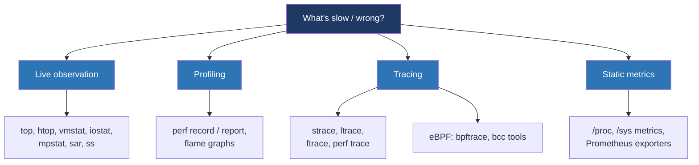

# Day 28 — Observability: strace, perf, eBPF

> **Week 4 — I/O, filesystems, networking, synthesis**
> Reading: Brendan Gregg, *Systems Performance* 2nd ed. ch 5 (applications) + ch 13–15 (perf, ftrace, eBPF); the bcc/bpftrace tools tutorial.

## Why this matters

Production systems will surprise you. A latency spike, a memory leak, a periodic pause that doesn't show up in any application log. The skill that separates senior systems engineers is methodically narrowing down *which layer* the problem lives in: application, libc, kernel, hardware. The tools you use to do that — `strace`, `perf`, `ftrace`, eBPF — are the same regardless of whether you're debugging your own service or interviewing for SRE.

This is the topic that pays off forever. Internalize the methodology and the tools.

## 28.1 The two big methodologies

**The USE method (Brendan Gregg).** For each resource (CPU, memory, disk, network), check three things:

- **Utilization:** how busy is it? (%)
- **Saturation:** how much queueing/waiting is happening?
- **Errors:** any error counters incrementing?

Walk through every resource. The bottleneck reveals itself.

**The RED method (Tom Wilkie).** For services, track three signals:

- **Rate:** requests per second.
- **Errors:** error rate (or rate of failed requests).
- **Duration:** latency distribution (p50, p95, p99).

USE is for resources, RED is for services. Together they catch most production problems.

## 28.2 Tool taxonomy



| Tool | What it does |
|---|---|
| `top`/`htop` | Per-process CPU and memory in real time |
| `vmstat` | Per-second system-wide stats: CPU, memory, swap, I/O |
| `iostat -x` | Per-device disk I/O: throughput, await, util |
| `mpstat -P ALL` | Per-CPU breakdown: user, sys, soft IRQ, idle |
| `ss -t -i` | Per-socket TCP info: window, RTT, retransmits |
| `strace -c` | Syscall summary: which syscalls, their counts, errors |
| `ltrace` | Library call tracing (less reliable than strace) |
| `perf record / report` | Sampling profiler — what code runs |
| `perf stat` | Hardware counters: instructions, cache misses, branch mispredicts |
| `perf trace` | Better strace — uses ftrace, low overhead |
| `ftrace` (via `trace-cmd`) | Tracing kernel functions |
| `bpftrace` | One-liners for kernel/user observability |
| `bcc/libbpf tools` | Pre-built eBPF tools: tcpconnect, biolatency, opensnoop, etc. |

## 28.3 strace: when and how

`strace` traces the syscalls a process makes. It's the workhorse for "why is my process not doing what I think."

```bash
# Trace a new process
strace -e trace=openat,read,write ls /tmp

# Attach to a running process
strace -p 12345

# Summary only — counts and time per syscall
strace -c -p 12345

# Follow forks (including children)
strace -f -p 12345
```

When `strace` is the right tool:
- A process is misbehaving and you want to see what it's doing at the syscall layer.
- A program fails with a vague error; strace shows which syscall failed and why.
- You want to know what files / sockets / mmaps a program touches.

Caveat: strace uses `ptrace`, which is **expensive** — every syscall has to stop, wake the tracer, resume. It can slow a process 10-100×. Don't run it in production on a hot path unless you understand the impact. Use `perf trace` instead for low-overhead syscall tracing.

```
$ strace -e trace=openat -e fault=openat:error=ENOENT ls /tmp
# even injects errors into syscalls — handy for testing error paths
```

## 28.4 perf: the swiss army knife

`perf` is the kernel's built-in profiler and tracer, frontend `perf` command. It uses two main mechanisms:

**Sampling (perf record).** At a fixed frequency (e.g., 99 Hz), interrupt and record the current call stack. After enough samples, the most-sampled functions are the hottest.

```bash
# Profile a process for 10 seconds
perf record -F 99 -p <pid> -g -- sleep 10
perf report     # interactive
perf script     # text output, feed to flame graph
```

**Counters (perf stat).** Use the CPU's hardware performance counters to count exact events.

```bash
# Run a program, count CPU events
perf stat -e cycles,instructions,cache-references,cache-misses ./myprog
# Output:
#   1,234,567,890 cycles
#     987,654,321 instructions  (0.80 IPC)
#       1,234,567 cache-references
#         123,456 cache-misses  (10.0% miss rate)
```

These hardware counters give you data that no software tool can: actual cache misses, branch mispredicts, instructions per cycle. The IPC number alone tells you a lot about whether your code is memory-bound (low IPC, ~0.5) or compute-bound (high IPC, 2+).

### Flame graphs

Brendan Gregg's flame graph is the canonical visualization for `perf record` data. Each box is a function; width = total samples; nested = call stack. You see at a glance which functions are eating CPU.

```bash
perf record -F 99 -ag -- sleep 30
perf script | stackcollapse-perf.pl | flamegraph.pl > flame.svg
```

A flame graph of a slow service usually reveals the answer in seconds.

## 28.5 ftrace and the tracing infrastructure

`ftrace` is the kernel's built-in tracing system. It can:

- Trace every kernel function call (function tracer).
- Trace specific tracepoints (predefined hook points like `sched_switch`, `block_rq_issue`, `net_dev_xmit`).
- Trace `kprobes` (dynamic instrumentation of arbitrary kernel functions).

You configure it through `/sys/kernel/debug/tracing/`. The user-friendly frontend is `trace-cmd`:

```bash
trace-cmd record -e sched:sched_switch -- sleep 5
trace-cmd report
```

ftrace is fast and pervasive. Most observability tools today either build on it or on its successor, eBPF.

## 28.6 eBPF

eBPF is the most important Linux observability development of the last decade. The model: you write small programs, compile to eBPF bytecode, the kernel verifies safety, then attaches them to hooks (kprobes, uprobes, tracepoints, perf events, network packets, etc.). The programs run in-kernel, in a sandboxed VM, with negligible overhead.

You can:

- Trace kernel functions and tracepoints with custom logic.
- Aggregate stats per-CPU in maps.
- Attach to USDT (User Statically Defined Tracing) markers in user programs.
- Intercept network packets (XDP, tc).
- Profile, count, histogram, summarize.

### bpftrace

`bpftrace` is the awk of eBPF. Short scripts for ad-hoc questions:

```bash
# Count processes opening files
bpftrace -e 'tracepoint:syscalls:sys_enter_openat { @[comm] = count(); }'

# Histogram of read sizes by process
bpftrace -e 'tracepoint:syscalls:sys_enter_read { @[comm] = hist(args->count); }'

# Latency of block I/O, histogram
bpftrace -e 'tracepoint:block:block_rq_issue { @start[args->dev] = nsecs; }
            tracepoint:block:block_rq_complete { @ms = hist((nsecs - @start[args->dev]) / 1000000); delete(@start[args->dev]); }'
```

### bcc tools

A library of pre-built eBPF programs for common questions. Selected favorites:

| Tool | What it does |
|---|---|
| `opensnoop` | Trace every `open()` system-wide |
| `execsnoop` | Trace every `exec()` (= every program launch) |
| `tcpconnect` | Trace every outgoing TCP connection |
| `tcpaccept` | Trace every accepted connection |
| `biolatency` | Histogram of block I/O latency |
| `runqlat` | Histogram of CPU run queue latency (scheduler) |
| `funccount` | Count function calls matching a pattern |
| `profile` | CPU sampling profiler, can produce flame graphs |
| `offcputime` | Profile *off-CPU* time — what processes are blocked on |

These tools are how you debug things you couldn't before. "Show me every TCP connect this server makes, in production, with no measurable overhead" — `tcpconnect` does that.

## 28.7 Methodology: the 60-second checkup

Brendan Gregg's "first 60 seconds on a slow Linux box":

```bash
uptime              # load average — trends?
dmesg | tail        # recent kernel messages
vmstat 1            # what's the system doing right now?
mpstat -P ALL 1     # any CPU pegged?
pidstat 1           # which processes are using CPU?
iostat -xz 1        # disk?
free -m             # memory
sar -n DEV 1        # network throughput
sar -n TCP,ETCP 1   # TCP retransmits?
top                 # confirm
```

This gives you, in a minute, a system-wide view: which resource is busy, which process is doing it, what kind of work it is.

## 28.8 Tying it together: a debugging tour

A real-world chain. Service is slow.

1. **RED.** Latency p99 has doubled. Rate normal. Errors low.
2. **`top`** on the box. CPU 30%, plenty free.
3. **`vmstat 1`.** No swap activity, no high `wa` (I/O wait).
4. **`iostat -x`.** Disk util 5%, no problem there.
5. **`sar -n TCP`.** Retransmits up sharply. Network problem.
6. **`ss -ti`.** Several connections show high `rtt`, increased `unacked`.
7. **`bpftrace`** to histogram TCP retransmit latencies, identify which destination.
8. **`mtr`** to that destination — a router two hops out is dropping packets.

You isolated the problem by walking layers, ruling each out, and only got specific (`bpftrace`) once you'd narrowed down. That's the methodology.

## Hands-on (30 minutes)

1. Run `strace -c ls /tmp/`. Note which syscalls dominate.
2. Run a CPU-heavy program (compute pi, hash a big file). Use `perf stat ./prog` to see IPC, cache miss rate.
3. Run `perf record -F 99 -ag -- sleep 30` while a workload runs. Then `perf report`. Identify the hot functions.
4. Install `bpftrace` (or use `bcc`'s `execsnoop`). Run `execsnoop` in one terminal, run `ls`, `cat`, etc. in another. See every program launch.
5. `iostat -x 1` while running `dd` to a real disk. Note `await` (latency) climbs as you increase load.
6. (If time) Run `runqlat` from `bcc-tools` while the system is loaded. See how long processes wait for CPU.

## Interview questions

**1. The web service you own has p99 latency that's 10× the p50. Walk me through how you'd debug it.**

> First, characterize the problem. p99 worse than p50 means a tail — most requests are fine, some are slow. Is it a specific subset of requests (a particular endpoint, a particular customer)? Look at logs and metrics by request attributes. If the slow requests are random, it's likely a system-level issue, not application logic.
>
> Next, the system view. Look at host metrics — CPU, memory, disk I/O, network — at the times of slow requests. If CPU is pegged or saturated cores are queueing, that explains tail latency. If disk I/O is slow or queue depth high, your application is blocking on disk. If memory pressure is causing swap or page cache thrash, that shows up too.
>
> Then look inside the process. A flame graph from `perf record` shows where CPU time is going. If the slow path is rare, it might not show up in the profile, so I'd reach for tracing — `bpftrace` to time individual operations. If the application is in a managed runtime (JVM, Go), I'd also check GC pause times: a long GC at p99 percentile would show as exactly this pattern.
>
> Other classic tail-latency culprits: lock contention (one mutex everyone needs), TCP retransmits (network drop somewhere), an upstream dependency timing out, an inefficient code path that fires only on certain inputs, a noisy neighbor on the host. The diagnostic is to instrument enough that you can correlate slow requests with what was happening on the system at that moment.

**2. What's the difference between `strace` and `perf trace`? When would you use each?**

> Both can show syscalls, but they work differently. `strace` uses `ptrace`, which stops the target process at every syscall, switches to the tracer, prints the syscall, then resumes. The overhead is enormous — easily 10× to 100× slowdown — because every syscall becomes two extra context switches. So `strace` is great for offline debugging or for traces of a few seconds, but you can't run it in production on a hot path.
>
> `perf trace` uses the kernel's perf/ftrace infrastructure: tracepoints fire as the kernel naturally executes them, and the data is written to a per-CPU ring buffer that user space reads asynchronously. There's no per-syscall stop. Overhead is typically 1-2%, often less. So `perf trace` is what you'd use to understand a long-running production process, or to capture what happens during a brief event without crippling the application.
>
> For most ad-hoc dev work, `strace` is more familiar and the output is simpler. For production observability or long captures, `perf trace` (or its eBPF equivalents) is the right answer.

**3. What is eBPF and why is it considered such a big deal?**

> eBPF is a way to run small, sandboxed programs inside the Linux kernel, attached to specific hooks: kernel tracepoints, kprobes (entry/exit of any kernel function), uprobes (entry/exit of user functions), perf events, network sockets, packet handling. You write the program in a restricted C-like dialect, compile it to eBPF bytecode, the kernel's verifier checks that it can't loop forever, can't dereference invalid pointers, can't access memory it shouldn't — then it runs.
>
> The reason it's a big deal is the combination of three things. First, you can attach observability or filtering logic anywhere, without modifying or rebuilding the kernel. Second, the verifier means you can't crash the kernel even by accident — programs that pass verification are safe by construction. Third, the overhead is tiny because the program runs in-kernel; there's no context switch per event, no copying out for analysis, you can aggregate in-kernel maps and just read summaries.
>
> The result is a generation of tools — `bpftrace` for one-liners, `bcc` tools for canned recipes, `Cilium` for networking, `Falco` for security — that do things that used to require kernel patches or carrying enormous overhead. You can ask "show me a histogram of all block I/O latencies in production right now" and get an answer with no measurable impact. That capability changes the way you debug.

**4. You've identified a function that's hot in `perf` output but you're not sure why. What do you do next?**

> Several angles depending on what "hot" means. If `perf stat` showed bad IPC — say 0.3 — the function is probably memory-bound, not CPU-bound. So I'd look at cache misses (`perf stat -e cache-misses,cache-references`) and TLB misses (`perf stat -e dTLB-load-misses`). High cache miss rate suggests the data layout is bad: chasing pointers, sparse arrays, false sharing. High TLB miss rate suggests too much memory being touched — sometimes huge pages help.
>
> If IPC is fine and the function is just genuinely doing a lot of work, I'd look at the call stack: who's calling it, with what frequency, with what arguments. `perf record -g` gives me the call graph. If a leaf function is called way more often than expected, the bug might be a level higher — maybe a caller is iterating where it shouldn't, or a cache that should hit is missing.
>
> If the function is hot but the workload feels lightweight, look for unintended work: logging at debug level in production, recomputing something that should be cached, repeated regex compilation, lock acquisition contention (which appears as time inside the lock function itself). `perf record` plus a flame graph plus reading the source for the hot function is usually enough to crack it.

## Self-test

1. Why is `strace` slow? What's a low-overhead alternative?
2. What does IPC tell you, and what does a low IPC suggest?
3. When would you use a flame graph vs. a hardware-counter summary?
4. Name three eBPF / bcc tools and what each tells you.
5. What's "off-CPU" profiling and when is it useful?
