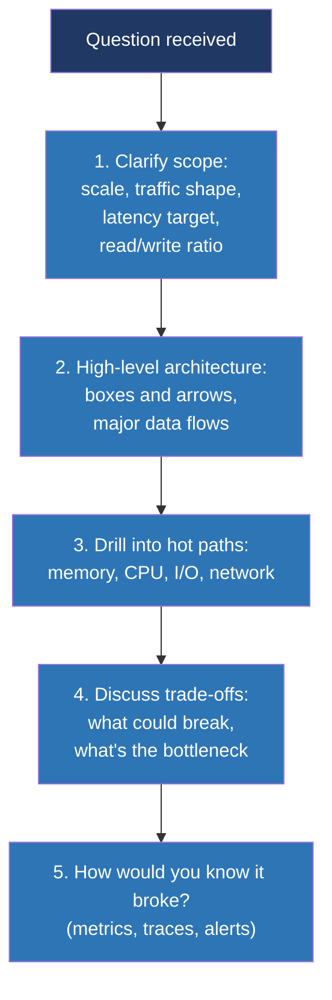

# Day 29 — Full-stack interview drill

> **Week 4 — I/O, filesystems, networking, synthesis**
> Reading: re-read your own notes from days 7, 14, 21. Skim the Brendan Gregg "Linux Performance" page. Read 1–2 systems-design write-ups (Discord, Cloudflare, Datadog engineering blogs are good).

## Why this matters

Real systems interviews don't ask "what is a page table" anymore. They ask: "design a high-performance proxy server" or "trace what happens when a user clicks 'send' on a chat app." The answer pulls in everything: process model, memory, concurrency, file I/O, networking, observability. The candidates who do well aren't the ones with deepest single-topic knowledge — they're the ones who can think across the stack.

Today is the dress rehearsal. Five end-to-end problems, each tied to multiple weeks. Practice answering aloud, even alone.

## 29.1 The framework for systems design questions

Don't just answer "how would you build it." Reason aloud about what's hard, what's easy, what could fail, and what you'd measure. That demonstrates seniority.

## 29.2 Problem 1: Trace a web request end to end

> *A user clicks a link. The browser sends `GET /api/users/123` to your server. Your server reads from Postgres, formats JSON, sends it back. The user sees the response. Walk me through everything that happens, layer by layer, on the server side.*

### Model answer

> Let me trace from the moment the packet hits the NIC to the moment the response packet leaves.
>
> The HTTP request arrives as TCP segments on the server's NIC. The NIC has been configured with DMA buffers, so it writes the packet bytes directly into kernel memory in the RX ring and raises an interrupt on a CPU. The driver's interrupt handler is minimal — just acknowledges the interrupt and schedules a NET_RX_SOFTIRQ. The soft IRQ runs the NAPI poll, which pulls the packet off the ring, wraps it in an `sk_buff`, possibly merges it with adjacent packets via GRO, and pushes it up the stack.
>
> The IP layer validates the IP header and routes to local delivery. TCP looks up the matching socket via the four-tuple — the connection is `ESTABLISHED` from a previous HTTP request that was kept alive. TCP appends the data to the socket's receive queue. If our application thread is currently blocked in `epoll_wait`, the kernel marks the socket fd readable and wakes the thread.
>
> Now the application takes over. The thread returns from `epoll_wait` and reads from the socket — the kernel copies bytes from the receive queue into our buffer. We parse HTTP, route to the `/api/users/123` handler.
>
> The handler needs to query Postgres. It already has a connection from a connection pool — another TCP socket to the database. It serializes a query, writes it to that socket, which copies into a kernel send buffer, gets framed by TCP and IP, gets DMA'd to the NIC, leaves the machine. The handler then either blocks on a read of the database socket, or — if the server is event-driven — yields back to the event loop and gets re-scheduled when the database fd becomes readable.
>
> The database response packet eventually returns through the same kernel path: NIC RX, NAPI, IP, TCP, socket queue, wake the application. The application reads the rows, possibly with multiple round trips. Once it has the data, it formats JSON.
>
> Now we send the response. We `write` to the client socket. The kernel copies our buffer into the socket send buffer, TCP frames it, IP routes it, the qdisc queues it, the driver gives it to the NIC. The NIC DMAs it out and transmits. Importantly, our `write` returns as soon as the data is buffered — the actual transmission is asynchronous.
>
> If we're feeling crisp, we mention specific opportunities for slowness at each layer: the receive queue could be full, the application could be GC-pausing, the database could be slow, the send buffer could fill up if the client is slow to ACK, the NIC could have hardware queueing issues. Each of those needs a different observation tool — `ss` for socket buffers, `iostat` for disk, flame graphs for CPU, `tcpdump` for network. The end-to-end trace is what makes the rest tractable.

## 29.3 Problem 2: Design a high-performance reverse proxy

> *Build something like nginx. It has to terminate TCP, parse HTTP/1.1 and HTTP/2, route to backends, and forward responses. Target: 100,000 connections per server, 50,000 RPS sustained. Walk me through the architecture and the key decisions.*

### Model answer

> Let's clarify scope first. 100,000 connections per server means most connections are idle most of the time — keepalive connections from web users. The 50,000 RPS is what's actually flowing. So the design has to scale to many idle fds while concentrating compute on the active ones. Latency target — let's assume p99 under 10 ms for proxy overhead.
>
> The architecture I'd start with is one event loop per CPU core, using `epoll` in edge-triggered mode with non-blocking sockets. Each loop has its own listening socket bound with `SO_REUSEPORT`, so the kernel hashes incoming connections across loops with no shared accept-queue contention. This pairs well with NIC RSS, which spreads packet interrupts across cores: ideally a connection's hardware queue, soft IRQ, kernel TCP, and event loop all live on the same CPU, cache-hot.
>
> Within each loop, the standard pattern: when a fd is ready, drain it to `EAGAIN`. For each accepted client, allocate per-connection state, parse HTTP incrementally as bytes arrive, and once we have the request, look up the backend, open or reuse a backend connection from a per-loop pool, and forward.
>
> The forwarding step is where you can be clever. Naive: `read` from client, `write` to backend, `read` from backend, `write` to client. Better: `splice()` from one socket fd to a pipe and from the pipe to the other socket — this avoids copying through user space, kernel does it directly. For large bodies, `splice` is a substantial win.
>
> Memory: per-connection state should be small — a few hundred bytes — so 100,000 connections fit in a few hundred MB. Buffers are tricky; you want to avoid allocating a full buffer for every connection, so use small fixed-size buffers and grow on demand, or share a per-loop buffer pool.
>
> For HTTP/2, you can't use splice because the protocol is multiplexed: many logical streams over one connection. So HTTP/2 connections need full parsing. The trade-off is that you do more CPU work per HTTP/2 connection but get better behavior under high request count per client.
>
> Backends: connection pools, one per loop, to avoid lock contention. Pre-resolved or with a fast async DNS path. Health checking via periodic background requests. Outlier detection — if a backend's latencies trend up, mark it unhealthy without waiting for outright failures.
>
> Observability: you need per-loop counters, exported via Prometheus or similar. Latency histograms per route. eBPF-based traces for in-flight requests when something looks slow. SO_LINGER tuning for graceful shutdown.
>
> Failure modes: TIME_WAIT accumulation if we're the active closer, mitigated by being passive closer for client connections and using `tcp_tw_reuse` for backend connections; backend timeouts cascading, mitigated by per-request deadlines and circuit breakers; head-of-line blocking on a slow backend connection, mitigated by HTTP/2 multiplexing or by early request timeouts. The key thing is that at 50K RPS, anything that takes a millisecond per request adds 50 cores of cost. So the inner loops have to be allocation-free, lock-free, and copy-light.

## 29.4 Problem 3: A service is occasionally returning 500 errors. Diagnose.

> *You're paged. A backend service is returning 500 errors at about 0.5% — most requests are fine, but some fail. Logs show "internal server error" with no detail. How do you find the problem?*

### Model answer

> First step is always: characterize the symptom before chasing causes. Is the 0.5% random, or correlated with something — a specific endpoint, a particular caller, certain inputs, time of day, a particular host in the fleet? I'd query the metrics by every dimension I have. If it's host-correlated, I'd compare healthy vs. unhealthy hosts. If endpoint-correlated, I'd focus there. If random and uncorrelated with anything in metrics, the cause is probably timing or environmental.
>
> Assuming I narrow it to "happens on all hosts, all endpoints, at random," I start ruling out layers. First, dependencies: does the service talk to a database, cache, downstream service? Are they showing the same 0.5% error rate? If yes, the issue is downstream and I follow it. If no, it's local.
>
> Next, the application itself. The 500 with no detail is a bug — production error logging that swallows the real exception. I'd add detailed logging or use a debugger / `bpftrace` to capture stacks at the moment of failure. If the service is in a JVM or Go, capture goroutine/thread dumps when failures happen.
>
> If it's a host-level intermittent — works fine, sometimes fails — common culprits: out-of-memory killer trimming a worker (check `dmesg`); file descriptor exhaustion (check `lsof | wc -l` against `ulimit -n`); ephemeral port exhaustion if making lots of outbound connections (`ss -tan | grep TIME_WAIT | wc -l`); CPU throttling under cgroup limits (check `nr_throttled` in `cpu.stat` of the cgroup).
>
> At the network layer: check `ss -s` for retransmit rates; `nstat | grep -i retrans`; check for connection resets with `bpftrace` on `tcp_v4_send_reset`. A small percentage of TCP-level failures looks exactly like a small percentage of HTTP 500s.
>
> One I've seen specifically: under high concurrency, ephemeral port exhaustion when making lots of short-lived outbound connections. The connect fails with `EADDRNOTAVAIL`, which gets surfaced as a 500. Fix is `tcp_tw_reuse=1`, raising the ephemeral port range, or using HTTP/2 / connection pooling so we make fewer total connections.
>
> The methodology is the meta-answer: characterize before fixing, rule out layers, gather evidence with low-overhead tooling, and don't guess. The cause being non-obvious from the logs means the next move is *more observability*, not more guessing.

## 29.5 Problem 4: Design a write-ahead log

> *Database persistence: an in-memory store with a write-ahead log on disk, so we can recover after a crash. Walk through the disk part — how do you make it correct and fast?*

### Model answer

> The basic idea: for every state change, append a record to the log on disk. On recovery, replay the log to reconstruct state. The hard parts are: making it durable, making it fast, making it crash-safe.
>
> Durability is the easy-to-state, hard-to-get-right part. After we tell the client "your write succeeded," the data must survive a crash. That means `fsync` between the write and the acknowledgment. If we just `write` to a file, the data sits in the page cache and is lost on power failure. If we `write` then `fsync`, the data has reached storage. So the inner loop is: append the record, `fsync`, ack the client. The cost is that `fsync` is slow — a millisecond or more on rotating disks, hundreds of microseconds on SSDs. So at high write rates, the bottleneck is `fsync` throughput.
>
> Optimizations to amortize that. **Group commit**: collect many concurrent writes into one batch, do one `fsync` for the batch, ack all writers. This trades latency (each write waits for the batch) for throughput (one fsync per N writes). Tune the batch deadline based on workload — a few hundred microseconds is often a sweet spot.
>
> **Direct I/O** with `O_DIRECT`: bypass the page cache. We don't need it; we know our data is going one way (to disk), and the page cache wastes memory and adds copy. Combined with our own application-level buffer, this is faster *and* gives more predictable latency.
>
> **Aligned, contiguous writes.** Storage devices are happiest with sequential, aligned, large writes. Pad records or batch them to fill 4 KB or larger blocks. SSDs especially prefer this.
>
> Crash safety. If we crash mid-write, the file might end with a partial record. Recovery has to detect this and discard the partial record. Standard approach: each record has a checksum. On replay, we read until we find a record with a bad checksum, stop there, and treat everything after as never having happened.
>
> File rotation: a single log file grows forever, so we need to rotate. After a checkpoint of the in-memory state, old log entries are no longer needed. Rotation is: snapshot the state to a new file with `fsync` and atomic rename, then truncate or delete the old log. This is the same write-then-rename pattern from filesystem durability.
>
> Recovery: on startup, read the latest snapshot, then replay the log from the snapshot's position forward, applying each valid record. Stop at the first checksum failure. We're now consistent with the last successful `fsync`.
>
> Performance to expect: with group commit, on NVMe storage, tens of thousands of small writes per second per log. With careful batching and direct I/O, hundreds of thousands. The bottleneck is rarely the FS — it's the device's write-through latency. Battery-backed write cache (server-grade hardware) makes `fsync` essentially free, which is why high-write databases are so often deployed on storage with that property.
>
> Failure modes I'd watch: `fsync` errors silently lost (the kernel had a long-running issue with this; it's better now but still subtle); page cache attribution if we accidentally use buffered I/O; kernel writeback storms if we mix our log with other heavy writers; SSD garbage collection pauses making latency spiky. Observability: histograms of fsync latency at p99, alerted if they spike.

## 29.6 Problem 5: Design a thread pool

> *A library that takes a function pointer + args and runs it on a pool of worker threads. Bounded queue, configurable size. What does the implementation look like?*

### Model answer

> The data structures: a bounded queue of work items, a fixed pool of worker threads, a mutex protecting the queue, two condition variables — one for "queue not empty" that workers wait on, one for "queue not full" that submitters wait on. Plus a shutdown flag and a bit of bookkeeping.
>
> Submission: lock the mutex; while the queue is full, wait on the not-full condvar; push the work item; signal not-empty; unlock. The wait must be in a `while` loop, not `if`, because of spurious wakeups and because by the time you wake, another submitter might have refilled the queue.
>
> Worker loop: lock the mutex; while the queue is empty and not shutting down, wait on the not-empty condvar; if shutting down and the queue is empty, exit; otherwise pop a work item; signal not-full; unlock; run the work; loop.
>
> Shutdown: set the flag, broadcast both condvars, join all workers. Pending work either finishes or is discarded depending on policy.
>
> Things that go wrong if you're not careful. First, the `if` vs `while` mistake — the classic. Second, signaling outside the mutex: technically allowed and often more efficient (no thundering herd waking and immediately blocking on the mutex), but you have to be sure the predicate has been updated already. Third, deadlock between the queue mutex and any locks the submitted work might take — keep the queue mutex narrow, never call user code while holding it. Fourth, exception safety: if work throws, the worker should catch and continue, not die.
>
> Performance considerations: at high throughput, the single mutex becomes a bottleneck. Standard mitigations are work-stealing (per-worker queues, idle workers steal from busy ones), or partitioned queues with consistent hashing. Java's `ForkJoinPool` and Go's runtime use work stealing.
>
> One subtle bug worth mentioning: if the work items hold references and the pool isn't shut down cleanly, you can leak. Document that shutdown should happen before destruction. Some implementations support graceful shutdown (drain queue) versus immediate (drop pending work).
>
> Why a bounded queue? Because backpressure. Unbounded queues let producers run ahead indefinitely, leading to OOM under load surges. A bounded queue forces producers to slow down when consumers can't keep up — they wait, which propagates back-pressure. It's a critical correctness property, not a tuning knob.

## 29.7 Things to drill in conversational form

Practice these aloud, alone, until they're smooth:

- "Walk me through what happens from `fork` to `exec`."
- "Trace a page fault from the moment of access to resolution."
- "Explain how `epoll` is implemented and why it's faster than `select`."
- "What is `TIME_WAIT` and what problems does it solve?"
- "What's the difference between hard and soft real-time scheduling, and what does Linux give you?"
- "How does the kernel know which physical pages a process is using?"
- "What happens when you call `malloc(8)` for the first time in a program?"
- "Explain the difference between `O_DIRECT` and buffered I/O. When does each make sense?"
- "What's a container, mechanically? Walk me through what `runc` does."

## Hands-on (30 minutes)

For each problem above, sketch a diagram on paper or text. Don't look at the model answer until you've tried alone.

For Problem 1 (web request trace), use `strace -e network -f` on a small test server to see the actual syscall sequence. Confirm your mental model matches.

For Problem 2 (proxy), look at one of: `ng_http_request_t` in the Nginx source, or HAProxy's session struct, or Envoy's `Connection`. See how a real implementation lays out per-connection state.

For Problem 3 (debugging), pick a service you have access to. Open up its metrics dashboard. Pick the most "ordinary-looking" graph — the latency histogram, say — and ask yourself: if this were 0.5% slow tomorrow, what would I check first? Write down your answer. Save it as a runbook.

For Problem 4 (WAL), read the SQLite WAL documentation. It's an excellent real-world example of these patterns, with explicit explanations of why each design choice was made.

For Problem 5 (thread pool), implement one in C. Test it. Find the bug — there will be one — and learn from it.

## Self-test

1. Without notes, draw the data flow from NIC → application for an incoming HTTP request.
2. State three reasons a service might have higher p99 than p50, and the tool you'd use to investigate each.
3. Sketch the inner loop of an event-driven server using `epoll` with edge triggering.
4. Explain the durability guarantees of `write` vs. `write + fsync` vs. `write + fsync + fsync(directory)`.
5. List five resources cgroups can limit, and three things they can't.
