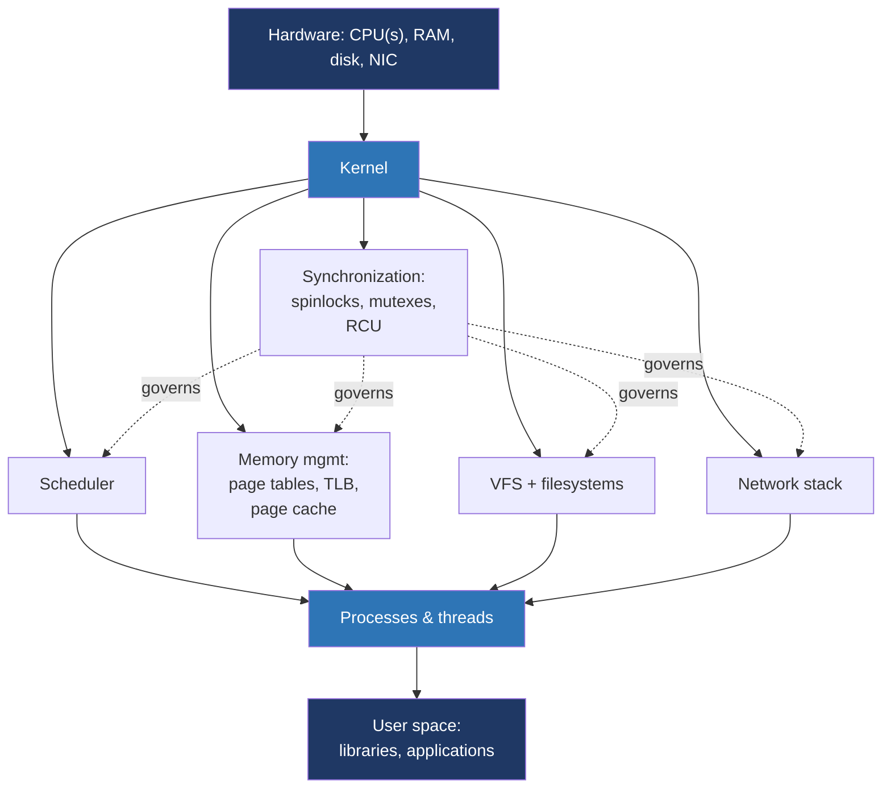

# Day 30 — Synthesis and what's next

> **Week 4 — I/O, filesystems, networking, synthesis**
> Reading: nothing new today. This is for review and forward planning.

## Why this matters

Knowledge that isn't connected fades. Today's job is to compress 30 days into a unified mental model — one you can replay end to end without notes — and to plan what comes next. The OS is the substrate everything else runs on. Understanding it well shows up in every part of your work as a systems engineer, not just in interviews.

## 30.1 The unified mental model

Five subsystems, all running on shared hardware, all coordinated by the kernel. Every one of them has a chapter (or several) of this plan behind it. The interconnections — the dotted lines from synchronization to everything else — matter as much as the boxes.

## 30.2 The five questions

Pick any system call or any program behavior, and ask:

1. **Process model** — whose process is this? whose threads? what state are they in?
2. **Memory** — what does the address space look like? where do pages live? what's mapped, what's swappable?
3. **Concurrency** — what's shared with what else? what synchronization protects it? what could race?
4. **I/O and storage** — what data is in flight? in cache? on disk? under what durability guarantees?
5. **Networking** — what packets are flowing? what protocol layers are in play? what queues are filling?

If you can answer these five for any scenario, you have a working mental model. The interview answers, the debugging methodology, the design instincts — they all flow from this.

## 30.3 What I should be able to do now

Knowledge tests:

- [ ] Explain `fork`, `exec`, `wait` to a junior engineer in 5 minutes.
- [ ] Draw a process address space, label each region, explain what fills each.
- [ ] Sketch how virtual memory becomes physical memory, including TLB and page tables.
- [ ] Walk through CFS scheduling at the level of the red-black tree of vruntime.
- [ ] Explain the futex fast/slow path of a mutex.
- [ ] Describe the producer-consumer pattern with mutex + two condvars.
- [ ] Distinguish data races from race conditions.
- [ ] Explain release/acquire memory ordering and when to use it.
- [ ] Describe what `write` does and why you need `fsync` for durability.
- [ ] Walk through what happens when `epoll_wait` returns a readable socket.
- [ ] Trace a packet from NIC to user `read`.
- [ ] Explain TCP's three-way handshake and why TIME_WAIT exists.
- [ ] Describe what containers are, in terms of namespaces and cgroups.
- [ ] Use `perf record` and `bpftrace` to investigate a problem.

If any of these feels shaky, that's where to revisit.

Skill tests:

- [ ] Read kernel source — pick a small subsystem, follow it.
- [ ] Write a non-trivial multi-threaded program without TSan reporting issues.
- [ ] Build an event-driven TCP server that handles 10k+ concurrent connections.
- [ ] Debug a real performance problem on a Linux system using only Linux's built-in tools.

## 30.4 What's not in this plan

Topics deliberately omitted, ranked by how much I'd recommend studying next:

1. **Distributed systems.** Consensus, replication, failure modes. *Designing Data-Intensive Applications* (Kleppmann) is the canonical text. Once you've internalized the OS, distributed systems is the natural next level: the OS is one machine, distributed systems are many.
2. **Database internals.** Storage engines (LSM trees, B-trees), MVCC, query optimization. *Database Internals* (Petrov) and the SQLite source are the best entry points.
3. **Compilers and runtime systems.** What does the JIT do? What does GC look like? *Engineering a Compiler* (Cooper & Torczon) is approachable.
4. **GPU and accelerator computing.** A different model: massively parallel, different memory hierarchy. CUDA programming guide is one direction.
5. **Real-time systems.** PREEMPT_RT Linux, real-time schedulers, deterministic latency. Specialized but valuable for certain domains.
6. **Security.** Capabilities, sandboxing, side-channel attacks (Spectre/Meltdown), exploitation techniques. *Hacking: The Art of Exploitation* (Erickson) starts low-level.
7. **Formal methods for concurrency.** TLA+, model checking. Lamport's "Specifying Systems" if you go deep.

You don't need any of these for OS interviews, but they're natural extensions. If you can pick only one, *Designing Data-Intensive Applications* will give you the most immediate career return.

## 30.5 How to keep current

Linux changes fast. Here's how to stay current without it becoming a job:

**LWN.net.** The single best Linux journalism. Weekly Edition costs a small subscription. Read 2–3 articles a week — pick whatever sounds interesting. Over a year you'll absorb most major kernel changes.

**Kernel mailing lists.** Don't subscribe to LKML directly (firehose). Subscribe to specific subsystem lists if you care about them: `linux-mm`, `netdev`, `linux-fsdevel`, `linux-block`. Read threads about big changes; ignore the bulk.

**Conferences and talks.** Linux Plumbers Conference, Kernel Recipes, USENIX OSDI/ATC, FOSDEM kernel track. Most have YouTube recordings. Plumbers in particular has the deepest content.

**Books to revisit.**
- OSTEP — re-read every couple of years; it stays relevant.
- TLPI — keep as reference; you don't read it cover to cover, you grep it.
- *Systems Performance* (Gregg, 2nd ed.) — the encyclopedia of Linux performance. Skim, then drill in when you have a relevant problem.
- *Operating Systems: Internals and Design Principles* (Stallings) — different perspective from OSTEP, complementary.
- *Linux Kernel Development* (Love) — getting dated but still good as a kernel-source orientation.
- *Understanding the Linux Network Internals* (Benvenuti) — the depth source for the network stack.

**Source code reading.** Pick one subsystem per quarter and read its source. Pick something concrete: futex, the page cache, qspinlock, epoll, the slab allocator, RCU. Trace from syscall to data structure. This is the highest-bandwidth way to actually understand how things work.

**Hands-on.** When you read something, build a small experiment to verify it. The amount you learn from "what does this do under these conditions" is enormous compared to passive reading.

## 30.6 The interview prep, condensed

If you have one week before an interview and can re-read only one thing, re-read these days from this plan:

- **Day 7 (week 1 review)** — for processes, threads, scheduling.
- **Day 14 (week 2 review)** — for memory.
- **Day 21 (week 3 review)** — for concurrency.
- **Day 29 (full-stack drill)** — for putting it all together.

If you have only one *day*: re-read day 29.

For verbal practice: the model answers in this plan are written to be spoken. Read them aloud. Time yourself. Notice which ones you'd answer differently, where your version is better, where the model has something you missed. Adapt them into your voice.

For the phone screen / coding round, the topics that come up most often: thread synchronization (locks, condvars, deadlock), virtual memory (paging, page faults), I/O models (blocking vs non-blocking, epoll), TCP basics (handshake, states). These are the high-frequency topics; have full stories for each.

For the systems design round: practice problems from Problem 2 and Problem 4 of day 29. Be ready to draw boxes and arrows. Talk through trade-offs. Mention observability. Senior interviews care about how you reason as much as what you know.

## 30.7 Habits that compound

Three things, if you do them, that will keep this knowledge alive:

1. **When you hit a real bug at work, narrate the diagnosis.** Aloud or written: "the symptom is X, my hypothesis is Y, I'll verify with Z." This forces the methodology to become reflexive.
2. **Read one piece of LWN per week.** Quick, easy, pays off years later when an interviewer mentions io_uring or sched_ext or RCU and you have context.
3. **Pick one annoying thing about your computer and explain it.** Why is the build slow? Why does the laptop fan kick on? Why does this curl command hang? You'll repeatedly find the answer is one of the topics from this plan, and the knowledge cements through use.

## 30.8 Parting thoughts

Operating systems is one of the few topics in computing where the fundamentals haven't changed in thirty years. Yes, the implementations have evolved — io_uring replaces epoll, eBPF transforms observability, containers replace processes-as-isolation, persistent memory blurs the disk/RAM line. But underneath all of that, the abstractions are the same: processes, address spaces, the file API, sockets, locks. The OS engineers who matured in 1995 can read the 2025 kernel and recognize most of it.

That's why this is worth deep study. Concurrency primitives don't get obsolete. Memory hierarchies don't get obsolete. The producer-consumer pattern is the same as it was 50 years ago. Web frameworks come and go; understanding what `accept` does is forever.

The other reason: at the senior level, the difference between a competent engineer and a great one is often *systems thinking*. The ability to reason across the stack, predict where the bottlenecks will be, debug things that don't show up in any log. That's what 30 days of OS study builds. It's not interview trivia — it's the underlying competence that makes the rest of your career easier.

Build something with it. Read more kernel source. Stay curious. The fundamentals will pay you back forever.

---

*That's the plan. 30 days, one topic at a time, ending here. The next 30 days are entirely yours.*
